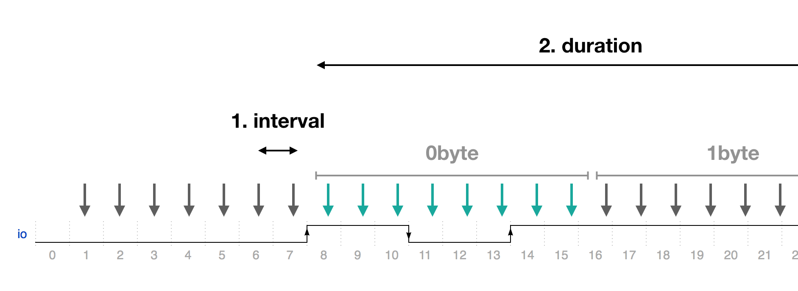
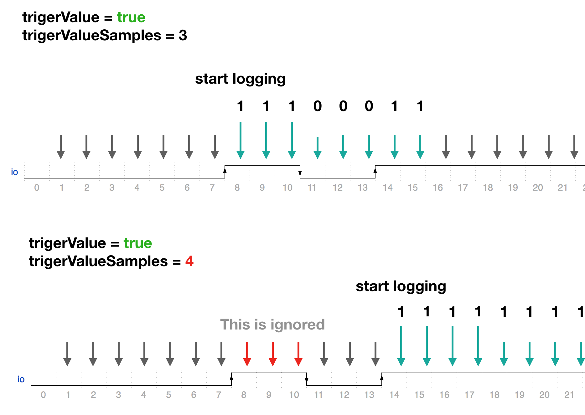

# LogicAnalyzer
LogicAnalyzer record samples readed from io periodically.
This is useful when digital bus signal check.

### How work

LogiAnalyzer start logging by trigger.  
Default trigger is "value change".
When It occures, then datas will be recoreded until desired duration.
After done, LogicAnalyzer start monitoring io change(=continuers working).
one sample becomes one bit. So 1 byte has 8 samples.


sampling interval and duration can be configured.
For example interval is 1msec and duration is 800msec then your will get array of 100byte(it contians 800 samples)



### Triger Option

Default trigger is "value change". But It is interrupted by some noises. Configure trigerValue/trigerValueSamples to filter it.

1. trigerValue - desired start value. true/false
2. trigerValueSamples - after this samples recorded then record will start.

This triger settings is "trigger when true/(or false) keeps more than X after io change"




## logicAnalyzer.start({io, interval, duration});
start logic analyzer on given io.
interval measn period(second) reading io value.
data_long measn how long does logcanalyzer collect the data.

For example, collect the data from io0 changed, 2msec period and 1sec long
```Javascript
// Javascript Example
obniz.logicAnalyzer.start({io:0, interval:2, duration:1000});  // start on io0. 2msec interval and 1sec long.
obniz.logicAnalyzer.onmeasured = function(array) {
  console.log(array);
}
```
## logicAnalyzer.start(io, interval, duration, trigerValue, trigerValueSamples);
start logic analyzer on given io with triger.

triger is optioanl triger configration.
without this, logicAnalyzer will start with any io level changes. triger specify start position.
value measn start value. true/false. samples measn how that values consists.
So, With below sample code, you will receive only datas which start with "false, false, false" 3bit.
```Javascript
// Javascript Example
obniz.logicAnalyzer.start({io:0, interval:2, duration:1000, trigerValue:false, trigerValueSamples:3});  // start on io0. 2msec interval and 1sec long.
obniz.logicAnalyzer.onmeasured = function(array) {
  console.log(array);
}
```

## logicAnalyzer.onmeasured(bytes)
callback function which be called when data arrived.
arrived data is byte array.
and it's every bit is measured data on every period.
For example, [0x01, 0x00] means io0 is onece high(around 2msec) but after that, it stay 0.

```Javascript
// Javascript Example
obniz.logicAnalyzer.start({io:0, interval:2, duration:1000});  // start on io0. 1msec interval and 1sec long.

obniz.logicAnalyzer.onmeasured = function(array) {
  console.log(array);
}
```
## logicAnalyzer.end()
Stop the logic analyzer.

```Javascript
// Javascript Example
obniz.logicAnalyzer.start({io:0, interval:2, duration:1000});  // start on io0. 1msec interval and 1sec long.
obniz.logicAnalyzer.end();
```