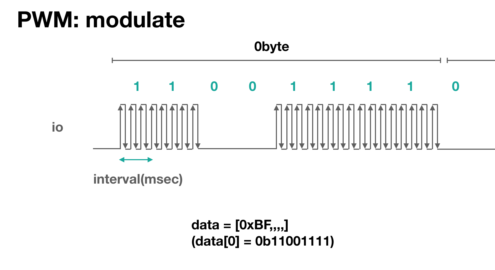

# Peripherals PWM
PWM generation.
Maximum current is depends on driving mode. see [io](./io).

6 module (pwm0 to pwm5) are available.

PWM generats repeated pulse.
Two parameter define pulse.

1. freq: pattern interval
2. pulse_width or duty: positive pulse width


pwm is often used for controlling a DC motor by changing it's duty.


## obniz.getFreePwm()
it reutrn pwm module which currently not used.

```Javascript
// Example
var pwm = obniz.getFreePwm();
```
It will throw Error when no free pwm.
```Javascript
// Example
var pwm0 = obniz.getFreePwm();
var pwm1 = obniz.getFreePwm();
var pwm2 = obniz.getFreePwm();
var pwm3 = obniz.getFreePwm();
var pwm4 = obniz.getFreePwm();
var pwm5 = obniz.getFreePwm();
var pwm6 = obniz.getFreePwm(); // Error
```

## start({io [,drive, pull]})
start a pwm on given io.
freq=1khz, duty=0% on start.

io drive and pull can be configred. see more dtail on [io](./io)

```Javascript
// Javascript Example
var pwm = obniz.getFreePwm();
pwm.start({io:0}); // start pwm. output at io0
pwm.freq(1000);
pwm.duty(50);

var pwm2 = obniz.getFreePwm();
pwm2.start({io:1, drive:"open-drain", pull:"5v"});
```
## freq(frequency)
set frequency. Not pulse duration.
For example, this value will be 1khz with DC motor.

```Javascript
// Javascript Example
var pwm = obniz.getFreePwm();
pwm.start({io:0});
pwm.freq(1000); // set pwm. frequency to 1khz
```
## pulse(width ms)
set pulse duty with ms.

```Javascript
// Javascript Example
var pwm = obniz.getFreePwm();
pwm.start({io:0});
pwm.freq(2000); // set pwm frequency to 2khz
pwm.pulse(0.5) // set pwm pulse 0.5msec.  so this is  25% ratio.
```
## duty(ratio)
set duty with ratio.

```Javascript
// Javascript Example
var pwm = obniz.getFreePwm();
pwm.start({io:0});
pwm.freq(2000); // set pwm frequency to 2khz
pwm.duty(50) // set pwm pulse witdh 50%
```

## modulate(modulation type, interval msec, data)
modulate pwm with datas
modulation can be choosed from below.

1. "am"

am modulation: data "1" measn output the pwm with duty 50%. "0" means stop pwm. io will be 0.
interval defines symbol baud rate. 
Duty is 50% fixed.



This is useful to generate IR signal (Remote control).
38kHz freq with signals.

```Javascript
// Javascript Example
var pwm = obniz.getFreePwm();
pwm.start({io:0});
pwm.freq(38000); // set pwm frequency to 38khz

// signal for room heater's remote signal
var arr = [0,0,0,0,0,0,0,0,0,0,0,0,0,0,0,1,1,1,1,1,1,1,1,1];

pwm.modulate("am", 0.07, arr); // am modulate. symbol length = 70usec.
```
## end();
stop pwm. It will release io.

```Javascript
// Javascript Example
var pwm = obniz.getFreePwm();
pwm.start({io:0});
pwm.end();
```