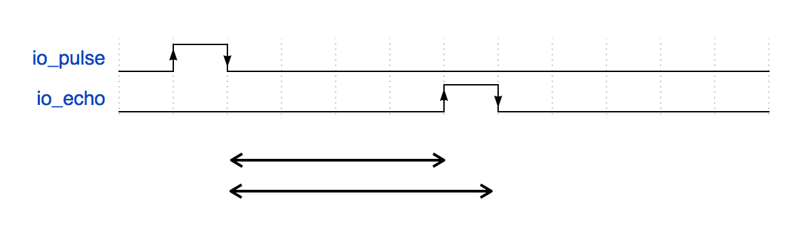

# measure
The measure module provides hardware level measurement.

## measure.echo({})

Some electrical parts or circuits accept "pulse" and echo the "pulse" after delay.
This module is best suited for measuring that delay.

This module generates one pulse shot on an io, then measures the response time.




### pulse generation
You can choose below to generate a pulse

1. io_pulse: io number to generate pulse
2. pulse: "positive" or "negative"
3. pulse_width: pulse duration in values between ms. 0.001 to 1000.


### Response measurement
You can choose below to measure response

1. io_echo: io for measuring response
2. measure_edges: maximum number of edges to detect. 1 to 4.
3. timeout: timeout in ms, and default is 1000. 0.001 to 1000.
4. callback: callback function after measurement or timeout

A callback function will be called when the edge count = measure_edges or timeout.
It has an array of edge information. For example, if you get a response like below 


then, you will get below
```javascript
callback: function(edges) {
  edges.length // == 2
  edges[0].edge // == true
  edges[0].timing // == t1
  edges[1].edge // == false
  edges[1].timing // == t2
}
```

The full example is as follows.

```javascript
// Javascript Example
obniz.measure.echo({
  io_pulse: 0, // io for generate pulse
  io_echo: 1, // io to be measured
  pulse: "positive", // generate pulse pattern
  pulse_width: 0.1,  // generate pulse width
  measure_edges: 3, // 1 to 4. maximum edges to measure
  timeout: 1000, // this is optional. 1000(1sec) is default
  callback: function(edges) {
    // callback function
    console.log(edges);
  }
});
```
