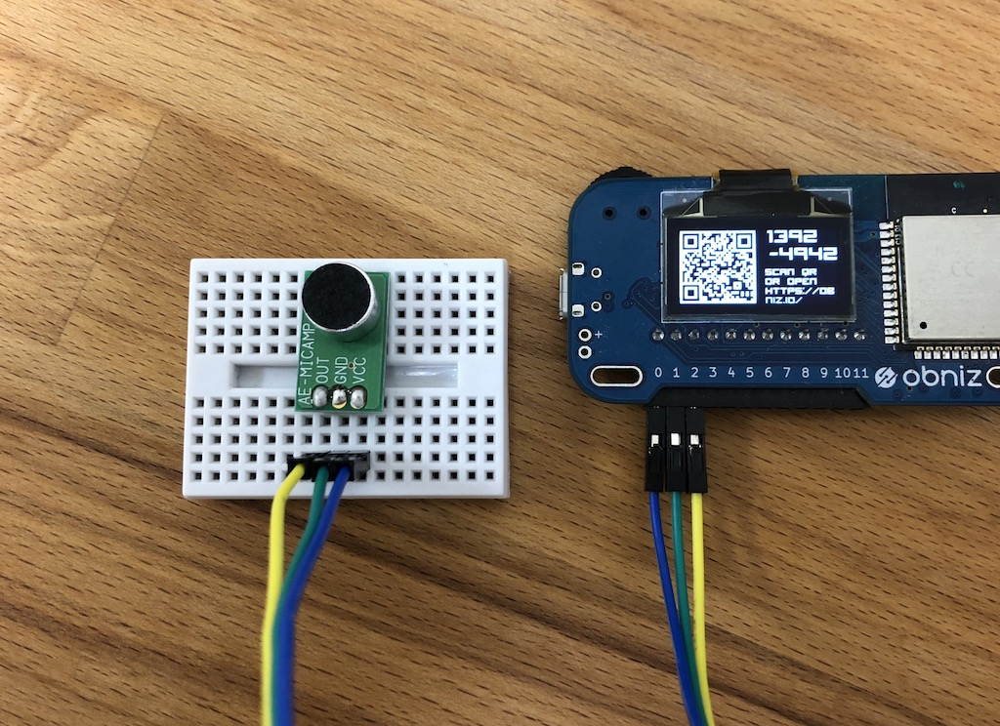

# Microphone Sensor Module - AE-MICAMP
Akizuki's Microphone kit AE-MICAP.
It detect sounds as voltage changes.



## wired(obniz, {vcc, out, gnd})

```javascript
// Javascript Example
var microphone = obniz.wired("AE_MICAMP", {vcc:0, gnd:1, out:2});
```

## onchange = callback(voltage)

It called when the output was changed.

If it is silence, voltage is closed to half of vcc (2.5v).
It change regards sounds.

```javascript
// Javascript Example
var microphone = obniz.wired("AE_MICAMP", {vcc:0, gnd:1, out:2});
microphone.onchange = function(voltage){
  console.log(voltage)
}
```
