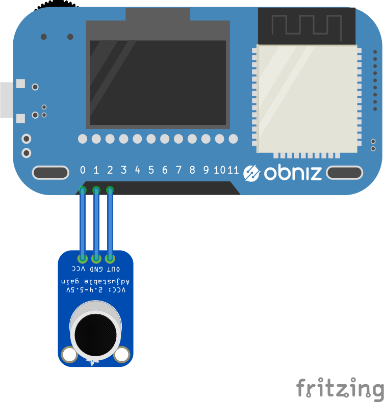

# Microphone Sensor Module - AE-MICAMP
秋月電子のマイクアンプキットAE-MICAMPです。音の大小を電圧を取得し、音センサとして使用します。




## wired(obniz, {vcc, out, gnd})
obnizにマイクセンサをつなぎます。
0,1,2はそれぞれマイクセンサの電源,GND,センサ出力へ接続してください。
```javascript
// Javascript Example
var microphone = obniz.wired("AE_MICAMP", {vcc:0, gnd:1, out:2});
```

## onchange = callback(voltage)
マイクセンサの値に変化があった場合にcallback関数を呼び出します。
音のレベルを電圧で返します。

音のレベルは無音がVCCの半分(USBに繋いでいる場合は、2.5V)で、
音の大きさに応じて上下します。

```javascript
// Javascript Example
var microphone = obniz.wired("AE_MICAMP", {vcc:0, gnd:1, out:2});
microphone.onchange = function(voltage){
  console.log(voltage)
}
```
