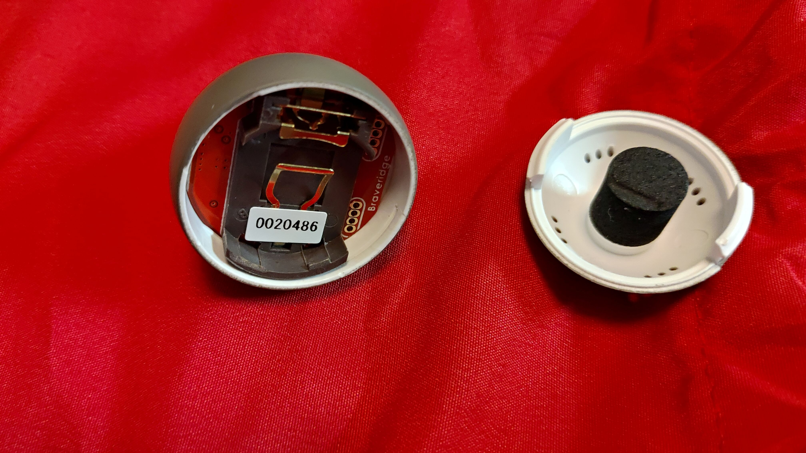

# Sizuku LUX BLE device

Library for [Sizuku LUX](http://www.products.braveridge.com/sizuku-lux/) BLE device. This library is based on the specifications defined by Peripheral Device Link Profile. For more information on this protocol please visit [here](https://linkingiot.com/developer/LinkingProfile/device_profile.html).


This devices has only brightness sensor. 

## Usage

Using the obniz wired function we can get an instance of such an object. We need to pass the serial number as a parameter. This is mandatory and it allows the usage of multiple ble devices of same model. The serial number can be found taped on the battery holder, on the case or on the manual LUXt comes with the device.



```javascript
let sizukuLUX = obniz.wired('SizukuLUX', {serial:'0142095'});
```

Initialize connection as follows:

```javascript
await sizukuLUX.connectWait();
```

After this period we can get some initial sensor values with:

```javascript
sizukuLUX.getSensors()
```

We can update these sensor values by calling updateSensors and have the device deliver them in our callback. We define the callback as onSensorData and can be used as below:

```javascript
sizukuLUX.onSensorData = function(data) {
  console.log('Sizuku callback', data);
}
sizukuLUX.updateSensors();
```

We can use setInterval to update regularly. The return data is a dictionary in the form of 

```json
{
  'Brightness': 220
}
```

---
**NOTE**
Brightness is reported in Lux.

---