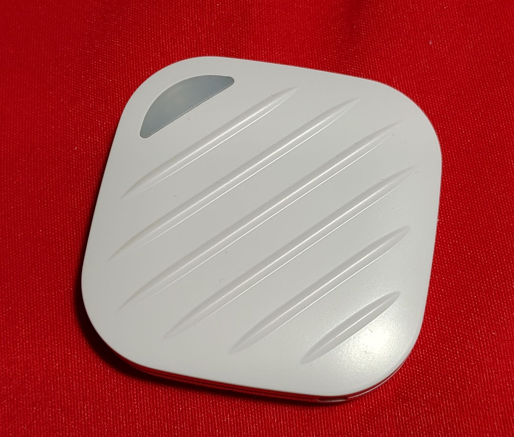
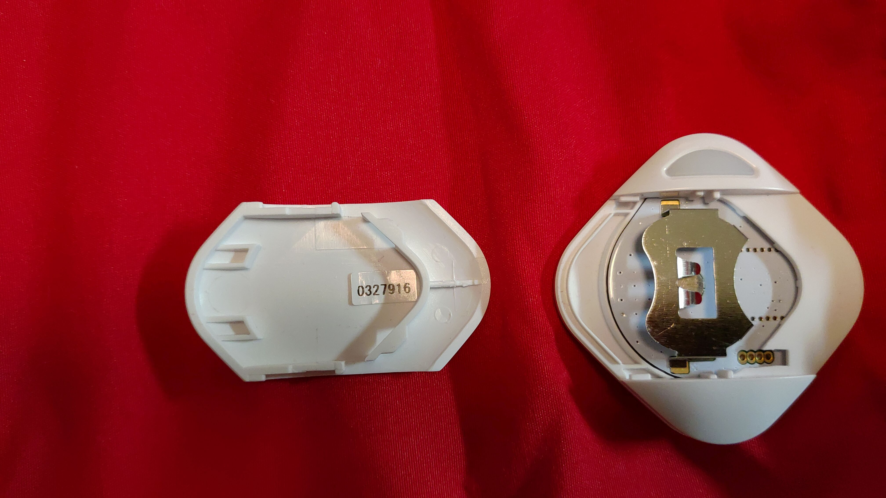

# Tomoru BLE device

Library for [Tomoru](http://www.products.braveridge.com/tomoru/) BLE device. This library is based on the specifications defined by Peripheral Device Link Profile. For more information on this protocol please visit [here](https://linkingiot.com/developer/LinkingProfile/device_profile.html).



This devices does not have any sensors.

## Usage

Using the obniz wired function we can get an instance of such an object. We need to pass the serial number as a parameter. This is mandatory and it allows the usage of multiple ble devices of same model. The serial number can be found taped on the battery holder, on the case or on the manual that comes with the device.



```javascript
let Tomoru = obniz.wired('Tomoru', {serial:'0142095'});
```

Initialize connection as follows:

```javascript
await Tomoru.connectWait();
```
