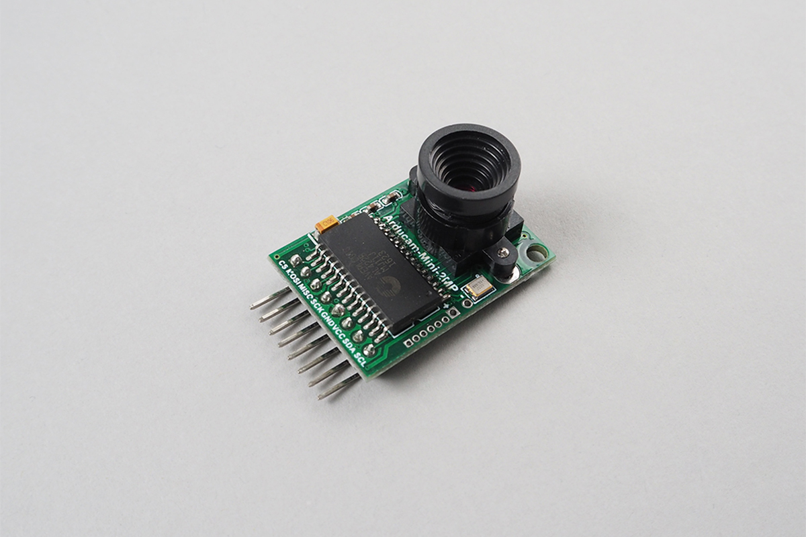

# ArduCAMMini

ArduCAM Mini works with few pins.
It takes image with many image resolutions and alos jpeg format.

ArduCam Mini has many series of product. This library is only for OV2640 2M pixel ArduCam, ArduCAM-Mini-2MP or ArduCAM-Mini-2MP-Plus.

Specify ```module_version:1``` when using ArduCAM-Mini-2MP-Plus.




## wired(obniz,  {cs [, mosi, miso, sclk, gnd, vcc, sda, scl, spi, i2c]} )

Instantiate camera object regarding ios.

We recommend to supply power to an arducam from other power resource.
You should pay attention over current detection when using an obniz Board as poewr supply.
Supply methods are


- use other power resource
- use J1 on an obniz Board.
- supply vcc more than two obniz Board io

This document use io5 and io11 to supply a vcc.


Arducam require each SPI and I2C.

name | type | required | default | description
--- | --- | --- | --- | ---
cs | `number(obniz Board io)` | yes | &nbsp; | obniz Board io. チップ選択
vcc | `number(obniz Board io)` | no | &nbsp; | obniz Board io. 電源 +5V
gnd | `number(obniz Board io)` | no | &nbsp; | obniz Board io. 電源 0v
mosi | `number(obniz Board io)` | no | &nbsp; | obniz Board io. SPI mosi 端子
miso | `number(obniz Board io)` | no | &nbsp; | obniz Board io. SPI miso 端子
sclk | `number(obniz Board io)` | no | &nbsp; | obniz Board io. SPI clk 端子
sda | `number(obniz Board io)` | no | &nbsp; | obniz Board io. I2C sda 端子
scl | `number(obniz Board io)` | no | &nbsp; | obniz Board io. I2C scl 端子
i2c | `i2c object` | no | &nbsp; | configured i2c object
spi | `spi object` | no | &nbsp; | configured spi object
spi_frequency | `spi object` | no | 4Mhz | for unstable situation, change frequency of spi
spi_drive | `spi object` | no | `'3v'` | for unstable situation, change drive method of spi
module_version | `number` | no | 0 | Specify 1 when using ArduCAM-Mini-2MP-Plus

Just specify connected io to configure.

```html
<!-- HTML Example -->
<html>
<head>
<meta charset="utf-8">
<meta name="viewport" content="width=device-width, initial-scale=1">
<script src="https://obniz.io/js/jquery-3.2.1.min.js"></script>
<script src="https://unpkg.com/obniz@latest/obniz.js"></script>
</head>
<body>

<div id="obniz-debug"></div>


<script>
var obniz = new Obniz("OBNIZ_ID_HERE");
obniz.onconnect = async function () {
  obniz.io11.output(true);
  var cam = obniz.wired("ArduCAMMini", { cs:0, mosi:1, miso:2, sclk:3, gnd:4, vcc:5, sda:6, scl:7 });
  await cam.startupWait();
  const data = await cam.takeWait('1024x768');
  console.log("image size = " + data.length + " bytes");

  const base64 = cam.arrayToBase64(data);
  document.getElementById("image").src = "data:image/jpeg;base64, " + base64;
}
</script>
</body>
</html>
```

Or, specify configured i2c and spi object to wired function.


## [await] startupWait();

Initialize and test a cam.
You should call this function only once before take.

This function does

- SPI communication test
- I2C communication test
- camera suppported check
- mode and jpeg configration
- 320x240 resolution setting

After this startup, takeWait() can be called to take.

```javascript
// Javascript Example
obniz.io11.output(true);
var cam = obniz.wired("ArduCAMMini", { cs:0, mosi:1, miso:2, sclk:3, gnd:4, vcc:5, sda:6, scl:7 });
await cam.startupWait();
```

Without calling startupWait(), you can configure manually like below.

```javascript
// Javascript Example
obniz.io11.output(true);
var cam = obniz.wired("ArduCAMMini", { cs:0, mosi:1, miso:2, sclk:3, gnd:4, vcc:5, sda:6, scl:7 });
await cam.spi_pingpongWait();
cam.setMode('MCU2LCD');
const chipid = await cam.getChipIdWait();
if (chipid != 0x2642) {
  throw new Error('unknown chip ' + chipid)
}
cam.init();
```

## [await] takeWait(size);

Getting jpeg image data from a cam.
Please call startupWait() function before take.

Set size to change resolution from default(320*240).
Not specified or specified size is same as before will change nothing.
Size options are same sas setSize() function.

Return value is array of jpeg image.
If it fail, this function throws a error or hang to wait a response form a cam.

```javascript
// Javascript Example
obniz.io11.output(true);
var cam = obniz.wired("ArduCAMMini", { cs:0, mosi:1, miso:2, sclk:3, gnd:4, vcc:5, sda:6, scl:7 });
await cam.startupWait();
const jpegData = await cam.takeWait('1024x768');
```

You can take a photo manually without using takeWait(). Please refer startCapture() function.

## arrayToBase64(bytearray)f
convert bytearray to base64 string.
It is useful when you want to print image to image tag
In html, you can see the image by setting base64 datat to ``tag.

```Javascript
obniz.io11.output(true);
var cam = obniz.wired("ArduCAMMini", { cs:0, mosi:1, miso:2, sclk:3, gnd:4, vcc:5, sda:6, scl:7 });
await cam.startupWait();
const jpegData = await cam.takeWait('1024x768');
console.log("image size = " + jpegData.length + " bytes");
  
const base64 = cam.arrayToBase64(jpegData);
document.getElementById("image").src = "data:image/jpeg;base64, " + base64;

```

## setMode(mode)

Configation of  camera mode.
options are below.

This function is used in startupWait() function.

- 'MCU2LCD'
- 'CAM2LCD'
- 'LCD2MCU'

```javascript
// Javascript Example
obniz.io11.output(true);
var cam = obniz.wired("ArduCAMMini", { cs:0, mosi:1, miso:2, sclk:3, gnd:4, vcc:5, sda:6, scl:7 });
cam.setMode('MCU2LCD')
```

## [await] spi_pingpongWait()

Testing a cam and obniz Board spi communication.
Use this to check cam power supply correction and wiring check.

This function is used in startupWait() function.

```javascript
// Javascript Example
obniz.io11.output(true);
var cam = obniz.wired("ArduCAMMini", { cs:0, mosi:1, miso:2, sclk:3, gnd:4, vcc:5, sda:6, scl:7 });
await cam.spi_pingpongWait()
```

## [await] getChipIdWait()

Retriving a chip id by using I2C communication
Use this to check I2C communication and validation of chip id.

This function is used in startupWait() function.

```javascript
// Javascript Example
obniz.io11.output(true);
var cam = obniz.wired("ArduCAMMini", { cs:0, mosi:1, miso:2, sclk:3, gnd:4, vcc:5, sda:6, scl:7 });
const chipid = await cam.getChipIdWait();
if (chipid != 0x2642) {
  throw new Error('unknown chip ' + chipid)
}
```

## init()

Initialize a cam.
It does basic initialization. Jpeg mode, and resolution set to 320*240.

This function is used in startupWait() function.

```javascript
// Javascript Example
obniz.io11.output(true);
var cam = obniz.wired("ArduCAMMini", { cs:0, mosi:1, miso:2, sclk:3, gnd:4, vcc:5, sda:6, scl:7 });
cam.setMode('MCU2LCD')
cam.init()
```

## setSize(size)

Setting a resolution of cam.
Options are

- '160x120'
- '176x144'
- '320x240'
- '352x288'
- '640x480'
- '800x600'
- '1024x768'
- '1280x960'
- '1600x1200'

ArduCam says 1sec waiting is recommended after configrations of size.

```javascript
// Javascript Example
obniz.io11.output(true);
var cam = obniz.wired("ArduCAMMini", { cs:0, mosi:1, miso:2, sclk:3, gnd:4, vcc:5, sda:6, scl:7 });
await cam.startupWait();
cam.setSize('1600x1200');
obniz.wait(1000);
```

## flushFIFO()

Clearing FIFO.
You should call twice before calling startCapture().

This function is used in takeWait() function.

```javascript
// Javascript Example
obniz.io11.output(true);
var cam = obniz.wired("ArduCAMMini", { cs:0, mosi:1, miso:2, sclk:3, gnd:4, vcc:5, sda:6, scl:7 });
await cam.startupWait();
cam.flushFIFO();
cam.flushFIFO();
cam.startCapture();
while (true) {
  if ((await cam.isCaptureDoneWait())) { break; }
}
const jpegData = await cam.readFIFOWait();
```

## startCapture()

Starting a photo taking.
It takes a time. You should wait. Use isCaptureDoneWait() function to check it done.

This function is used in takeWait() function.

```javascript
// Javascript Example
obniz.io11.output(true);
var cam = obniz.wired("ArduCAMMini", { cs:0, mosi:1, miso:2, sclk:3, gnd:4, vcc:5, sda:6, scl:7 });
await cam.startupWait();
cam.flushFIFO();
cam.flushFIFO();
cam.startCapture();
while (true) {
  if ((await cam.isCaptureDoneWait())) { break; }
}
const jpegData = await cam.readFIFOWait();
```

## [await] isCaptureDoneWait()

Checking photo taking is done or not.

This function is used in takeWait() function.

```javascript
// Javascript Example
obniz.io11.output(true);
var cam = obniz.wired("ArduCAMMini", { cs:0, mosi:1, miso:2, sclk:3, gnd:4, vcc:5, sda:6, scl:7 });
await cam.startupWait();
cam.flushFIFO();
cam.flushFIFO();
cam.startCapture();
while (true) {
  if ((await cam.isCaptureDoneWait())) { break; }
}
const jpegData = await cam.readFIFOWait();
```

## [await] readFIFOWait()

Getting a data in camera FIFO.

This function is used in takeWait() function.


```javascript
// Javascript Example
obniz.io11.output(true);
var cam = obniz.wired("ArduCAMMini", { cs:0, mosi:1, miso:2, sclk:3, gnd:4, vcc:5, sda:6, scl:7 });
await cam.startupWait();
cam.flushFIFO();
cam.flushFIFO();
cam.startCapture();
while (true) {
  if ((await cam.isCaptureDoneWait())) { break; }
}
const jpegData = await cam.readFIFOWait();
```
