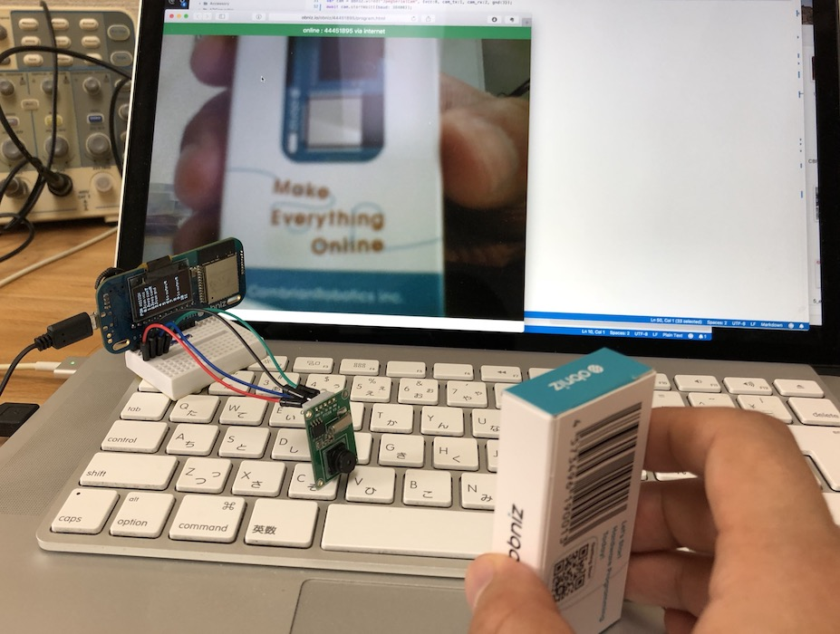
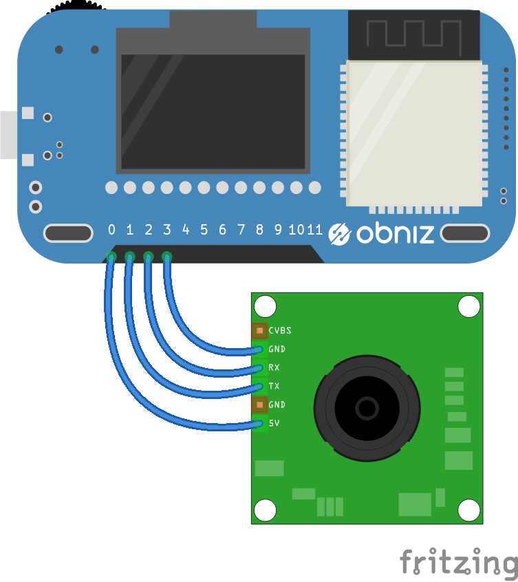

# JpegSerialCam
JpegCamera PTC06



<iframe width="560" height="315" src="https://www.youtube.com/embed/CYoMmMoa3ao" frameborder="0" allow="autoplay; encrypted-media" allowfullscreen></iframe>

```html
<!-- HTML Example -->
<html>
<head>
<meta charset="utf-8">
<meta name="viewport" content="width=device-width, initial-scale=1">
<script src="https://obniz.io/js/jquery-3.2.1.min.js"></script>
<script src="https://unpkg.com/obniz@latest/obniz.js"></script>
</head>
<body>

<div id="obniz-debug"></div>


<script>
var obniz = new Obniz("OBNIZ_ID_HERE");
obniz.onconnect = async function () {
  obniz.io6.output(true);
  obniz.io9.output(false);
  var cam = obniz.wired("JpegSerialCam", {vcc:0, cam_tx:1, cam_rx:2, gnd:3});
  await cam.startWait({baud: 38400});
  await cam.setSizeWait("640x480");
  const jpegData = await cam.takeWait();
  document.getElementById("image").src = "data:image/jpeg;base64," + cam.arrayToBase64(jpegData);
}
</script>
</body>
</html>
```

## wire(obniz, {vcc, cam_tx, cam_rx, gnd})
connect PowerSupply and UART.
cam_tx measn transmit from camera.

We recommend to supply power to an arducam from other power resource.
You should pay attention over current detection when using an obniz Board as poewr supply.
Supply methods are

- use other power resource
- use J1 on an obniz Board.
- supply vcc more than two obniz Board io

This document use io5 and io11 to supply a vcc.



**Please note that the arrangement depends on the product**

```Javascript
obniz.io6.output(true);
obniz.io9.output(false);
var cam = obniz.wired("JpegSerialCam", {vcc:0, cam_tx:1, cam_rx:2, gnd:3});
```

## [await] startWait({baud:baudrate})
start camera.
It takes around 2.5 second.

Factory setted default Baudrate = 38400
So, maybe, yours is 38400.
But onece baud was changed to different value, The values consist even after power down. You should specify new correct baudrate to startWait() after changing.

```Javascript
// Javascript Example
obniz.io6.output(true);
obniz.io9.output(false);
var cam = obniz.wired("JpegSerialCam", {vcc:0, cam_tx:1, cam_rx:2, gnd:3});
await cam.startWait({baud: 38400});
var data = await cam.takeWait();
```

## [await] setSizeWait(resolution)
set image resolution
This configuration consists even after power off.

1. "640x480" (image size around 40kb)
2. "320x240" (image size around 12kb)
3. "160x120" (image size arond 4kb)

are available.
data size depends on what you take.
```Javascript
// Javascript Example
obniz.io6.output(true);
obniz.io9.output(false);
var cam = obniz.wired("JpegSerialCam", {vcc:0, cam_tx:1, cam_rx:2, gnd:3});
await cam.startWait({baud: 38400});
await cam.setSizeWait("640x480");
var data = await cam.takeWait();
```

## [await] setBaudWait(baud)
set baudrate of cam.
This configuration consists even after power off.
So you should specify new baud value to startWait() function next time.

1. 9600
2. 19200
3. 38400
4. 57600
5. 115200

are avaiable.
High-speed is better. But, if the Wifi network speed is slow, then obniz Board will lost the data when high-speed.

```Javascript
// Javascript Example
obniz.io6.output(true);
obniz.io9.output(false);
var cam = obniz.wired("JpegSerialCam", {vcc:0, cam_tx:1, cam_rx:2, gnd:3});
await cam.startWait({baud: 38400});
await cam.setBaudWait(115200);
await cam.takeWait(); // baud is already changed to 115200.
```

## [await] takeWait()
take a photo and return a byte array.

```Javascript
// Javascript Example
obniz.io6.output(true);
obniz.io9.output(false);
var cam = obniz.wired("JpegSerialCam", {vcc:0, cam_tx:1, cam_rx:2, gnd:3});
await cam.startWait({baud: 38400});
var jpegData = await cam.takeWait();
```

## arrayToBase64(bytearray)
convert bytearray to base64 string.
It is useful when you want to print image to image tag

```Javascript
obniz.io6.output(true);
obniz.io9.output(false);
var cam = obniz.wired("JpegSerialCam", {vcc:0, cam_tx:1, cam_rx:2, gnd:3});
await cam.startWait({baud: 38400});
const jpegData = await cam.takeWait();
document.getElementById("image").src = "data:image/png;base64," + cam.arrayToBase64(jpegData);
```