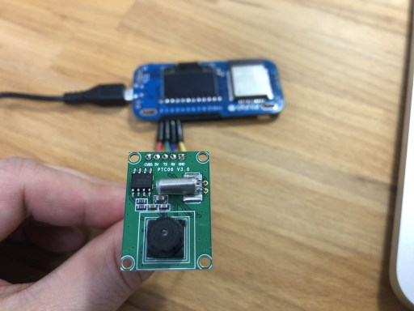

# JpegSerialCam
JpegCamera PTC06



<iframe width="560" height="315" src="https://www.youtube.com/embed/CYoMmMoa3ao" frameborder="0" allow="autoplay; encrypted-media" allowfullscreen></iframe>

```Javascript
// Javascript Example
var cam = obniz.wired("JpegSerialCam", {vcc:0, cam_tx:1, cam_rx:2, gnd:3});
await cam.startwait({baud: 38400});
await cam.setResolusionWait("640*480");
var data = await cam.takewait();
```

## wire(obniz, {vcc, cam_tx, cam_rx, gnd})
connect PowerSupply and UART.
cam_tx measn transmit from camera.

```Javascript
var cam = obniz.wired("JpegSerialCam", {vcc:0, cam_tx:1, cam_rx:2, gnd:3});
```

## [await] startwait({baud:baudrate})
start camera.
It takes around 2.5 second.

Default Baudrate = 38400
```Javascript
// Javascript Example
var cam = obniz.wired("JpegSerialCam", {vcc:0, cam_tx:1, cam_rx:2, gnd:3});
await cam.startwait({baud: 38400});
var data = await cam.takewait();
```

## [await] setResolusionWait(resolution)
set image resolution
This configuration consists even after power off.

1. "640*480" (image size around 40kb)
2. "320*240" (image size around 12kb)
3. "160*120" (image size arond 4kb)

are available.
data size depends on what you take.
```Javascript
// Javascript Example
var cam = obniz.wired("JpegSerialCam", {vcc:0, cam_tx:1, cam_rx:2, gnd:3});
await cam.startwait({baud: 38400});
await cam.setResolusionWait("640*480");
var data = await cam.takewait();
```

## [await] setBaudWait(baud)
set baudrate of cam.
This configuration consists even after power off.

1. 9600
2. 19200
3. 38400
4. 57600
5. 115200

are avaiable.
High-speed is better. But, if the Wifi network speed is slow, then obniz will lost the data when high-speed.

```Javascript
// Javascript Example
var cam = obniz.wired("JpegSerialCam", {vcc:0, cam_tx:1, cam_rx:2, gnd:3});
await cam.startwait({baud: 38400});
await cam.setBaudWait(115200);
await cam.takewait(); // baud is already changed to 115200.
```

## [await] takewait()
take a photo and return a byte array.

```Javascript
// Javascript Example
var cam = obniz.wired("JpegSerialCam", {vcc:0, cam_tx:1, cam_rx:2, gnd:3});
await cam.startwait({baud: 38400});
var imagedata = await cam.takewait();
```

## arrayToBase64(bytearray)
convert bytearray to base64 string.
It is useful when you want to print image to image tag

```Javascript
// Javascript Example
var cam = obniz.wired("JpegSerialCam", {vcc:0, cam_tx:1, cam_rx:2, gnd:3});
await cam.startwait({baud: 38400});
const imagedata = await cam.takewait();
document.getElementById("ItemPreview").src = "data:image/png;base64," + cam.arrayToBase64(imagedata);
```