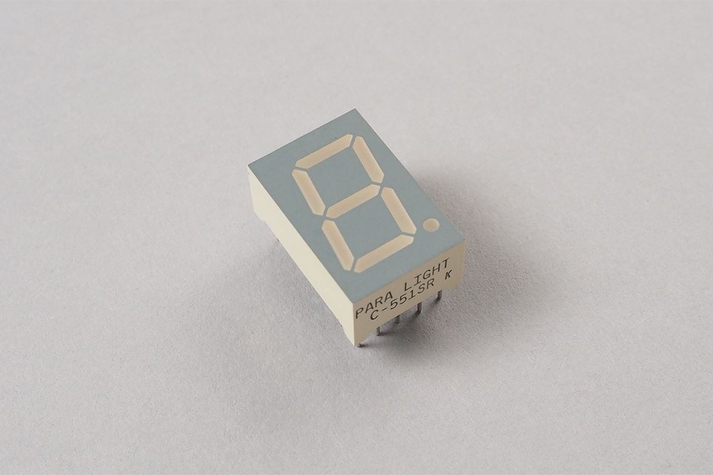
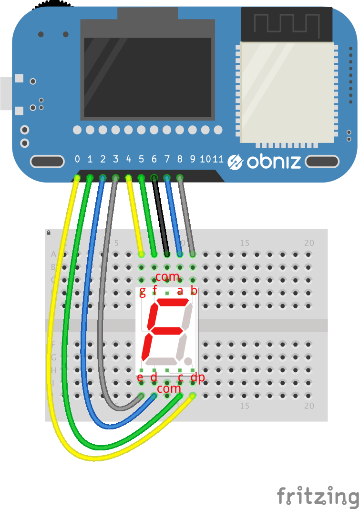

# 7SegmentLED
7セグメントLEDとは数字を表示するために作られたLEDが7個集まった部品です。
数字のための７個と、小数点用のドットがあるものが一般的です。

このライブラリではアノードコモン、カソードコモンの７セグメントLEDに対応しています。



## wired(obniz,{ a, b, c, d, e, f, g, dp, common, commonType})
a~gはセグメントのそれぞれに対応しています。
つないだobniz Boardのioを指定します。dpは小数点で、使わない場合は不要です。
commonType は "anode"/"cathode" のどちらかで、カソードコモンなら"cathode"と指定して下さい。指定しない場合は "cathode"となります。

一般的な７セグメントLEDの配置は以下のようになります。
部品により詳しくは利用する部品のデータシートを確認して下さい。

また、ただのLEDですので、通常は470オーム程度の抵抗がそれぞれのセグメントに必要になります。

```javascript
// Javascript Example
var seg = obniz.wired("7SegmentLED", {a:5, b: 6, c: 7, d:1, e:0, f:3, g:2, dp:8, common:4, commonType:"cathode"});
seg.print(7);
```




## print(number)
数字を表示します

.print(7) => 7

.print(89) => 9

```javascript
// Javascript Example
var seg = obniz.wired("7SegmentLED", {a:5, b: 6, c: 7, d:1, e:0, f:3, g:2, dp:8, common:4, commonType:"cathode"});

for(var i=0; i<10; i++){
  seg.print(i)
  await obniz.wait(1000);
}
```

## printRaw(number)
それぞれのLED直接操作します。
```javascript
// Javascript Example
var seg = obniz.wired("7SegmentLED", {a:7, b: 8, c: 1, d:2, e:3, f:5, g:4, dp:0, common:6, commonType:"cathode"});
seg.printRaw(0x77)
```

## off()
LED全体を消灯します。
```javascript
// Javascript Example
var seg = obniz.wired("7SegmentLED", {a:5, b: 6, c: 7, d:1, e:0, f:3, g:2, dp:8, common:4, commonType:"cathode"});

for(var i=0; i<10; i++){
  seg.print(i)
  await obniz.wait(1000);
}
seg.off();
```

## on()
LED全体を点灯します。（最後に表示していた数字が表示されます）
```javascript
// Javascript Example
var seg = obniz.wired("7SegmentLED", {a:5, b: 6, c: 7, d:1, e:0, f:3, g:2, dp:8, common:4, commonType:"cathode"});

seg.print(7);
while(true){
  seg.on();
  await obniz.wait(1000);
  seg.off();
  await obniz.wait(1000);
}
```

## dpState(show)
小数点の点灯/消灯をします
```javascript
// Javascript Example
var seg = obniz.wired("7SegmentLED", {a:5, b: 6, c: 7, d:1, e:0, f:3, g:2, dp:8, common:4, commonType:"cathode"});

seg.print(7);
while(true){
  seg.dpState(true);
  await obniz.wait(1000);
  seg.dpState(false);
  await obniz.wait(1000);
}
```
