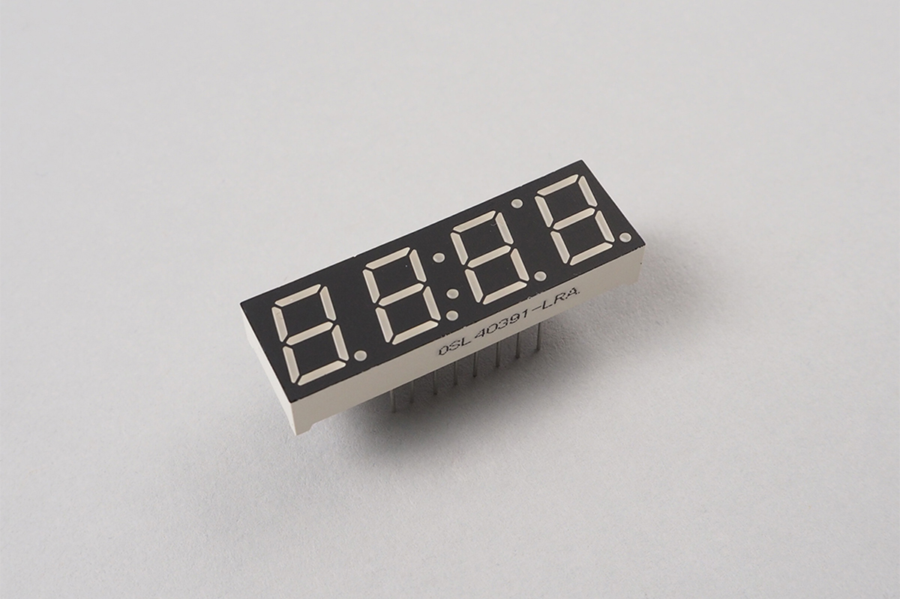

# 7SegmentLEDArray
7セグメントアレイです。7SegmentLEDを複数連ねてダイナミック点灯させることができます。
カソードコモン/アノードコモンに対応しています。



## wired(obniz, {segments:[]})
wiredで作った7セグメントのオブジェクトをsegmentsとして渡してください。最低１つは必要です。
それにより自動的にダイナミック点灯して、複数桁の数字などを表示できます。

```javascript
// Javascript Example
var seg0 = obniz.wired("7SegmentLED",  {a:7, b: 8, c: 1, d:2, e:3, f:5, g:4, dp:0, common:6, commonType:"cathode"});
var seg1 = obniz.wired("7SegmentLED", {a:7, b: 8, c: 1, d:2, e:3, f:5, g:4, dp:0, common:9, commonType:"cathode"});
var seg2 = obniz.wired("7SegmentLED", {a:7, b: 8, c: 1, d:2, e:3, f:5, g:4, dp:0, common:10, commonType:"cathode"});
var seg3 = obniz.wired("7SegmentLED",  {a:7, b: 8, c: 1, d:2, e:3, f:5, g:4, dp:0, common:11, commonType:"cathode"});

var segArray = obniz.wired("7SegmentLEDArray", {segments: [seg0, seg1, seg2, seg3]});
segArray.print(1234);

```


## print(number)

数字を表示します。小数以下は切り取られます。

```javascript
// Javascript Example
var seg0 = obniz.wired("7SegmentLED",  {a:7, b: 8, c: 1, d:2, e:3, f:5, g:4, dp:0, common:6, commonType:"cathode"});
var seg1 = obniz.wired("7SegmentLED", {a:7, b: 8, c: 1, d:2, e:3, f:5, g:4, dp:0, common:9, commonType:"cathode"});
var seg2 = obniz.wired("7SegmentLED", {a:7, b: 8, c: 1, d:2, e:3, f:5, g:4, dp:0, common:10, commonType:"cathode"});
var seg3 = obniz.wired("7SegmentLED",  {a:7, b: 8, c: 1, d:2, e:3, f:5, g:4, dp:0, common:11, commonType:"cathode"});

var segArray = obniz.wired("7SegmentLEDArray", {segments: [seg0, seg1, seg2, seg3]});
segArray.print(1234);
```

## off()
ディスプレイを消灯します。
```javascript
// Javascript Example
var seg0 = obniz.wired("7SegmentLED",  {a:7, b: 8, c: 1, d:2, e:3, f:5, g:4, dp:0, common:6, commonType:"cathode"});
var seg1 = obniz.wired("7SegmentLED", {a:7, b: 8, c: 1, d:2, e:3, f:5, g:4, dp:0, common:9, commonType:"cathode"});
var seg2 = obniz.wired("7SegmentLED", {a:7, b: 8, c: 1, d:2, e:3, f:5, g:4, dp:0, common:10, commonType:"cathode"});
var seg3 = obniz.wired("7SegmentLED",  {a:7, b: 8, c: 1, d:2, e:3, f:5, g:4, dp:0, common:11, commonType:"cathode"});

var segArray = obniz.wired("7SegmentLEDArray", {segments: [seg0, seg1, seg2, seg3]});

segArray.print(1234);
await obniz.wait(1000);
segArray.off();
await obniz.wait(1000);
segArray.on();
```

## on()
ディスプレイを点灯します。最後に表示していた数値が表示されます。
```javascript
// Javascript Example
var seg0 = obniz.wired("7SegmentLED",  {a:7, b: 8, c: 1, d:2, e:3, f:5, g:4, dp:0, common:6, commonType:"cathode"});
var seg1 = obniz.wired("7SegmentLED", {a:7, b: 8, c: 1, d:2, e:3, f:5, g:4, dp:0, common:9, commonType:"cathode"});
var seg2 = obniz.wired("7SegmentLED", {a:7, b: 8, c: 1, d:2, e:3, f:5, g:4, dp:0, common:10, commonType:"cathode"});
var seg3 = obniz.wired("7SegmentLED",  {a:7, b: 8, c: 1, d:2, e:3, f:5, g:4, dp:0, common:11, commonType:"cathode"});

var segArray = obniz.wired("7SegmentLEDArray", {segments: [seg0, seg1, seg2, seg3]});

segArray.print(1234);
await obniz.wait(1000);
segArray.off();
await obniz.wait(1000);
segArray.on();
```
