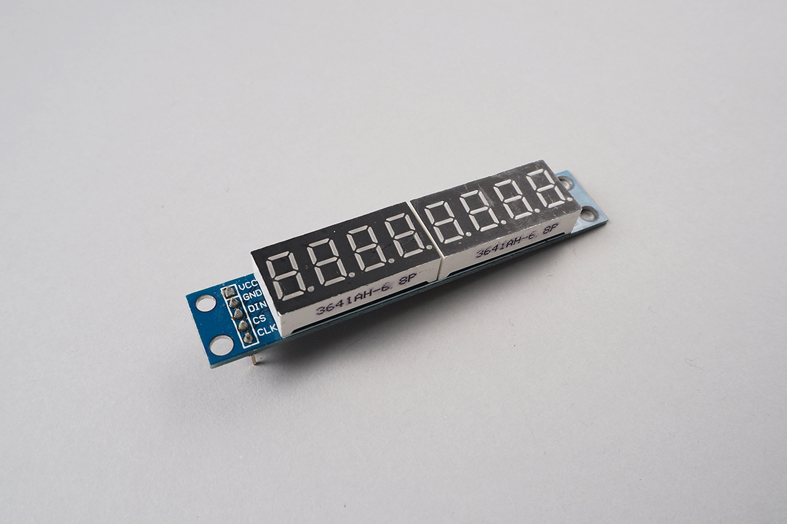
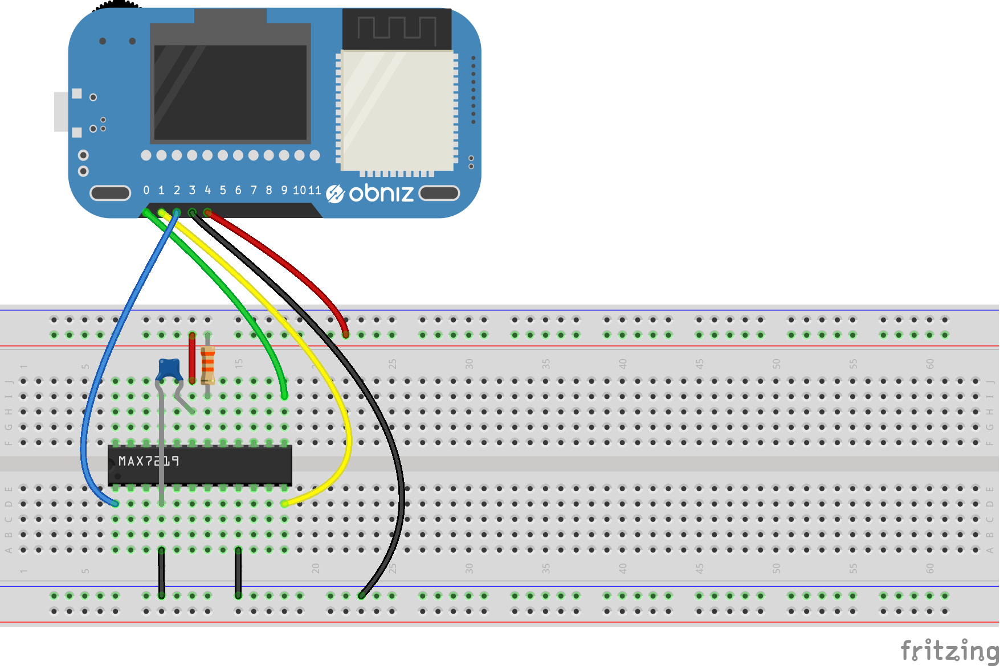
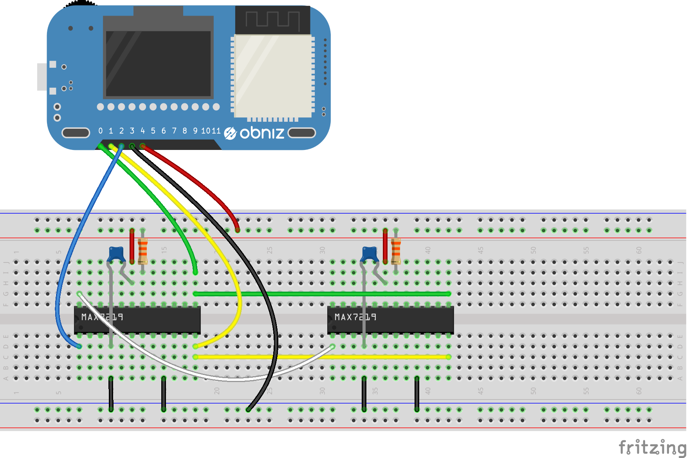

# 7SegmentLED_MAX7219
This class controls 7 segment LEDs connected to MAX7219.
One MAX7219 can drive up to 8 digits.
And chaining connections of MAX7219 is available.





## wired(obniz,  { clk, cs, din, gnd, vcc});

1. clk: Clock of SPI. connect to CLK of MAX7219
2. cs: Chip selection. connect to LOAD(CK) of MAX7219
3. din: MOSI of SPI. connect to DIN of MAX7219
4. gnd: GND
5. vcc: Power supply +5V

This is a example.


For example, 7segments are
[LED](http://akizukidenshi.com/catalog/goods/search.aspx?keyword=&maker=&goods=i&number=osl40391&name=%83J%83%5C%81%5B%83h&min_price=&max_price=&last_sdt=&sort=&style=T&search.x=0&search.y=0)

If you want to chain connection, connect DIN of next to DOUT of before.


```Javascript
// Javascript Example
const segment = obniz.wired("7SegmentLED_MAX7219", { clk:0, cs:1, din:2, gnd:3, vcc:4});
segment.init(1, 4); // one MAX7219 which has 4 digits
segment.setNumber(0,0,5,false); // show '5' on first digit. without dot.
```

## init(numberOfDisplays, digits)

Initialize LEDs.
numberOfDisplays is number of MAX7219.
digits is number of digits each MAX7219 has.
So, If 4 digits per MAX7219 and only one MAX7219 then `init(1,4)`

```Javascript
// Javascript Example
const segment = obniz.wired("7SegmentLED_MAX7219",  { clk:0, cs:1, din:2, gnd:3, vcc:4});
segment.init(1, 4);  // one MAX7219 which has 4 digits
```

## brightness(display,value)
Change brightness on specific digit.
value must be within 0 to 15.

```Javascript
// Javascript Example
const segment = obniz.wired("7SegmentLED_MAX7219",  { clk:0, cs:1, din:2, gnd:3, vcc:4});
segment.init(1, 4);
segment.brightness(0, 1)
segment.setNumber(0, 0, 5, false);
```

## brightnessAll(value)
Change all LED brightness.

```Javascript
// Javascript Example
const segment = obniz.wired("7SegmentLED_MAX7219",  { clk:0, cs:1, din:2, gnd:3, vcc:4});
segment.init(1, 4);
segment.brightnessAll(1)
segment.setNumber(0, 0, 5, false);
```

## setNumber(display,digit,number,dp)
change the digit of LED showing.

1. display: index of MAX7219.
2. digit: digit in specified MAX7219.
3. number: the number want to show
4. dp: dot to show.

value accept 

| Value        | description   | 
| ------------- |-------------| 
| 0 to 9      | number | 
| 'on'      | all on (=8) | 
| 'off'      | all off | 
| '-'      |  show "-" | 
| 'e'      |  show "E" | 
| 'h'      |  show "H" | 
| 'l'      |  show "L" | 
| 'p'      |  show "P" | 

```Javascript
// Javascript Example
const segment = obniz.wired("7SegmentLED_MAX7219",  { clk:0, cs:1, din:2, gnd:3, vcc:4});
segment.init(1, 4);
segment.setNumber(0,0,5,false);
segment.setNumber(0,1,"e",false);
segment.setNumber(0,2,"off",true);
```

## clear(display)
Clear specified MAX7219 connected LEDs

```Javascript
// Javascript Example
const segment = obniz.wired("7SegmentLED_MAX7219",  { clk:0, cs:1, din:2, gnd:3, vcc:4});
segment.init(1, 4);
segment.setNumber(0, 0, 5, false);
segment.setNumber(0,1,"e",false);
segment.clear(0)
```

## clearAll()
Clear all LEDs.

```Javascript
// Javascript Example
const segment = obniz.wired("7SegmentLED_MAX7219",  { clk:0, cs:1, din:2, gnd:3, vcc:4});
segment.init(1, 4);
segment.setNumber(0, 0, 5, false);
segment.clearall();
```

## test()
Send test command to MAX7219.

```Javascript
// Javascript Example
const segment = obniz.wired("7SegmentLED_MAX7219",  { clk:0, cs:1, din:2, gnd:3, vcc:4});
segment.init(1, 4);
segment.test();
```
