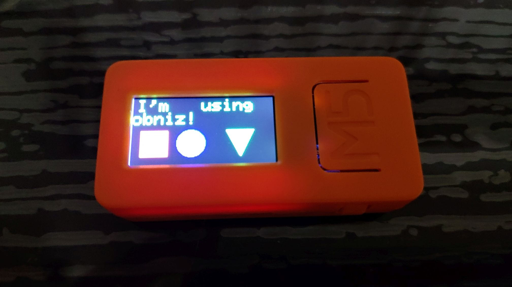

# ST7735S based 80x160 TFT 

Library for M5StickC 80x160px display that's using a ST7735S controller. This is a port of the [SainSmartTFT18LCD](../SainSmartTFT18LCD/README.md) part that's using a ST7735R controller. Functionality is basically the same with just some configuration adjustments.



[test.html](./test.html)

## Usage

When using the M5StickC, we don't need to specify any pins as the library will use the default connection shown in the table below. This library can also be used with just the display module and then we need to specify the pin connections

<table>
 <tr><td>GPIO15</td><td>GPIO13</td><td>GPIO23</td><td>GPIO18</td><td>GPIO5</td></tr>
 <tr><td>TFT_MOSI</td><td>TFT_CLK</td><td>TFT_DC</td><td>TFT_RST</td><td>TFT_CS</td></tr>
</table>

```javascript
lcd = obniz.wired("ST7735S", {});
```

---
**Note**
Important aspect to note is that when using M5StickC LCD power and LCD backlight power are controlled by a AXP192 PMIC. Before calling *obniz.wired("ST7735S", {});*, one should first connect to AXP192 and make sure the LCD and its backlight have power.

---

```javascript
var pmic = obniz.wired("AXP192", {sda:21, scl:22});
pmic.set3VLDO2_3();
pmic.enableLDO2_3();
```

## APIs

Please refer to [SainSmartTFT18LCD](../SainSmartTFT18LCD/README.md) for description of APIs.