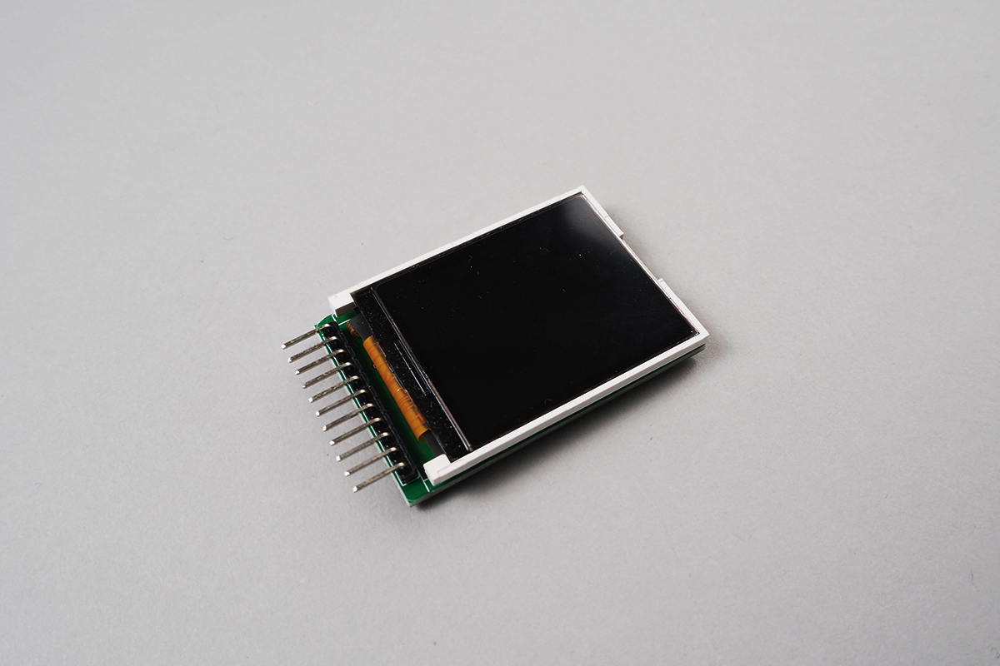
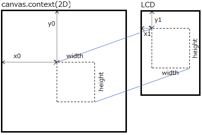

# SainSmartTFT18LCD


obniz Boardから[サインスマート 1.8インチ TFTカラーディスプレイ](https://www.amazon.co.jp/サインスマート（SainSmart）-カラー-LCD-インタフェース-MicroSD-付き-Arduino/dp/B008HWTVQ2/)に描画するためのライブラリです。ただし、このLCDに内蔵するMicroSDへのアクセスはサポートしていません。




このLCDはSPIインターフェースでアクセスしますが、obniz BoardではArduinoやRaspberry Piの様に高速に描画することはできません。また、LCDからデータを読み出すこともできません。  


[example.html](./example.html)

<iframe width="560" height="315" src="https://www.youtube.com/embed/lfdfvs3ldmE" frameborder="0" allow="autoplay; encrypted-media" allowfullscreen></iframe>

## wired(scl, sda, dc, res, cs {, vcc, gnd })

scl, sda, dc, res, cs, vcc, gndをobniz Boardに接続し、接続したioをプログラムで以下のように記述します。SD-CARDのアクセスに必要なピンは接続しません。


```javascript
// Javascript Example
lcd = obniz.wired('SainSmartTFT18LCD', { scl:4, sda:3, dc:2, res:1, cs:0, vcc:6, gnd:5 });
```


# 描画API

このパーツライブラリはLCDに描画するための様々なAPIを提供します。はじめに各APIに共通する事項から説明します。  

## `witdh`と`height`プロパティ

LCDのサイズは`witdh`と`height`プロパティから得ることができます。

```javascript
// Javascript Example
lcd = obniz.wired('SainSmartTFT18LCD', { scl:4, sda:3, dc:2, res:1, cs:0, vcc:6, gnd:5 });
console.log(lcd.width);  //128
console.log(lcd.height); //160 
```

## color16(r, g, b)

描画APIは引数`color`に16bitRGB値を指定します。`color16()`は、引数に指定した各色8bit値(0〜255)(つまり24bitRGB値)から減色して16bitRGB値を生成します。
```
16bitRGB値　=　赤(r)：8bit値の上位5bit、緑(g)：8bit値の上位6bit、青(b)：8bit値の上位5bit
```
また、引数`color`には後述する16bitRGB値プリセットカラーを指定することもできます。   
なお、後述する`raw()`と`rawBound()`で指定する`pixel`データは24bitRGB値を指定しますが、実際の描画は18bitRGB値に減色してLCDに描画します。


```javascript
// Javascript Example
let red = lcd.color16(255, 0, 0); //16bitRGB for red
lcd.drawRect(0, 0, lcd.width, lcd.height, red);
```

# 共通的な引数の説明

描画APIに共通する引数を以下に説明します。

|引数|説明|
|:---|:--|
|x<br>y|描画の起点となる座標を`x`と`y`で指定します。<br>2点を指定する関数の場合は`x0,y0`と`x1,y1`、3点を指定する関数の場合は`x0,y0`と`x1,y1`と`x2,y2`で指定します。|
|width<br>height|描画する図形の幅と高さを`width`と`height`で指定します。描画APIによっては`width`のみ、`height`のみ指定する関数もあります。|
|color|描画する色を16bitRGB値で指定します。後述する16bitRGB値プリセットカラーを指定することもできます。|
|radius|円を描画する場合の半径を指定します。|
|round|角丸矩形を描画する場合の角の丸みの半径を指定します。|
|backgroundColor|`dwarChar()`, `drawString()`において、描画する文字の背景色を指定します。`color`と同じ値を指定した場合は、背景を描画しません。つまり、透過モードとなります。|
|size|`dwarChar()`, `drawString()`において、描画する文字サイズの倍率を指定します。`1`：1倍（横5ピクセルx縦7ピクセルの文字）、`2`：2倍（横10ピクセルx縦14ピクセルの文字）、`3`：3倍、`4`：4倍、・・・。スムージングではなく、縦横単純にピクセルを等倍した文字を描画します。|
|||

# 描画API

## fillScreen(color)

LCD全体を`color`で塗りつぶします。次の`fillRect(0, 0, lcd.width, lcd.height, color)`と等価です。


## drawRect(x, y, width, height, color)<br>fillRect(x, y, width, height, color)

`drawRect()`は引数`x`, `y`, `width`, `height`に指定した矩形を`color`で描画します。
`fillRect()`は塗りつぶします。


## drawRoundRect(x, y, width, height, round, color)<br>fillRoundRect(x, y, width, height, round, color)

`drawRoundRect()`は引数`x`, `y`, `width`, `height`, `round`に指定した角丸矩形を`color`で描画します。
`fillRoundRect()`は塗りつぶします。


## drawCircle(x, y, radius, color)<br>fillCircle(x, y, radius, color)
  
`drawCircle()`は引数`x`, `y`を中心として半径`radius`の円を`color`で描画します。
`fillCircle()`は塗りつぶします。


## drawTriangle(x0, y0, x1, y1, x2, y2, color)<br>fillTriangle(x0, y0, x1, y1, x2, y2, color)
  
`drawTriangle()`は引数で指定した座標3点`x0`, `y0`と`x1`, `y1`と`x2`, `y2`を結ぶ三角形を`color`で描画します。
`fillTriangle()`は塗りつぶします。


## drawVLine(x, y, height, color)<br>drawHLine(x, y, width, color)
  
`drawVLine()`は引数`x`, `y`で指定した座標点から高さ`height`の垂直線を`color`で描画します。  
`drawHLine()`は引数`x`, `y`で指定した座標点から幅`width`の水平線を`color`で描画します。これらの関数は次の`drawLine()`より高速に描画します。


## drawLine(x0, y0, x1, y1, color)
  
`drawLine()`は引数で指定した座標2点`x0`, `y0`と`x1`, `y1`を`color`で直線を描画します。


```javascript
// Javascript Example
:  :
// 16bit-RGB color value
const BLACK   = 0x0000;
const BLUE    = 0x001F;
const RED     = 0xF800;
const GREEN   = 0x07E0;
const CYAN    = 0x07FF;
const MAGENTA = 0xF81F;
const YELLOW  = 0xFFE0;
const WHITE   = 0xFFFF;
lcd.fillScreen(BLACK);
lcd.drawRoundRect(0, 0, lcd.width, lcd.height, 8, RED);
lcd.fillRect(10, 10, lcd.width - 20, lcd.height - 20, MAGENTA);
await obniz.wait(1000);
lcd.drawRect(14, 14, lcd.width - 28, lcd.height - 28, GREEN);
lcd.fillRoundRect(20, 20, lcd.width - 40, lcd.height - 40, 4, CYAN);
await obniz.wait(1000);
lcd.drawCircle(0, 0, 100, BLACK);
lcd.fillCircle(64, 80, 40, YELLOW);
lcd.drawCircle(64, 80, 40, RED);
await obniz.wait(1000);
lcd.drawTriangle(64, 24, 24, lcd.height - 24, lcd.width - 24, lcd.height - 24, BLACK);
lcd.fillTriangle(64, lcd.height - 48, 24, 48, lcd.width - 24, 48, GREEN);
await obniz.wait(1000);
lcd.drawVLine(64, 10, lcd.height - 20, RED);
lcd.drawHLine(10, 80, lcd.width - 20, BLUE);
lcd.drawLine(10, 10, lcd.width - 10, lcd.height - 10, BLACK);
```


## drawChar(x, y, char, color, backgroundColor {, size })<br>drawString(x, y, string, color, backgroundColor {, size {, wrap }})
  
`drawChar()`は引数`x`, `y`で指定した座標点に引数`char`で指定したASCII文字を`color`で描画します。文字の背景色は`backgroundColor`で指定します。文字サイズを引数`size`で指定します。`size`を省略すると`1`と解釈します。

`drawString()`は文字列`string`を描画します。1文字づつ1文字分の横幅ピクセル数を`x`に加えながら、`drawChar()`を呼び出して描画します。  
引数`wrap`が`true`の場合は、`x`が`width`を超えた場合に、`y`に1文字分の縦幅ピクセル数を加え、`x=0`にします（つまり、改行します）。また、文字列中に改行コード`'\n'`が出現した場合は`wrap`の値によらず改行します。  
このように`drawString()`内では`x`と`y`を更新しながら文字列を描画して、最後の文字を描画し終わった後の`[x, y]`をリターンします。つまり、戻り値の`x`, `y`を再使用することで、`drawString()`を繰り返し呼ぶことができます。   
`size`を省略すると`1`と解釈します。`wrap`を省略すると`false`と解釈します。

```javascript
// Javascript Example
:  :
let white = lcd.color16(255, 255, 255);
let red = lcd.color16(255, 0, 0);
let yellow = lcd.color16(255, 255, 0);
lcd.drawChar(0, 0, '+', yellow, red, 4);
var x = 7, y = 32;
[x, y] = lcd.drawString(x, y, 'This is 1st draw.', white, white);
[x, y] = lcd.drawString(x, y, 'This is 2nd draw.', red, red, 2, true);
```


文字フォントを指定したり漢字や他言語などASCII文字以外を描画する場合は、一旦[Canvas](https://developer.mozilla.org/en-US/docs/Web/API/Canvas_API)に描画してから次の`drawContextBound()`や`drawContext()`を使用してLCDに転送してください。  


## drawContextBound(context, x0, y0, width, height, x1, y1)<br>drawContext(context)

`drawContextBound()`と`drawContext()`は`canvas.context(2D)`に描画した内容をLCDに転送します。転送元(**context**)と転送先(**LCD**)の関係を下図に示します。



転送元の`canvas.context`を引数`context`に、転送範囲を引数`x0`, `y0`, `width`, `height`に指定し、転送先のLCDの座標を引数`x1`, `y1`に指定します。`drawContextBound()`と`drawContext()`は`context`の内容を18bitRGB値に減色したカラーで描画します。  
`drawContext()`は`drawContextBound(context, 0, 0, lcd.width, lcd.height, 0, 0)`と等価です。  
ネットワーク環境にもよりますが`drawContext()`で約300ミリ秒を要します。なお、描画性能はネットワーク環境にも依存します。

```javascript
// Javascript
//<canvas id="canvas" width="128" height="160"></canvas>
let canvas = $('#canvas');
let context = canvas[0].getContext('2d');
context.fillStyle = '#FFFFCC';
context.fillRect(0, 0, lcd.width, lcd.height);
lcd.drawContext(context, false);
```

# その他のAPI

## setRotation(dir)

LCDの向きを`0`から`3`で指定します。初期化後は `0` (正位)です。
この設定後の描画から有効となり、描画済みの内容の向きは変わりません。


指定した向きに応じて`witdh`と`height`プロパティも再設定されます。また、描画の原点`{x:0, y:0}`は図の<font color="Red">赤点</font>の位置、つまり、向きに応じた左上となります。

```javascript
// Javascript Example
:  :
lcd.fillScreen(0); //clear screen to black
for (let n = 0; n < 4; n++) {
  lcd.setRotation(n);
  lcd.drawChar(0, 0, n+'', 0xFFFF, 0xFFFF, 2);
  lcd.fillCircle(2, 2, 2, 0xF800); // plots origin point to red
}
```

## setInversionOn()<br>setInversionOff()<br>setInversion(inversion)

LCD表示の色反転を制御します。LCD自体の機能です。  
`setInversionOn()`：LCD表示を色反転します。   
`setInversionOff()`：LCD表示の色反転を戻します。  
`setInversion(inversion)`：引数`inversion`が`true`の場合、LCD表示を色反転します。`false`の場合、LCD表示の色反転を戻します。


## rawBound(x, y, width, height, [pixel0, pixel1, pixel2, ...])<br>raw([pixel0, pixel1, pixel2, ...])

`rawBound()`は引数`x`, `y`, `width`, `height`に指定したLCDの範囲に`pixel0`, `pixel1`, `pixel2`, `...`の順に描画します。各ピクセルデータは24bitRGB値の配列を指定します。実際の描画は18bitRGB値に減色されます。  
`raw()`は`rawBound(0, 0, lcd.width, lcd.height, [pixel0, pixel1, pixel2, ...])`と等価でLCD全体を描画します。  
これらの関数は`drawPixel()`の繰り返しより遥かに高速で描画できますが、大量のデータ転送を必要とするため、`raw()`で約800ミリ秒を要します。なお、描画性能はネットワーク環境にも依存します。   
<font color="Red">注意）</font>`pixel[]`は24bitRGBカラー値を指定するため、後述の16bitRGB値プリセットカラーを指定すると色が異なります。

`raw()`1回当たりのLCDへの転送データ量：60Kbyte ≒ 128 x 160 x 3byte（18bitカラー値）


## プリセットカラー（16bitRGB値）

このライブラリで提供する16bitRGB値プリセットカラーを下表に示します。各描画APIの`color`引数に使用することができます。なお、プリセットカラーは24bitRGB値から16bitRGB値を生成しているため、名前は異なるが値(色)が同じ場合があります。

```javascript
// Javascript Example
:  :                 引数colorに「xxx.color.プリセット名」で指定します。
lcd.drawLine(0, 0, lcd.width, lcd.height, lcd.color.AliceBlue);
:  :
```

| preset name  | red | green | blue | sample | 
|:-----|:-----|:-----|:-----|:-----:|
|AliceBlue|0x1e|0x3e|0x1f|<font color="AliceBlue">■</font>|
|AntiqueWhite|0x1f|0x3a|0x1a|<font color="AntiqueWhite">■</font>|
|Aqua|0x00|0x3f|0x1f|<font color="Aqua">■</font>|
|Aquamarine|0x0f|0x3f|0x1a|<font color="Aquamarine">■</font>|
|Azure|0x1e|0x3f|0x1f|<font color="Azure">■</font>|
|Beige|0x1e|0x3d|0x1b|<font color="Beige">■</font>|
|Bisque|0x1f|0x39|0x18|<font color="Bisque">■</font>|
|Black|0x00|0x00|0x00|<font color="Black">■</font>|
|BlanchedAlmond|0x1f|0x3a|0x19|<font color="BlanchedAlmond">■</font>|
|Blue|0x00|0x00|0x1f|<font color="Blue">■</font>|
|BlueViolet|0x11|0x0a|0x1c|<font color="BlueViolet">■</font>|
|Brown|0x14|0x0a|0x05|<font color="Brown">■</font>|
|BurlyWood|0x1b|0x2e|0x10|<font color="BurlyWood">■</font>|
|CadetBlue|0x0b|0x27|0x14|<font color="CadetBlue">■</font>|
|Chartreuse|0x0f|0x3f|0x00|<font color="Chartreuse">■</font>|
|Chocolate|0x1a|0x1a|0x03|<font color="Chocolate">■</font>|
|Coral|0x1f|0x1f|0x0a|<font color="Coral">■</font>|
|CornflowerBlue|0x0c|0x25|0x1d|<font color="CornflowerBlue">■</font>|
|Cornsilk|0x1f|0x3e|0x1b|<font color="Cornsilk">■</font>|
|Crimson|0x1b|0x05|0x07|<font color="Crimson">■</font>|
|Cyan|0x00|0x3f|0x1f|<font color="Cyan">■</font>|
|DarkBlue|0x00|0x00|0x11|<font color="DarkBlue">■</font>|
|DarkCyan|0x00|0x22|0x11|<font color="DarkCyan">■</font>|
|DarkGoldenRod|0x17|0x21|0x01|<font color="DarkGoldenRod">■</font>|
|DarkGray|0x15|0x2a|0x15|<font color="DarkGray">■</font>|
|DarkGreen|0x00|0x19|0x00|<font color="DarkGreen">■</font>|
|DarkKhaki|0x17|0x2d|0x0d|<font color="DarkKhaki">■</font>|
|DarkMagenta|0x11|0x00|0x11|<font color="DarkMagenta">■</font>|
|DarkOliveGreen|0x0a|0x1a|0x05|<font color="DarkOliveGreen">■</font>|
|DarkOrange|0x1f|0x23|0x00|<font color="DarkOrange">■</font>|
|DarkOrchid|0x13|0x0c|0x19|<font color="DarkOrchid">■</font>|
|DarkRed|0x11|0x00|0x00|<font color="DarkRed">■</font>|
|DarkSalmon|0x1d|0x25|0x0f|<font color="DarkSalmon">■</font>|
|DarkSeaGreen|0x11|0x2f|0x11|<font color="DarkSeaGreen">■</font>|
|DarkSlateBlue|0x09|0x0f|0x11|<font color="DarkSlateBlue">■</font>|
|DarkSlateGray|0x05|0x13|0x09|<font color="DarkSlateGray">■</font>|
|DarkTurquoise|0x00|0x33|0x1a|<font color="DarkTurquoise">■</font>|
|DarkViolet|0x12|0x00|0x1a|<font color="DarkViolet">■</font>|
|DeepPink|0x1f|0x05|0x12|<font color="DeepPink">■</font>|
|DeepSkyBlue|0x00|0x2f|0x1f|<font color="DeepSkyBlue">■</font>|
|DimGray|0x0d|0x1a|0x0d|<font color="DimGray">■</font>|
|DodgerBlue|0x03|0x24|0x1f|<font color="DodgerBlue">■</font>|
|FireBrick|0x16|0x08|0x04|<font color="FireBrick">■</font>|
|FloralWhite|0x1f|0x3e|0x1e|<font color="FloralWhite">■</font>|
|ForestGreen|0x04|0x22|0x04|<font color="ForestGreen">■</font>|
|Fuchsia|0x1f|0x00|0x1f|<font color="Fuchsia">■</font>|
|Gainsboro|0x1b|0x37|0x1b|<font color="Gainsboro">■</font>|
|GhostWhite|0x1f|0x3e|0x1f|<font color="GhostWhite">■</font>|
|Gold|0x1f|0x35|0x00|<font color="Gold">■</font>|
|GoldenRod|0x1b|0x29|0x04|<font color="GoldenRod">■</font>|
|Gray|0x10|0x20|0x10|<font color="Gray">■</font>|
|Green|0x00|0x20|0x00|<font color="Green">■</font>|
|GreenYellow|0x15|0x3f|0x05|<font color="GreenYellow">■</font>|
|HoneyDew|0x1e|0x3f|0x1e|<font color="HoneyDew">■</font>|
|HotPink|0x1f|0x1a|0x16|<font color="HotPink">■</font>|
|IndianRed|0x19|0x17|0x0b|<font color="IndianRed">■</font>|
|Indigo|0x09|0x00|0x10|<font color="Indigo">■</font>|
|Ivory|0x1f|0x3f|0x1e|<font color="Ivory">■</font>|
|Khaki|0x1e|0x39|0x11|<font color="Khaki">■</font>|
|Lavender|0x1c|0x39|0x1f|<font color="Lavender">■</font>|
|LavenderBlush|0x1f|0x3c|0x1e|<font color="LavenderBlush">■</font>|
|LawnGreen|0x0f|0x3f|0x00|<font color="LawnGreen">■</font>|
|LemonChiffon|0x1f|0x3e|0x19|<font color="LemonChiffon">■</font>|
|LightBlue|0x15|0x36|0x1c|<font color="LightBlue">■</font>|
|LightCoral|0x1e|0x20|0x10|<font color="LightCoral">■</font>|
|LightCyan|0x1c|0x3f|0x1f|<font color="LightCyan">■</font>|
|LightGoldenRodYellow|0x1f|0x3e|0x1a|<font color="LightGoldenRodYellow">■</font>|
|LightGray|0x1a|0x34|0x1a|<font color="LightGray">■</font>|
|LightGreen|0x12|0x3b|0x12|<font color="LightGreen">■</font>|
|LightPink|0x1f|0x2d|0x18|<font color="LightPink">■</font>|
|LightSalmon|0x1f|0x28|0x0f|<font color="LightSalmon">■</font>|
|LightSeaGreen|0x04|0x2c|0x15|<font color="LightSeaGreen">■</font>|
|LightSkyBlue|0x10|0x33|0x1f|<font color="LightSkyBlue">■</font>|
|LightSlateGray|0x0e|0x22|0x13|<font color="LightSlateGray">■</font>|
|LightSteelBlue|0x16|0x31|0x1b|<font color="LightSteelBlue">■</font>|
|LightYellow|0x1f|0x3f|0x1c|<font color="LightYellow">■</font>|
|Lime|0x00|0x3f|0x00|<font color="Lime">■</font>|
|LimeGreen|0x06|0x33|0x06|<font color="LimeGreen">■</font>|
|Linen|0x1f|0x3c|0x1c|<font color="Linen">■</font>|
|Magenta|0x1f|0x00|0x1f|<font color="Magenta">■</font>|
|Maroon|0x10|0x00|0x00|<font color="Maroon">■</font>|
|MediumAquaMarine|0x0c|0x33|0x15|<font color="MediumAquaMarine">■</font>|
|MediumBlue|0x00|0x00|0x19|<font color="MediumBlue">■</font>|
|MediumOrchid|0x17|0x15|0x1a|<font color="MediumOrchid">■</font>|
|MediumPurple|0x12|0x1c|0x1b|<font color="MediumPurple">■</font>|
|MediumSeaGreen|0x07|0x2c|0x0e|<font color="MediumSeaGreen">■</font>|
|MediumSlateBlue|0x0f|0x1a|0x1d|<font color="MediumSlateBlue">■</font>|
|MediumSpringGreen|0x00|0x3e|0x13|<font color="MediumSpringGreen">■</font>|
|MediumTurquoise|0x09|0x34|0x19|<font color="MediumTurquoise">■</font>|
|MediumVioletRed|0x18|0x05|0x10|<font color="MediumVioletRed">■</font>|
|MidnightBlue|0x03|0x06|0x0e|<font color="MidnightBlue">■</font>|
|MintCream|0x1e|0x3f|0x1f|<font color="MintCream">■</font>|
|MistyRose|0x1f|0x39|0x1c|<font color="MistyRose">■</font>|
|Moccasin|0x1f|0x39|0x16|<font color="Moccasin">■</font>|
|NavajoWhite|0x1f|0x37|0x15|<font color="NavajoWhite">■</font>|
|Navy|0x00|0x00|0x10|<font color="Navy">■</font>|
|OldLace|0x1f|0x3d|0x1c|<font color="OldLace">■</font>|
|Olive|0x10|0x20|0x00|<font color="Olive">■</font>|
|OliveDrab|0x0d|0x23|0x04|<font color="OliveDrab">■</font>|
|Orange|0x1f|0x29|0x00|<font color="Orange">■</font>|
|OrangeRed|0x1f|0x11|0x00|<font color="OrangeRed">■</font>|
|Orchid|0x1b|0x1c|0x1a|<font color="Orchid">■</font>|
|PaleGoldenRod|0x1d|0x3a|0x15|<font color="PaleGoldenRod">■</font>|
|PaleGreen|0x13|0x3e|0x13|<font color="PaleGreen">■</font>|
|PaleTurquoise|0x15|0x3b|0x1d|<font color="PaleTurquoise">■</font>|
|PaleVioletRed|0x1b|0x1c|0x12|<font color="PaleVioletRed">■</font>|
|PapayaWhip|0x1f|0x3b|0x1a|<font color="PapayaWhip">■</font>|
|PeachPuff|0x1f|0x36|0x17|<font color="PeachPuff">■</font>|
|Peru|0x19|0x21|0x07|<font color="Peru">■</font>|
|Pink|0x1f|0x30|0x19|<font color="Pink">■</font>|
|Plum|0x1b|0x28|0x1b|<font color="Plum">■</font>|
|PowderBlue|0x16|0x38|0x1c|<font color="PowderBlue">■</font>|
|Purple|0x10|0x00|0x10|<font color="Purple">■</font>|
|RebeccaPurple|0x0c|0x0c|0x13|<font color="RebeccaPurple">■</font>|
|Red|0x1f|0x00|0x00|<font color="Red">■</font>|
|RosyBrown|0x17|0x23|0x11|<font color="RosyBrown">■</font>|
|RoyalBlue|0x08|0x1a|0x1c|<font color="RoyalBlue">■</font>|
|SaddleBrown|0x11|0x11|0x02|<font color="SaddleBrown">■</font>|
|Salmon|0x1f|0x20|0x0e|<font color="Salmon">■</font>|
|SandyBrown|0x1e|0x29|0x0c|<font color="SandyBrown">■</font>|
|SeaGreen|0x05|0x22|0x0a|<font color="SeaGreen">■</font>|
|SeaShell|0x1f|0x3d|0x1d|<font color="SeaShell">■</font>|
|Sienna|0x14|0x14|0x05|<font color="Sienna">■</font>|
|Silver|0x18|0x30|0x18|<font color="Silver">■</font>|
|SkyBlue|0x10|0x33|0x1d|<font color="SkyBlue">■</font>|
|SlateBlue|0x0d|0x16|0x19|<font color="SlateBlue">■</font>|
|SlateGray|0x0e|0x20|0x12|<font color="SlateGray">■</font>|
|Snow|0x1f|0x3e|0x1f|<font color="Snow">■</font>|
|SpringGreen|0x00|0x3f|0x0f|<font color="SpringGreen">■</font>|
|SteelBlue|0x08|0x20|0x16|<font color="SteelBlue">■</font>|
|Tan|0x1a|0x2d|0x11|<font color="Tan">■</font>|
|Teal|0x00|0x20|0x10|<font color="Teal">■</font>|
|Thistle|0x1b|0x2f|0x1b|<font color="Thistle">■</font>|
|Tomato|0x1f|0x18|0x08|<font color="Tomato">■</font>|
|Turquoise|0x08|0x38|0x1a|<font color="Turquoise">■</font>|
|Violet|0x1d|0x20|0x1d|<font color="Violet">■</font>|
|Wheat|0x1e|0x37|0x16|<font color="Wheat">■</font>|
|White|0x1f|0x3f|0x1f|<font color="White">■</font>|
|WhiteSmoke|0x1e|0x3d|0x1e|<font color="WhiteSmoke">■</font>|
|Yellow|0x1f|0x3f|0x00|<font color="Yellow">■</font>|
|YellowGreen|0x13|0x33|0x06|<font color="YellowGreen">■</font>|
