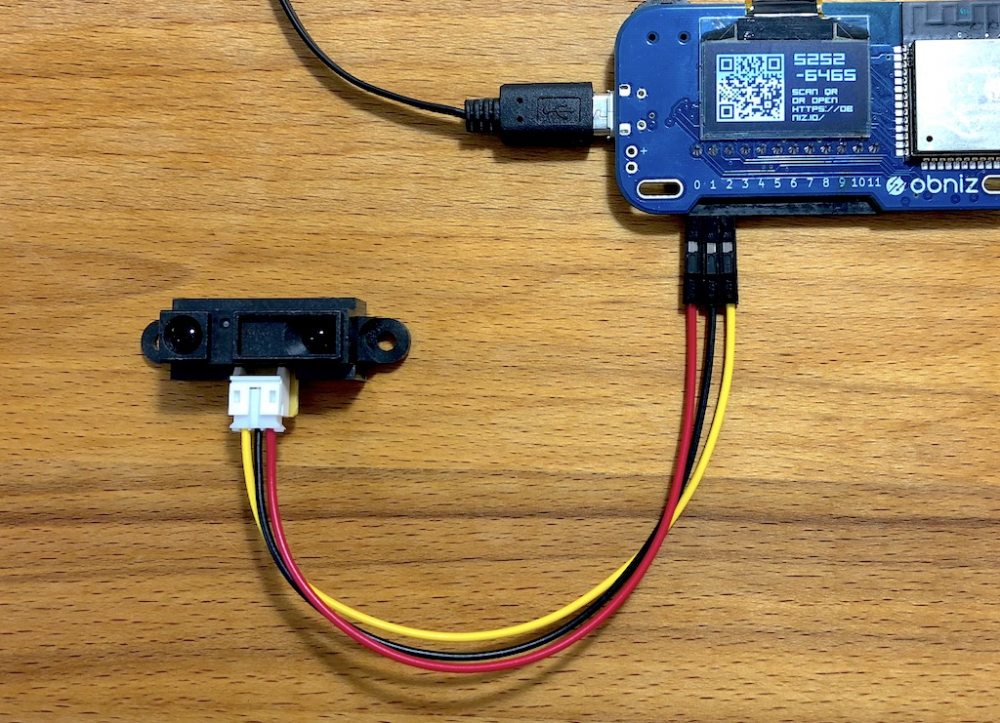

# GP2Y0A21YK0F
Infrared Distance Measurement Unit.
This unit output voltage regarding measured distance.




## wired(obniz, {vcc, gnd, signal})


```javascript
// Javascript Example
var sensor = obniz.wired("GP2Y0A21YK0F", {vcc:0, gnd:1, signal:2})
sensor.start(function( distance ){
  console.log("distance " + distance + " mm")
})
```

## start(callback(distance))
measure distance continurously.
Callback will be called when distance changed.
default return unit is "mm". change by calling .unit()
```javascript
// Javascript Example
var sensor = obniz.wired("GP2Y0A21YK0F", {vcc:0, gnd:1, signal:2})
sensor.start(function( distance ){
  console.log("distance " + distance + " mm")
})
```

## [await] getWait()

Measure distance once.

```javascript
// Javascript Example
var sensor = obniz.wired("GP2Y0A21YK0F", {vcc:0, gnd:1, signal:2})

while (1) {
  var val = await sensor.getWait();
  console.log("distance " + val);
  await obniz.wait(1000);
}
    
```
    
## unit(unit)
change unit

1. "mm"(default)
2. "inch"

are available

```javascript
// Javascript Example
var sensor = obniz.wired("GP2Y0A21YK0F", {vcc:0, gnd:1, signal:2})
sensor.unit("inch")
sensor.start(function( distance ){
  console.log("distance " + distance + " inch")
})
```

