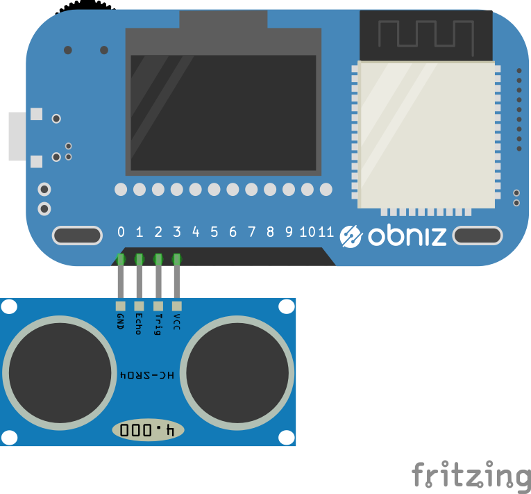

# HC-SR04
Ultrasonic Distance Measurement Unit.


## wired(obniz, {vcc, trigger, echo, gnd})


```javascript
// Javascript Example
var hcsr04 = obniz.wired("HC-SR04", {gnd:0, echo:1, trigger:2, vcc:3});
hcsr04.measure(function( distance ){
  console.log("distance " + distance + " mm")
})
```

## measure(callback(distance))
measure distance.
default return unit is "mm". change by calling .unit()
```javascript
// Javascript Example

var hcsr04 = obniz.wired("HC-SR04", {gnd:0, echo:1, trigger:2, vcc:3});
hcsr04.measure(function( distance ){
  onsole.log("distance " + distance + " mm")
})
```

## [await] measureWait()
This is async/await version of measure()

```javascript
// Javascript Example
const hcsr04 = obniz.wired("HC-SR04", {gnd:0, echo:1, trigger:2, vcc:3});
while(true) {
  let avg = 0;
  let count = 0;
  for (let i=0; i<3; i++) { // measure three time. and calculate average
    const val = await hcsr04.measureWait();
    if (val) {
      count++;
      avg += val;
    }
  }
  if (count > 1) {
    avg /= count;
  }
  console.log(avg);
  await obniz.wait(100);
}
```

## temp
The speed of ultrasonic depends on temperature.
By default calculation temp is 15 degree(Celsius). Change this to get more accurate result.
```javascript
// Javascript Example
var hcsr04 = obniz.wired("HC-SR04", {gnd:0, echo:1, trigger:2, vcc:3});
hcsr04.temp = 36;
const distance = await hcsr04.measureWait();
console.log("distance " + distance + " mm")
```

## reset_alltime
Some HC-SR04 needs power reset after measure.
set true to this property to automatic power reset after each measurement.
```javascript
// Javascript Example
var hcsr04 = obniz.wired("HC-SR04", {gnd:0, echo:1, trigger:2, vcc:3});
hcsr04.reset_alltime = true;
const distance = await hcsr04.measureWait();
console.log("distance " + distance + " mm")
```

## unit(unit)
change unit

1. "mm"(default)
2. "inch"

are available

```javascript
// Javascript Example
var hcsr04 = obniz.wired("HC-SR04", {gnd:0, echo:1, trigger:2, vcc:3});
hcsr04.unit("inch")
hcsr04.measure(function( distance ){
  console.log("distance " + distance + " inch")
})
```