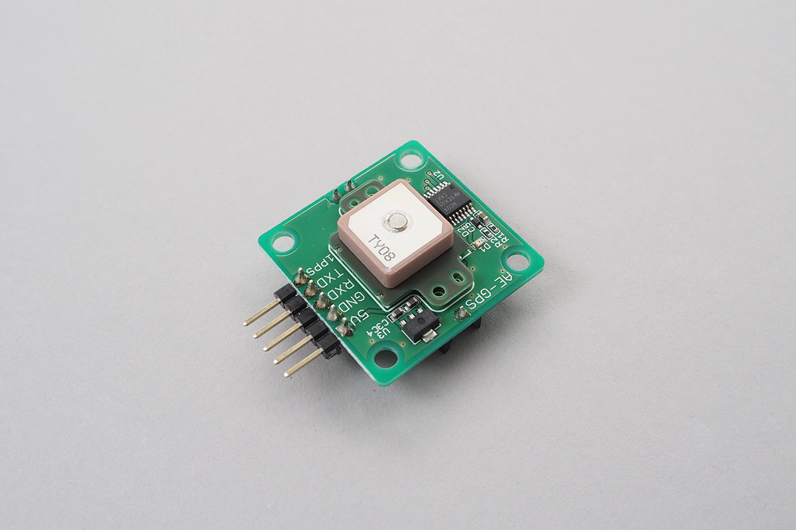

# GYSFDMAXB

Library for GPS Module [GYSFDMAXB](https://www.yuden.co.jp/jp/product/category/module/GYSFDMAXB.html).



## wired(vcc, gnd, txd, rxd {, Opps })

Connect vcc(5v), gnd, txd, rxd, Opps to an obniz Board.
And specify the pins on program.

```javascript
// Javascript Example
let gps = obniz.wired("GYSFDMAXB", { vcc:7, gnd:8, txd:9, rxd:10, Opps:11 });
let sentence = gps.readSentence();
```

This module start blinking LED and output pulse at 1PPS while receiving GPS signal.

Opps is optional.

## start1pps(callback)

callback will be called every 1pps regarding Opps.

```javascript
// Javascript Example
let gps = obniz.wired("GYSFDMAXB", { vcc:7, gnd:8, txd:9, rxd:10, Opps:11 });
gps.start1pps(function() {
  console.log("1pps received.");
});
```


## getGpsInfo({editedData})

Retriving infomation from received NMEA sentences.
Same information will be set to gpsInfo property.

`editedData` is optional.

```javascript
// Javascript Example
let gps = obniz.wired("GYSFDMAXB", { vcc:7, gnd:8, txd:9, rxd:10, Opps:11 });
let gpsInfo = gps.getGpsInfo();
console.log(gpsInfo);

// Output example
gpsInfo: Object
  utc: Sat Sep 08 2018 22:42:14 GMT+0900 (JST)
  status: A [Active]	// Active or Void
  fixMode: 3 [3D]	// 1:Fix not available, 2:2D, 3:3D
  gpsQuality: 2 [DGPS fix]	// 0:Invalid, 1:GPS fix, 2:DGPS fix
  latitude: 35.999999
  longitude: 139.999999
  pdop: 1.24	// PDOP: Position Dilution of Precision
  hdop: 0.97	// HDOP: Horizontal Dilution of Precision
  vdop: 0.77	// VDOP: Vertical Dilution of Position
  altitude: 57.4[M]
  declination: NaN	// Magnetic declination
  direction: 236.34
  speed: 0.02[km/h]
  satelliteInfo: Object
    inUse: 11
    inView: 15
    satellites: Array (15)
      [0]: {id: 194,	elevation: 87,	azimuth: 261,	snr: 31[dB],	inUse: true, }
      [1]: {id: 25,	elevation: 63,	azimuth: 179,	snr: 34[dB],	inUse: true, }
      [2]: {id: 12,	elevation: 59,	azimuth: 67,	snr: 20[dB],	inUse: true, }
      [3]: {id: 193,	elevation: 59,	azimuth: 210,	snr: 37[dB],	inUse: true, }
      [4]: {id: 10,	elevation: 55,	azimuth: 256,	snr: 40[dB],	inUse: true, }
      [5]: {id: 42,	elevation: 48,	azimuth: 170,	snr: 31[dB],	inUse: false, }
      [6]: {id: 20,	elevation: 43,	azimuth: 211,	snr: 35[dB],	inUse: true, }
      [7]: {id: 32,	elevation: 41,	azimuth: 315,	snr: 46[dB],	inUse: true, }
      [8]: {id: 24,	elevation: 35,	azimuth: 57,	snr: NaN[dB],	inUse: false, }
      [9]: {id: 15,	elevation: 25,	azimuth: 120,	snr: 23[dB],	inUse: true, }
      [10]: {id: 14,	elevation: 19,	azimuth: 307,	snr: 30[dB],	inUse: true, }
      [11]: {id: 195,	elevation: 18,	azimuth: 168,	snr: 28[dB],	inUse: true, }
      [12]: {id: 31,	elevation: 12,	azimuth: 260,	snr: 24[dB],	inUse: true, }
      [13]: {id: 19,	elevation: 5,	azimuth: 46,	snr: NaN[dB],	inUse: false, }
      [14]: {id: 29,	elevation: 1,	azimuth: 160,	snr: NaN[dB],	inUse: false, }
  sentences: Set {GPGGA, GPGSA, GPGSV, GPRMC, GPVTG, GPZDA, }

```

## readSentence()

Read and analyze one sentence (one line) from received ([NMEA Format](https://ja.wikipedia.org/wiki/NMEA_0183)).
Empty string will be returned when no data received.

This method is useful only when NMEA direct use.

One sentence will appear in one string.
**Example:** "$GPGGA,134214.000,3599.9999,N,13999.9999,E,2,11,0.97,57.4,M,39.5,M,,\*5C"

```javascript
// Javascript Example
let gps = obniz.wired("GYSFDMAXB", { vcc:7, gnd:8, txd:9, rxd:10, Opps:11 });
let sentence = gps.readSentence();
```

## getEditedData()

Get GPS info object from received NMEA format.
Same data is set to editedData property.

- editedData.enable : indicate having datas below
- editedData.GPGGA : GPGGA sentence data
- editedData.GPGLL : GPGLL sentence data
- editedData.GPGSA : GPGSA sentence data
- editedData.GPGSV[ ] : GPGSV array of sentence data
- editedData.GPRMC : GPRMC sentence data
- editedData.GPVTG : GPVTG sentence data
- editedData.GPZDA : GPZDA sentence data
- editedData.xxx : otherxxx sentence data
- editedData.timestamp : GPZDA sentence data's date(Date object)

**Example:** $GPGGA,134214.000,3599.9999,N,13999.9999,E,2,11,0.97,57.4,M,39.5,M,,\*5C
<br>
["$GPGGA","134214.000","3599.9999","N","13999.9999","E","2","11","0.97","57.4","M","39.5","M","","*5C"]

```javascript
// Javascript Example
let gps = obniz.wired("GYSFDMAXB", { vcc:7, gnd:8, txd:9, rxd:10, Opps:11 });

function mainLoop() {
  var data = gps.getEditedData();
  if (data.enable) {
    if (data.GPGGA)    console.log(data.GPGGA.join(","));
    if (data.GPGLL)    console.log(data.GPGLL.join(","));
    if (data.GPGSA)    console.log(data.GPGSA.join(","));
    if (data.GPGSV[0]) console.log(data.GPGSV[0].join(","));
    if (data.GPGSV[1]) console.log(data.GPGSV[1].join(","));
    if (data.GPGSV[2]) console.log(data.GPGSV[2].join(","));
    if (data.GPGSV[3]) console.log(data.GPGSV[3].join(","));
    if (data.GPRMC)    console.log(data.GPRMC.join(","));
    if (data.GPVTG)    console.log(data.GPVTG.join(","));
    if (data.GPZDA)    console.log(data.GPZDA.join(","));
    if (data.PMTK010)  console.log(data.PMTK010.join(","));
    if (data.PMTK011)  console.log(data.PMTK011.join(","));
  }
  setTimeout(mainLoop, 100);
}

setTimeout(mainLoop, 10);
```


## unit conversion methods

Data conversion methods for NMEA format.

- nmea2dms(value)<br>
Latitude/Longitude of NMEA to DMS format string (999°99'99.9")

- nmea2dm(value)<br>
Latitude/Longitude of NMEA to DM format string (999°99.9999')

- nmea2dd(value)<br>
Latitude/Longitude of NMEA to DD format string (999.999999)

- nmea2s(value)<br>
Latitude/Longitude of NMEA to S format string (0.999999999)


```javascript
// Javascript Example

  let d = gps.getEditedData();
  if (d.enable) {
    if (d.GPGGA) {
      let p = d.GPGGA;
      if (p[6] != "0") {
        //Longitude
        let longitude = gps.nmea2dd(p[2]);
        //Latitude
        let latitude = gps.nmea2dd(p[4]);

        ・・・

      }
    }
  }

```

[Reference](https://www.petitmonte.com/robot/howto_gysfdmaxb.html)

---

Merged Pull Request

[https://github.com/obniz/obniz/pull/127](https://github.com/obniz/obniz/pull/127)

[https://github.com/obniz/obniz/pull/132](https://github.com/obniz/obniz/pull/132)
