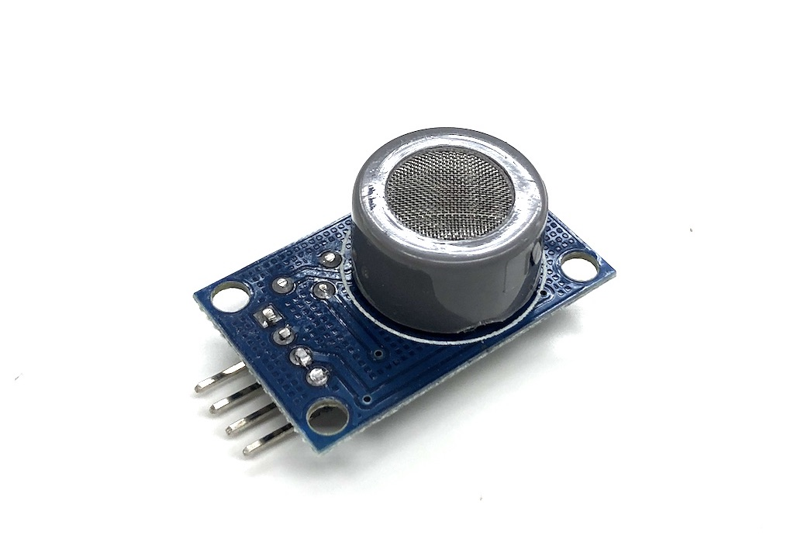

# MQ9
High sensitve multiple gas sensor especially for carbon monoxide and CH4，LPG.

If you are using just MQ9(not module), Then prepare load resistance around 2k ohm.

This sensor need pre-heating. To get stable output, wait for heat-up, minimum 2 minutes.

This library get analog voltage from a sensor. Output voltage will increase regarding gas level. When you need actual level (ppm), you should do calibrate the sensor and prepare a formula.



## wired(obniz,  { vcc, gnd, do, ao});

name | type | required | default | description
--- | --- | --- | --- | ---
vcc | `number(obniz Board io)` | no |  &nbsp; | VCC or H on MQ9.
gnd | `number(obniz Board io)` | no |  &nbsp; | GND or H on MQ9.
do | `number(obniz Board io)` | no |  &nbsp; | digital out
ao | `number(obniz Board io)` | no | &nbsp;  | analog out


```Javascript
// Javascript Example
var mq9 = obniz.wired("MQ9", {vcc:3, gnd:2, do:1, ao:0});
await mq9.heatWait();
mq9.onchangeanalog = function(voltage) {
  console.log(voltage);
}
```

## startHeating()

It start heating.

```Javascript
// Javascript Example
var mq9 = obniz.wired("MQ9", {vcc:3, gnd:2, do:1, ao:0});
mq9.startHeating();
```

## [await] heatWait(sec: number)

It start heating and wait for a while.
You can update wait time.

name | type | required | default | description
--- | --- | --- | --- | ---
sec | `number` | no | 120 | seconds for wait

```Javascript
// Javascript Example
var mq9 = obniz.wired("MQ9", {vcc:3, gnd:2, do:1, ao:0});
await mq9.heatWait();
mq9.onchangeanalog = function(voltage) {
  console.log(voltage);
}
```

## onchangeanalog = function(voltage: number)

Specified function will be called every voltage change.

```Javascript
// Javascript Example
var mq9 = obniz.wired("MQ9", {vcc:3, gnd:2, do:1, ao:0});
await mq9.heatWait();
mq9.onchangeanalog = function(voltage) {
  console.log(voltage);
}
```

## onexceedvoltage = function(voltage: number)

Specified function will be called only when a voltage exceed voltageLimit variable.

```Javascript
// Javascript Example
var mq9 = obniz.wired("MQ9", {vcc:3, gnd:2, do:1, ao:0});
await mq9.heatWait();
mq9.voltageLimit = 1.0
mq9.onexceedvoltage = function(voltage) {
  console.log(voltage);
}
```

## voltageLimit = number

It define the level of onexceedvoltage call.

```Javascript
// Javascript Example
var mq9 = obniz.wired("MQ9", {vcc:3, gnd:2, do:1, ao:0});
await mq9.heatWait();
mq9.voltageLimit = 1.0
mq9.onexceedvoltage = function(voltage) {
  console.log(voltage);
}
```

## onchangedigital = function(voltage: number)

This function only be called when do was specified at wired function.
do output high/low regarding output. It compared in a module.
This function will be called every change of do.

```Javascript
// Javascript Example
var mq9 = obniz.wired("MQ9", {vcc:3, gnd:2, do:1, ao:0});
await mq9.heatWait();
mq9.onchangedigital = function(value) {
  console.log(value);
}
```