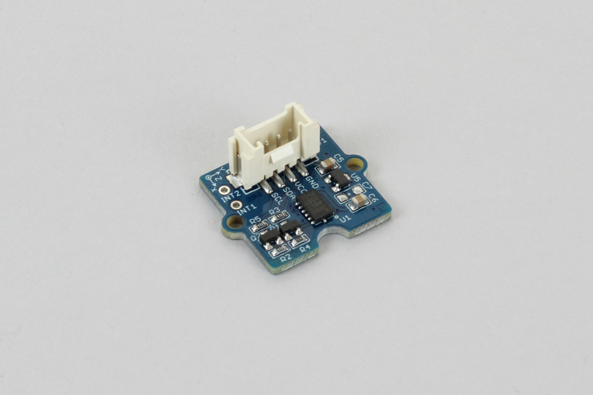

# Grove_3AxisAccelerometer

Grove 3軸加速度センサモジュール[Grove - 3 Axis Digital Accelerometer(±16g)](http://wiki.seeedstudio.com/Grove-3-Axis_Digital_Accelerometer-16g/)からX,Y,Z軸の加速度を取得します。



## wired(scl, sda {, vcc, gnd})

obniz Boardに3軸加速度センサを接続します。
次のように接続を行います。

| grove | cable | obniz |
|:--:|:--:|:--:|
| scl | - | scl |
| sda | - | sda |
| vcc | - | vcc |
| gnd | - | gnd |

```javascript
// Javascript Example
var accelMeter = obniz.wired("Grove_3AxisAccelerometer", { scl:0, sda:1, vcc:2, gnd:3 });
```

## [await] getWait()

センサーから値を取得します。
戻り値はX,Y,Z軸の値が順に入った配列で返されます。
値は重力の単位,gです。

```javascript
// Javascript Example
var accelMeter = obniz.wired("Grove_3AxisAccelerometer", { scl:0, sda:1, vcc:2, gnd:3 });
var val = await accelMeter.getWait(); // [x,y,z]
console.log(val);
```
