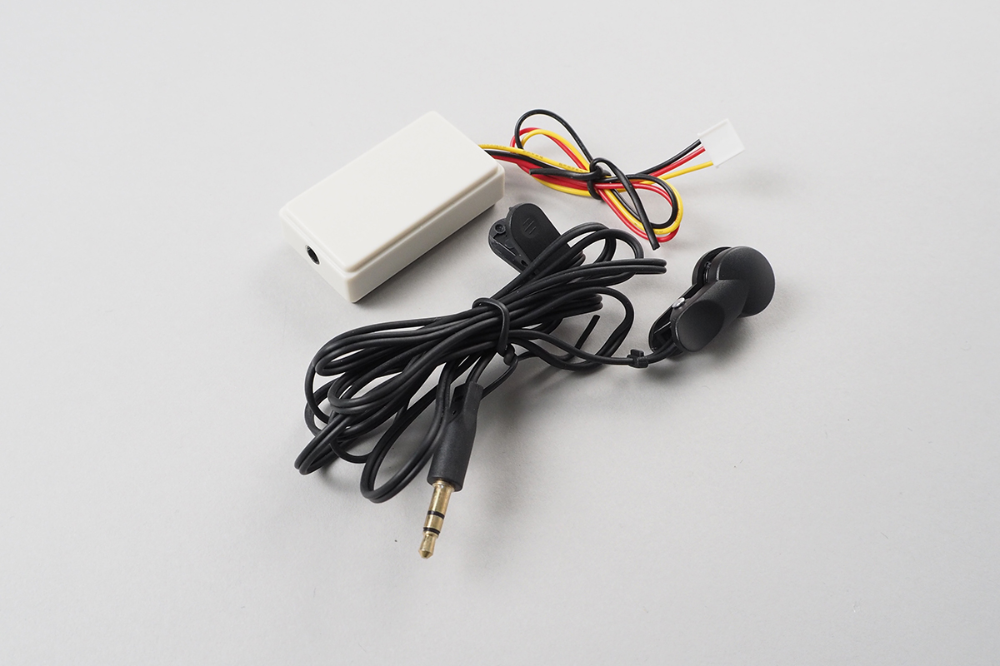

# Grove_EarHeartRate
Grove - Ear-clip Heart Rate Sensor



Stores

[http://wiki.seeedstudio.com/Grove-Ear-clip_Heart_Rate_Sensor/](http://wiki.seeedstudio.com/Grove-Ear-clip_Heart_Rate_Sensor/)

[https://www.switch-science.com/catalog/2526/](https://www.switch-science.com/catalog/2526/)


## wired(obniz, {gnd, vcc, signal})
Connect Grove cables.
Black: GND, Red: VCC, Yellow: Signal.

```javascript
// Javascript Example
var heartrate = obniz.wired("Grove_EarHeartRate", {gnd: 0, vcc: 1, signal: 2});
heartrate.start(function(rate){
  console.log(rate);
})
```

## start(callback(heartrate))
measure heart rate.
It callback measured heart rate around every 3sec.(It depends network)
Callback function will be called only when data exist.
```javascript
// Javascript Example
var heartrate = obniz.wired("Grove_EarHeartRate", {gnd: 0, vcc: 1, signal: 2});
heartrate.start(function(rate){
  console.log(rate);
})
```

## [await] getWait()
measure heart rate once. 

```javascript
// Javascript Example
var heartrate = obniz.wired("Grove_EarHeartRate", {gnd: 0, vcc: 1, signal: 2});
var rate = await heartrate.getWait();
console.log(rate);
```

