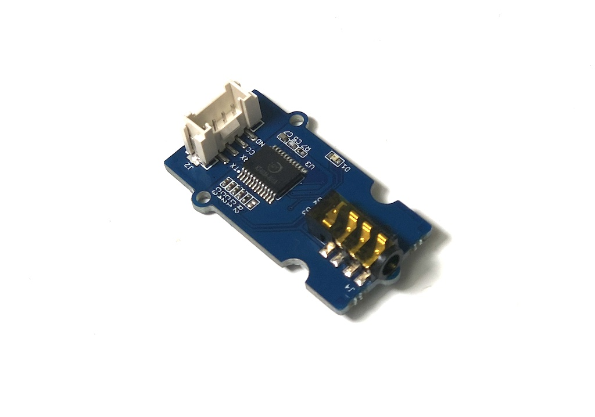

# Grove_MP3
Grove MP3 Audio Player.
It can play mp3 file inside a SD card.
This library can drive Grove MP3 V2.0.



<iframe width="560" height="315" src="https://www.youtube.com/embed/cCRMpeUk9HM" frameborder="0" allow="autoplay; encrypted-media" allowfullscreen></iframe>

## Rules of mp3 file
Grove MP3 has file regulation. File name and folder structure.


SD Card

- Capacity: Under 8GB.  
- Filesystem: FAT16, FAT32

MP3 File

- Sampling Rate:8 / 11.025 / 12 / 16 / 22.05 / 24 / 32 / 44.1 / 48 (KHz)

Filename, Foldername

Folder should be on root of sd directory.

1. case of using "MP3" folder.

 - folder name: MP3
 - file name: 4 digits start from 0001(not 0000).

filename can contain other texts after 4 digits like 0001abc.mp3, 0002_def.mp3, 0003.mp3 ...

Max file number under the folder is around 3k.

2. case of using numberd folder

- folder name: 2 digits start from 01 to 99.

Folder name can contain other texts after 2 digits.
Filenames under this kind of folder should be 3 digits from 001.

One folder can contain files up to 255.

## wired(obniz, {gnd, vcc, mp3_rx, mp3_tx})

Connect to a module.
If you are using Grove cable, 

- gnd=black
- vcc=red
- mp3_rx=white
- mp3_tx=yellow


```Javascript
// Javascript Example
var mp3 = obniz.wired("Grove_MP3", {gnd:0, vcc:1, mp3_rx:2, mp3_tx:3});
```

## [await] initWait()
Start and initialize a module.
It takes around 1sec.
```javascript
// Javascript Example
var mp3 = obniz.wired("Grove_MP3", {gnd:0, vcc:1, mp3_rx:2, mp3_tx:3});
await mp3.initWait();
```

## setVolume(vol)
volume should be within 0 to 31.
Defualt is 31.
```javascript
// Javascript Example
var mp3 = obniz.wired("Grove_MP3", {gnd:0, vcc:1, mp3_rx:2, mp3_tx:3});
await mp3.initWait();
mp3.setVolume(10);
```

## volUp()
+1 volume.
```javascript
// Javascript Example
var mp3 = obniz.wired("Grove_MP3", {gnd:0, vcc:1, mp3_rx:2, mp3_tx:3});
await mp3.initWait();
mp3.volUp();
```

## volDown()
-1 volume
```javascript
// Javascript Example
var mp3 = obniz.wired("Grove_MP3", {gnd:0, vcc:1, mp3_rx:2, mp3_tx:3});
await mp3.initWait();
mp3.volDown();
```

## play(track,folder)
It play a specified mp3 file.
When you don't specify a folder name, It recognized as a file under "MP3" folder.

Examples

play(1) -> /MP3/0001.mp3

play(2,1) -> /01/002.mp3

```javascript
// Javascript Example
var mp3 = obniz.wired("Grove_MP3", {gnd:0, vcc:1, mp3_rx:2, mp3_tx:3});
await mp3.initWait();
mp3.setVolume(10);
mp3.play(1);
```

## stop()
stop playing
```javascript
// Javascript Example
var mp3 = obniz.wired("Grove_MP3", {gnd:0, vcc:1, mp3_rx:2, mp3_tx:3});
await mp3.initWait();
mp3.setVolume(10);
mp3.play(1);
await obniz.wait(5000);
mp3.stop();
```

## pause()
pause playing
```javascript
// Javascript Example
var mp3 = obniz.wired("Grove_MP3", {gnd:0, vcc:1, mp3_rx:2, mp3_tx:3});
await mp3.initWait();
mp3.setVolume(10);
mp3.play(1);
await obniz.wait(5000);
mp3.pause();
```

## resume()
resume playing
```javascript
// Javascript Example
var mp3 = obniz.wired("Grove_MP3", {gnd:0, vcc:1, mp3_rx:2, mp3_tx:3});
await mp3.initWait();
mp3.setVolume(10);
mp3.play(1);
await obniz.wait(5000);
mp3.pause();
await obniz.wait(3000);
mp3.resume();
```
