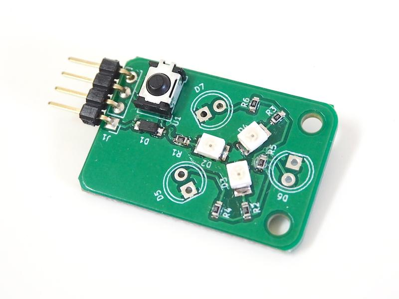

# IRModule

リモコンで使われる赤外線の信号を送受信します。



## wired(obniz, { send, recv[, vcc, gnd]})

sendとrecv, vcc, gndを接続します。vccとgndはオプショナルです。外に繋いでいる場合は無くても大丈夫です。

 
```javascript
// Javascript Example
var module = obniz.wired('IRModule', { vcc: 0, send: 1, recv: 2, gnd: 3 });
```

## start(callback(array))
赤外線信号のモニターを開始ます。検出したら引数に渡した関数が呼ばれます。

```javascript
// Javascript Example
var module = obniz.wired('IRModule', { vcc: 0, send: 1, recv: 2, gnd: 3 });
module.start(function (arr) {
  console.log('detected!!')
  console.log(JSON.stringify(arr));
})
```

結果であるarrには `obniz.LogicAnalyzer`で得られのと同じ配列が入っています。
なので、こんなフォーマットです。

```javascript
[1,1,1,1,1,1,1,1,1,1,1,1,1,1,1,1,1,1,1,1,1,1,1,1,1,1,1,1,1,1,1,1,1,1,1,1,1,1,1,1,1,1,1,1,1,1,1,1,0,0,0,0,0,0,0,0,0,0,0,0,0,0,0,0,0,0,0,0,0,0,0,0,1,1,1,1,1,1,0,0,0,0,0,0,0]
```


いくつかの検出オプションは`start()`で開始する前に設定することが出来ます。
どれも`obniz.LogicAnalyzer`のオプションと共通ですので、詳しくはそちらをご覧ください。

設定可能なのは以下のとおりです。

property | type | default | description
--- | --- | --- | --- 
dataSymbolLength | `number` | 0.07 (msec) | LogicAnalyzerのサンプリング間隔
duration | `number` | 500 (msec) | 取得データの長さ
dataInverted | `number` | true | 取得データの0,1を反転するかどうか
cutTail | `number` | false | 信号の最後の無駄な0を除去します。除去することでうまく通信できないこともあります。
output_pullup | `number` | true | センサーの出力端子を5vで内部プルアップします。

どれも`start()`で開始する前に設定して下さい。

```javascript
// Javascript Example
var module = obniz.wired('IRModule', { vcc: 0, send: 1, recv: 2, gnd: 3 });
module.duration = 150;
module.dataInverted = false;
module.start(function (arr) {
  console.log('detected!!')
  console.log(JSON.stringify(arr));
})
```

## ondetect = function(array)

startした後にcallbackを設定/変更する場合はこの変数に関数を入れて下さい。

```javascript
// Javascript Example
var module = obniz.wired('IRModule', { vcc: 0, send: 1, recv: 2, gnd: 3 });
module.start()

module.ondetect = function(arr) {
  console.log('detected!!')
  console.log(JSON.stringify(arr));
}
```


## send(array)
データを送信します。
データのボーレートは`dataSymbolLength`で設定します（デフォルトで 70usecです）
この関数は`pwm.modulate`を使います。データ形式について、詳しくはそちらを参照下さい。
`start(callback)`で取得した信号はそのまま、この`send(array)`より送信可能です。

```Javascript
// Javascript Example
// Example: Turn on KOIZUMI's Room Lamp
var module = obniz.wired('IRModule', { vcc: 0, send: 1, recv: 2, gnd: 3 });
module.send([1,1,1,1,1,1,1,1,1,1,1,1,1,1,1,1,1,1,1,1,1,1,1,1,1,1,1,1,1,1,1,1,1,1,1,1,1,1,1,1,1,1,1,1,1,1,1,1,1,1,1,1,1,1,1,1,1,1,1,1,1,1,1,1,1,1,1,1,1,1,1,1,1,1,1,1,1,1,1,1,1,1,1,1,1,1,1,1,1,1,1,1,1,1,1,1,1,1,1,1,1,1,1,1,1,1,1,1,1,1,1,1,1,1,1,1,1,1,1,1,1,1,1,1,0,0,0,0,0,0,0,0,0,0,0,0,0,0,0,0,0,0,0,0,0,0,0,0,0,0,0,0,0,0,0,0,0,0,0,0,0,0,0,0,0,0,0,0,0,0,0,0,0,0,0,0,0,0,0,0,0,0,0,0,0,0,1,1,1,1,1,1,1,1,0,0,0,0,0,0,0,0,1,1,1,1,1,1,1,1,0,0,0,0,0,0,0,0,1,1,1,1,1,1,1,1,0,0,0,0,0,0,0,1,1,1,1,1,1,1,1,1,0,0,0,0,0,0,0,1,1,1,1,1,1,1,1,1,0,0,0,0,0,0,0,1,1,1,1,1,1,1,1,0,0,0,0,0,0,0,0,1,1,1,1,1,1,1,1,0,0,0,0,0,0,0,1,1,1,1,1,1,1,1,1,0,0,0,0,0,0,0,0,0,0,0,0,0,0,0,0,0,0,0,0,0,0,0,0,1,1,1,1,1,1,1,1])
```

## dataSymbolLength

信号のボーレートを設定します。
設定しない場合は70usec(0.07msec)となっています。
詳しくは`pwm.modulate`を参考にして下さい。

```Javascript
// Javascript Example
var module = obniz.wired('IRModule', { vcc: 0, send: 1, recv: 2, gnd: 3 });
module.dataSymbolLength = 0.1 // 100usec baud rate
led.send([1,1,1,1,1,1,1,1,1,1,1,1,1,1,1,1,1,1,1,1,1,1,1,1,1,1,1,1,1,1,1,1,1,1,1,1,1,1,1,1,1,1,1,1,1,1,1,1,1,1,1,1,1,1,1,1,1,1,1,1,1,1,1,1,1,1,1,1,1,1,1,1,1,1,1,1,1,1,1,1,1,1,1,1,1,1,1,1,1,1,1,1,1,1,1,1,1,1,1,1,1,1,1,1,1,1,1,1,1,1,1,1,1,1,1,1,1,1,1,1,1,1,1,1,0,0,0,0,0,0,0,0,0,0,0,0,0,0,0,0,0,0,0,0,0,0,0,0,0,0,0,0,0,0,0,0,0,0,0,0,0,0,0,0,0,0,0,0,0,0,0,0,0,0,0,0,0,0,0,0,0,0,0,0,0,0,1,1,1,1,1,1,1,1,0,0,0,0,0,0,0,0,1,1,1,1,1,1,1,1,0,0,0,0,0,0,0,0,1,1,1,1,1,1,1,1,0,0,0,0,0,0,0,1,1,1,1,1,1,1,1,1,0,0,0,0,0,0,0,1,1,1,1,1,1,1,1,1,0,0,0,0,0,0,0,1,1,1,1,1,1,1,1,0,0,0,0,0,0,0,0,1,1,1,1,1,1,1,1,0,0,0,0,0,0,0,1,1,1,1,1,1,1,1,1,0,0,0,0,0,0,0,0,0,0,0,0,0,0,0,0,0,0,0,0,0,0,0,0,1,1,1,1,1,1,1,1])
```