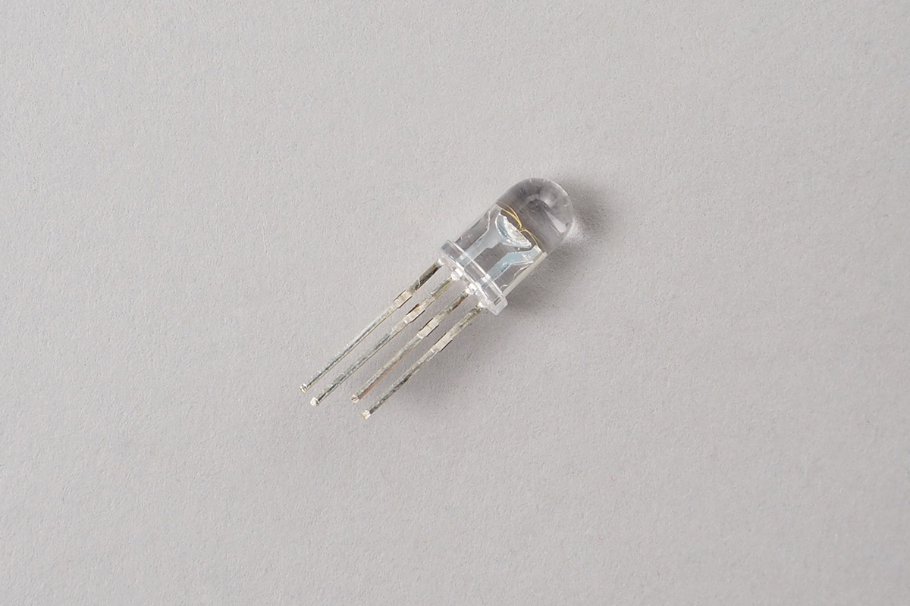
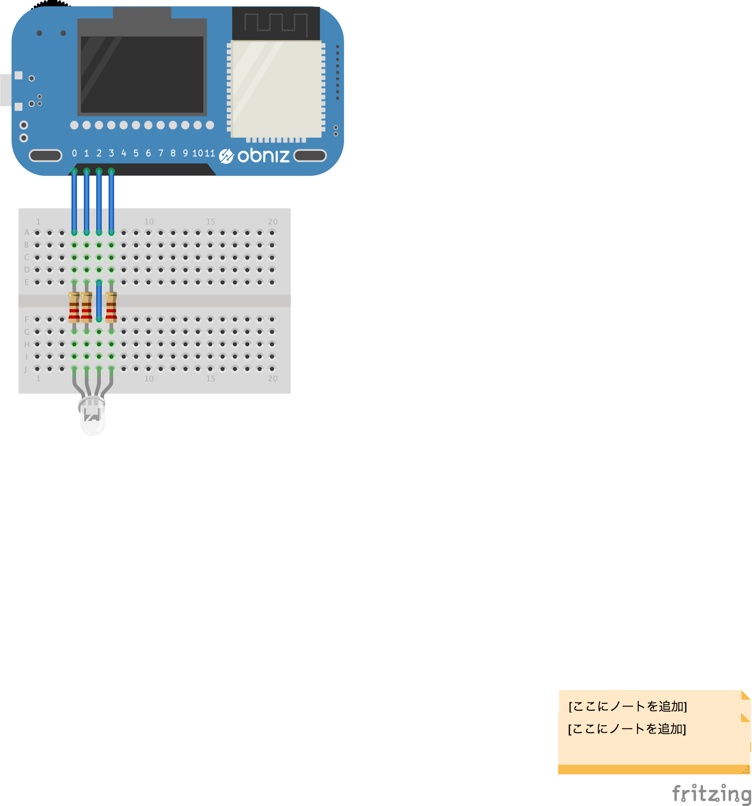

# FullColorLED

アナログのフルカラーLEDです。３色のLEDが１つのLEDになっているものです。




## wired(obniz, {r, g, b, common, common_type})

r,g,b,common は繋いだobniz Boardのioを指定してください。
common_type はLEDがアノードコモンであれば`anode_common`カソードコモンであれば`cathode_common`を指定してください。



```Javascript
// Javascript Example
var led = obniz.wired("FullColorLED", {r: 3, g:0, b:1, common:2, commonType:'anode_common'}); 
```

## rgb(red, green, blue)
RGBにより色を変更します。
```Javascript
// Javascript Example
var led = obniz.wired("FullColorLED", {r: 3, g:0, b:1,  common:2, commonType:'anode_common'}); 
led.rgb(0xFF, 255, 0); // Yellow
```

## hsv(hue, saturation, value)
HSVにより色を変更します。

1. hue : 0 ~ 360
2. saturation : 0 ~ 1
3. value : 0 ~ 1

```Javascript
// Javascript Example
var led = obniz.wired("FullColorLED", {r: 3, g:0, b:1,  common:2, commonType:'anode_common'}); 
led.hsv(180, 0.5, 1);
```


## gradation(cycle_ms)
自動で色をグラデーションで変え続けます。

```Javascript
// Javascript Example
var led = obniz.wired("FullColorLED",{r: 3, g:0, b:1,  common:2, commonType:'anode_common'}); 
led.gradation(1000); // 1000 msec loop
```

## stopgradation
自動グラデーションを止めます。

```Javascript
// Javascript Example
var led = obniz.wired("FullColorLED", {r: 3, g:0, b:1, common:2, commonType:'anode_common'}); 
led.gradation(1000); // 1000 msec loop

await obniz.wait(5000);
led.stopgradation()

```

