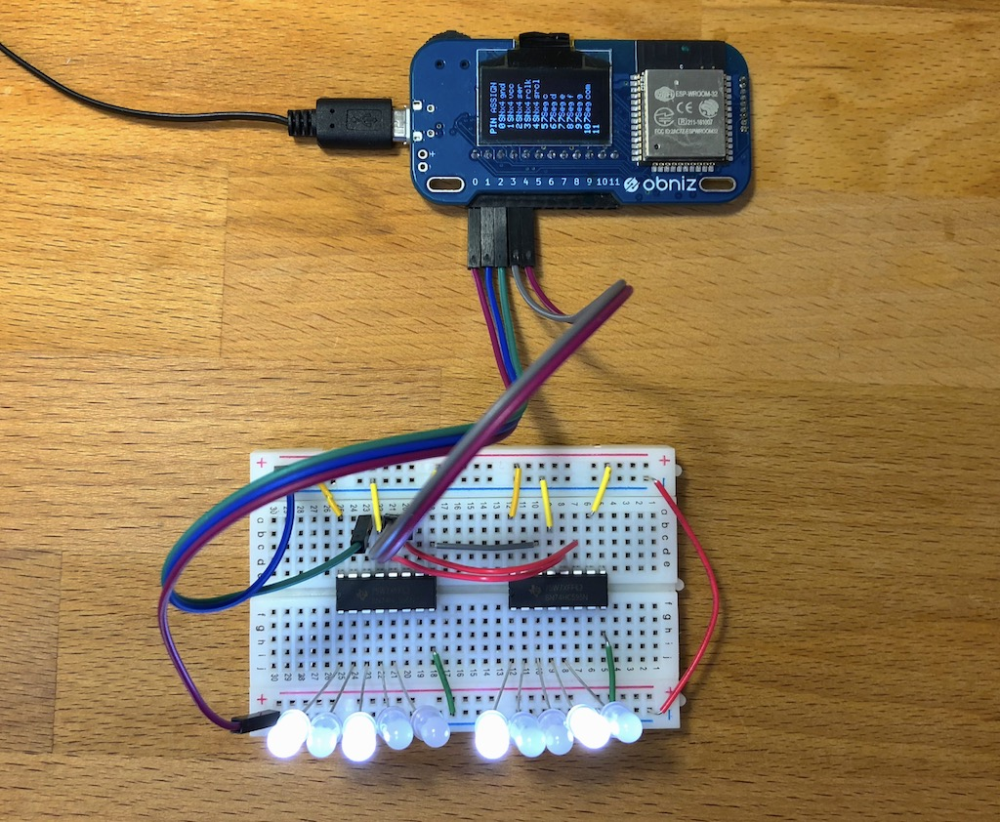
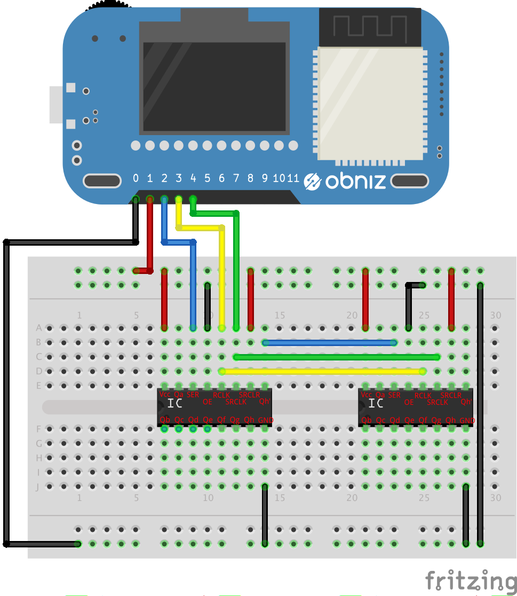

# SNx4HC595


SNx4HC595 is a library for SN54HC595 and SN74HC595.
It chip has 8 output IO and these are controlled from 3(minimum) wire.
So this is called "io extender".
Additionally, this chip can be connected like chain. You can extend io by chaining 8,16,24,,,.



Reference
[http://www.ti.com/lit/ds/symlink/sn74hc595.pdf](http://www.ti.com/lit/ds/symlink/sn74hc595.pdf)

## obniz.wired('SNx4HC595', {ser, rclk, srclk [, gnd, vcc, oe, srclr, io_num]});

Specify which obniz Board io is connected to each pin.

name | type | required | default | description
--- | --- | --- | --- | ---
ser | `number(obniz Board io)` | yes | &nbsp; | connected obniz Board io
rclk | `number(obniz Board io)` | yes | &nbsp;  | connected obniz Board io
srclk | `number(obniz Board io)` | yes | &nbsp;  | connected obniz Board io
vcc | `number(obniz Board io)` | no |  &nbsp; | If you specify either vcc/gnd, wire() will wait a moment after power up.
gnd | `number(obniz Board io)` | no | &nbsp;  | If you specify either vcc/gnd, wire() will wait a moment after power up.
oe | `number(obniz Board io)` | no |  &nbsp; | oe controls output tri-state. off for normal operation.This is optional. You don't need to specify oe when oe is connected directly to GND.You can use setEnable() function when specify oe. By default, oe is set to enabled state.
srclr | `number(obniz Board io)` | no | &nbsp;  | srclr clear shift resistor values. You don't need to specify srclr when srclr is connected directly to 5v.
io_num | `number` | no | 8  | io_num is number of io. You can set under 8. If you specify over 8 like 16, then obniz Board will treat chained chip.
enabled | `boolean` | no | true  | If oe was specified, you can set initial enable/disable with this parameter.




**Please note that the arrangement depends on the product**

```Javascript
// Javascript Example
var ioext = obniz.wired('SNx4HC595', {gnd:0, vcc:1, ser:2, rclk:3, srclk:4});
ioext.output(3, true)
```

```Javascript
// Javascript Example
var ioext = obniz.wired('SNx4HC595', {gnd:0, vcc:1, ser:2, rclk:3, srclk:4, io_num:16});
ioext.output(0, true)  // first chip's io
ioext.output(15, true) // next chip's io
```

## ioNum(num)

This is equal to io_num on wired().
After calling this. all number of output will be changed to false.

```Javascript
// Javascript Example
var ioext = obniz.wired('SNx4HC595', {gnd:0, vcc:1, ser:2, rclk:3, srclk:4});
ioext.ioNum(16);
ioext.output(15, true)
```

## output(io, value)
output io with value. The others will not be affected. Only specified io.

```Javascript
// Javascript Example
var ioext = obniz.wired('SNx4HC595', {gnd:0, vcc:1, ser:2, rclk:3, srclk:4});
ioext.output(3, true)
ioext.output(4, true) // io4 will be changed to true "after" io3 changed to true.
ioext.output(5, true)
```

## onece(function)
This chip can change it's output at same timing.
This function let you use it.
Set values within this function.

```Javascript
// Javascript Example
var ioext = obniz.wired('SNx4HC595', {gnd:0, vcc:1, ser:2, rclk:3, srclk:4});
ioext.onece(function(){ // io 4 and 5 will be changed to false state at same timing.
  ioext.output(4, false)
  ioext.output(5, false)
})
```

## getIO(io)
Retriving io object. io object works like a obniz Board io. You can call output().
Additionaly, you can use this io for io in  [LED](./LED) and [7SegmentLED](./7SegmentLED).

```Javascript
// Javascript Example
var ioext = obniz.wired('SNx4HC595', {gnd:0, vcc:1, ser:2, rclk:3, srclk:4});

var io1 = ioext.getIO(1);
io1.output(true);

var io2 = ioext.getIO(2);
var led = obniz.wired("LED", {anode: io2});
led.blink();

var io3 = ioext.getIO(3);
var io4 = ioext.getIO(4);
var seg = obniz.wired("7SegmentLED", {a:io3, b: io4, c: 5, d:6, e:7, f:8, g:9, common:10});
seg.print(0);
```

## setEnable(enabled)
This function available only when oe was specified.
Changing Normal-operation/Hi-Z on all of it's chip output.

```Javascript
// Javascript Example
var ioext = obniz.wired('SNx4HC595', {gnd:0, vcc:1, ser:2, rclk:3, srclk:4, oe:5, enabled: false});
ioext.output(0, true); // no affect
ioext.setEnable(true); // 0 is true
```