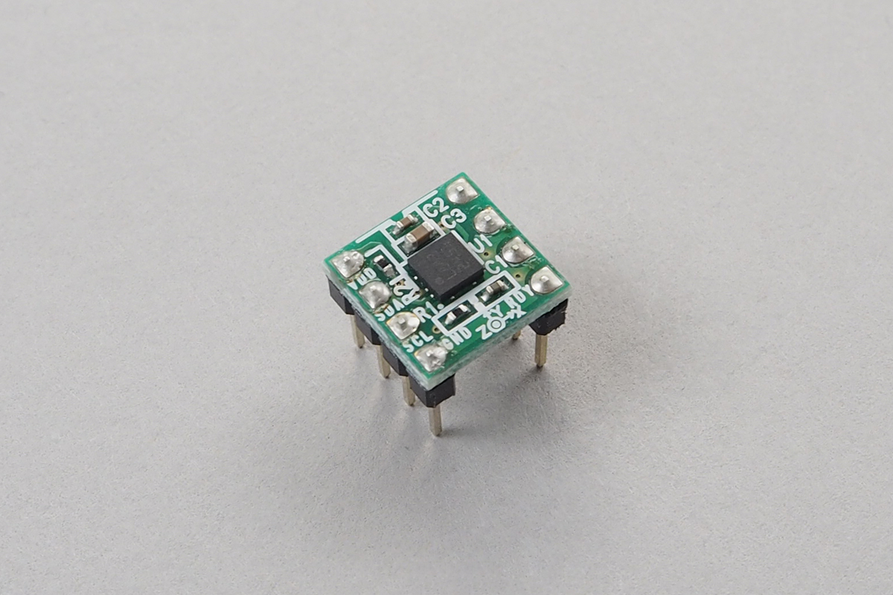

# Compass Sensor - HMC5883L
3軸地磁気センサです。取得した値から方位を知ることができます。
コンパスとして使うには、キャリブレーションが必要です。



[Datasheet](http://www.farnell.com/datasheets/1683374.pdf)


## wired(obniz,  { [gnd, sda, scl, i2c]});
obniz Boardに地磁気センサをつなぎます。

消費電力のためにobniz Boardから直接電源を供給することができません。
外部の3.3v電源を用意するか、３端子レギュレータなどでobniz Boardから出力させる5vを3.3vに変換して供給する必要があります。

```javascript
// Javascript Example
var compass = obniz.wired("HMC5883L", {gnd:1 , sda:2 , scl:3 });
compass.init();
while(true) {
  var obj = await compass.get();
  console.log(obj.x, obj.y, obj.z);
}
```

## init();
センサを初期化します。
```javascript
// Javascript Example
var compass = obniz.wired("HMC5883L", {gnd:1 , sda:2 , scl:3 });
compass.init();
```

## [await] get()

x,y,zの結果を持ったオブジェクトを取得します。

```javascript
// Javascript Example
var compass = obniz.wired("HMC5883L", {gnd:1 , sda:2 , scl:3 });
compass.init();
while(true) {
  var obj = await compass.get();
  console.log(obj.x, obj.y, obj.z);
}
```