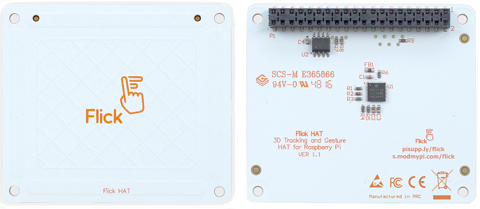
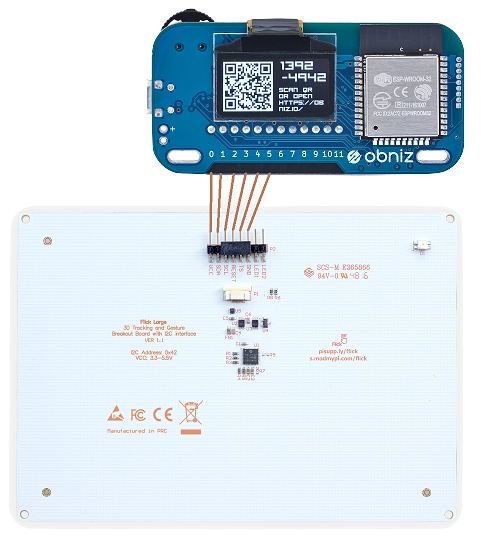

# Flick HAT

[Flick HAT](https://uk.pi-supply.com/products/flick-hat-3d-tracking-gesture-hat-raspberry-pi) / 
[Flick Zero](https://uk.pi-supply.com/products/flick-zero-3d-tracking-gesture-phat-pi-zero) / 
[Flick Large](https://uk.pi-supply.com/products/flick-large-standalone-3d-tracking-gesture-breakout)
はジェスチャートラッキングができるユニークなパーツです。もともとRaspberry Pi向けのこのパーツを、obnizから利用するためのライブラリです。



日本では
[マルツ](https://www.marutsu.co.jp/pc/i/839457/)や
[RS](https://jp.rs-online.com/web/p/human-machine-interface-hmi-development-kits/1365431/)、他から購入可能です。


## obniz Boardとの接続

Flick HATとFlick Zeroは3.3V駆動のため、電源はobniz Boardのioピンから直接取ることができません。3.3V電源を別に用意してください。電源以外の`SDA, SCL, Gnd, Reset, TS`は、下図を参考にobniz Boardのioピンに接続します。  


Flick Largeは5V駆動できるため、電源も含めてすべてobniz Boardのioピンに接続します.  
**<font color="Red">5V駆動で動作しない場合は、Flick HATと同様に3.3Vで試してください。</font>**




## wired( { vcc, } sda, scl, reset, ts, gnd { , led1, led2 } )

`VCC(5v), SDA, SCL, RESET, TS, GND`をobniz Boardに接続し、接続したioをプログラムで以下のように記述します。
3.3Vや5V電源を別に用意した場合は、vccを省略します。  
LED1(赤)、LED2(緑)はFlick Largeの場合で、ioをobniz Boardに接続した場合に指定します。

```javascript
// Javascript Example
let flick = obniz.wired("FlickHat", { vcc: 0, sda: 1, scl: 2, reset: 3, ts: 4, gnd: 5, led1: 6, led2: 7 });
flick.led1.on();
flick.led2.blink(100);
```

LED1(赤)、LED2(緑)の制御は[LEDライブラリ](https://obniz.io/sdk/parts/LED/README.md)を参照してください。


## [await] start({callbackFwInfo})

Flick Hatをリセットして使用できる状態にします。Flick Hatのファームウェア情報を受け取る場合は、引数にコールバック関数を指定します。

```javascript
// Javascript Example
let flickhat = obniz.wired("FlickHat", { vcc: 0, sda: 1, scl: 2, reset: 3, ts: 4, gnd: 5 });
await flickhat.start(function(fwinfo) {
  console.log(fwinfo.fwVersion); //1.3.14;p:HillstarV01;x: ;DSP:ID9000r2963;i:B;f:22500;nMsg;s:Rel_1_3_prer1784:NM;
});
```


## [await] polling({timeout})

Flick Hatをポーリングします。定期的に呼び出す必要があるため、タイマーループまたはobniz Boardのアイドルループ内で呼び出します。引数`timeout`は、ジェスチャー情報が何も無い場合に監視ループする最大時間をミリ秒で指定します。省略値は3000ms(3秒)です。（`ts`ピンが`high(true)`から`low(false)`に変化することを監視している）

```javascript
// Javascript Example
let flickhat = obniz.wired("FlickHat", { vcc: 0, sda: 1, scl: 2, reset: 3, ts: 4, gnd: 5 });
await flickhat.start();
obniz.repeat(async function() {
  await flick.polling(1000)); //1秒
}, 100);
```

## コールバック関数プロパティ

Flick Hatから各ジェスチャー情報を受け取るためのコールバック関数を指定します。
ハンドリングしたいジェスチャーだけコールバック関数を指定すればよい。

- onxyzプロパティ
- ongestureプロパティ
- ontouchプロパティ
- ontapプロパティ
- ondoubletapプロパティ
- onairwheelプロパティ


## onxyz = function(xyz)

  ジェスチャーした位置を受け取ります。onxyzコールバック関数で受け取る`xyz`オブジェクトの内容は次の通り。  
  
  プロパティ | 内容
  |--|--|
  x | x座標：0～1
  y | y座標：0～1
  z | z座標：0～1
  seq | Flick Hat受信データ通番：0～255
  
  Flick Hatの左下が`x:0, y:0`、右上が`x:1, y:1`、Z軸方向はFlick Hatに近い方が`0`。
  
  例）中央やや下側をジェスチャーの場合； `{ x: 0.2, y:0.5, z:0.4, seq: 99 }`


## ongesture = function(gesture)
  flickジェスチャー（上から下、左から右などのジェスチャー）通知を受け取ります。ongestureコールバック関数で受け取る`gesture`オブジェクトの内容は次の通り。  
  
  プロパティ | 内容
  |--|--|
  action | 'gesture'（固定）
  from | 'west', 'east', 'north', 'south'のいずれか
  to | 'west', 'east', 'north', 'south'のいずれか
  seq | Flick Hat受信データ通番：0～255
  raw | ローデータ

  例）上から下方向のジェスチャーの場合； `{ action: 'gesture', from:'north', to: 'south', seq: 99, raw:・・・ }`

## onontouch = function(touch)
  touchジェスチャー（タッチイベント）通知を受け取ります。ontouchコールバック関数で受け取る`touch`オブジェクトの内容は次の通り。  
  
  プロパティ | 内容
  |--|--|
  action | 'touch'（固定）
  positions | [ 'west'｜'east'｜'north'｜'south'｜'center' ]
  seq | Flick Hat受信データ通番：0～255
  raw | ローデータ

`positions`にはタッチされた場所が以下の文字列の配列で格納されます。
- 'west'：Flick Hatの左側部分
- 'east'：右側部分
- 'north'：上側部分
- 'south'：下側部分
- 'center'：中央部分

 例）下側と中央部がタッチされた場合； `{ action: 'touch', positions: ['south', 'center'], seq: 99, raw:・・・ }`
 
## ontap = function(tap)
  tapジェスチャー（タップイベント）通知を受け取ります。ontapコールバック関数で受け取る`tap`オブジェクトの内容は次の通り。  
  
  プロパティ | 内容
  |--|--|
  action | 'tap'（固定）
  positions | [ 'west'｜'east'｜'north'｜'south'｜'center' ]
  seq | Flick Hat受信データ通番：0～255
  raw | ローデータ

`positions`にはタッチされた場所が配列で格納されます。

例）右側がタップされた場合； `{ action: 'tap', positions: ['east'], seq:99, raw:・・・ }`

## ondoubletap = function(doubletap)
  double tapジェスチャー（ダブルタップイベント）通知を受け取ります。ondoubletapコールバック関数で受け取る`doubletap`オブジェクトの内容は次の通り。  
  
  プロパティ | 内容
  |--|--|
  action | 'doubletap'（固定）
  positions | [ 'west'｜'east'｜'north'｜'south'｜'center' ]
  seq | Flick Hat受信データ通番：0～255
  raw | ローデータ

`positions`にはタッチされた場所が配列で格納されます。

 例）中央部がダブルタップされた場合； `{ action: 'doubletap', positions: ['center'], seq: 99, raw:・・・ }`

## onairwheel = function(airwheel)  
  air wheelジェスチャー（時計回り、反時計回りのジェスチャー）通知を受け取ります。onairwheelコールバック関数で受け取る`airwheel`オブジェクトの内容は次の通り。  
  
  プロパティ | 内容
  |--|--|
  delta | ジェスチャーで描いた円の角度（時計回りのジェスチャーは正数、反時計回りのジェスチャーは負数）
  rotation | ジェスチャーで描いた円周の数（時計回りのジェスチャーで増加、反時計回りのジェスチャーで減少）
  seq | Flick Hat受信データ通番：0～255
  raw | ローデータ

 例）時計回りのジェスチャーの場合； `{ delta: 22.5, rotation: 2, seq: 99, raw:・・・ }`


```javascript
// Javascript Example
let flickhat = obniz.wired("FlickHat", { vcc: 0, sda: 1, scl: 2, reset: 3, ts: 4, gnd: 5 });
flickhat.onxyz = function(xyz) {
  console.log(xyz); // { x: 0.2, y:0.5, z:0.4, seq: 99 }
}
flickhat.ongesture = function(gesture) {
  console.log(gesture); // { action: 'gesture', from:'north', to: 'south', seq: 99, raw:・・・ }
}
flickhat.onontouch = function(touch) {
  console.log(touch); // { action: 'touche', positions: ['south', 'center'], seq: 99, raw:・・・ }
}
flickhat.ontap = function(tap) {
  console.log(tap); // { action: 'tap', positions: ['east'], seq:99, raw:・・・ }
}
flickhat.ondoubletap = function(doubletap) {
  console.log(doubletap); // { action: 'doubletap', positions: ['center'], seq: 99, raw:・・・ }
}
flickhat.onairwheel = function(airwheel) {
  console.log(airwheel); // { delta: 22.5, rotation: 2, seq: 99, raw:・・・ }
}
await flickhat.start();
obniz.repeat(async function() {
  await flick.polling();
}, 100);
```
