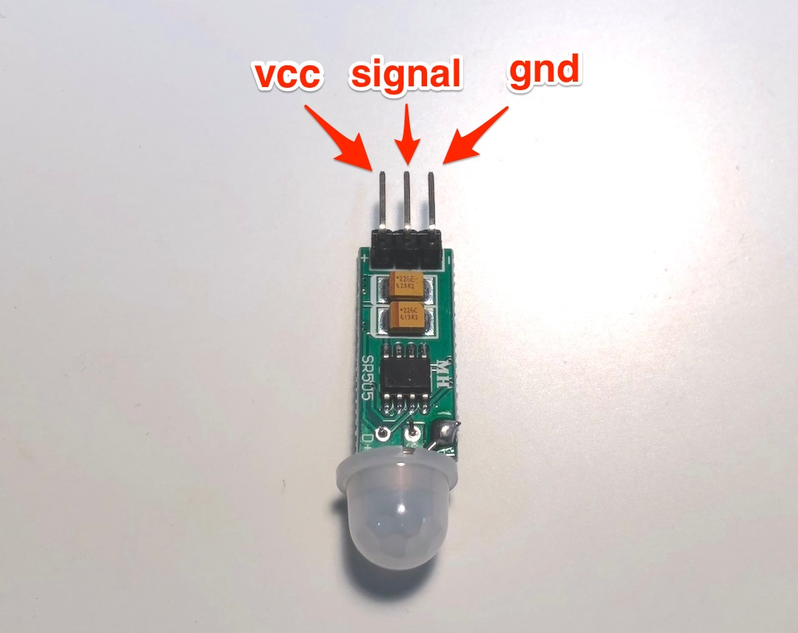

# HC-SR505

PIR センサーです。人や動物が近くにいるかを検出できます。




## wired(obniz, {signal [,vcc, gnd]})

３つのピンがあります。直接obniz Boardに接続して下さい。

```Javascript
// Javascript Example
var sensor = obniz.wired("HC-SR505", {vcc:0, signal:1, gnd:2});
sensor.onchange = function(val){
  console.log(val ? 'Moving Something!' : 'Nothing moving');
}
```

## onchange = function(value)

何かが変化した時に呼ばれる関数を設定します。
人が近づいてきたときに関数が呼ばれ、値`true`が引数に入っています。
もし、人がいなくなったりすると`false`が引数に入ります。

```Javascript
// Javascript Example
var sensor = obniz.wired("HC-SR505", {vcc:0, signal:1, gnd:2});
sensor.onchange = function(val){
  console.log(val ? 'Moving Something!' : 'Nothing moving');
}
```

## [await] getWait()

近くに人がいるかどうかを一度だけ取得します．
`true`なら近くに人がいて，`false`なら近くに人がいない状態です


```Javascript
// Javascript Example
var sensor = obniz.wired("HC-SR505", {vcc:0, signal:1, gnd:2});
var val = await sensor.getWait();
console.log(val ? 'Moving Something!' : 'Nothing moving');
```
