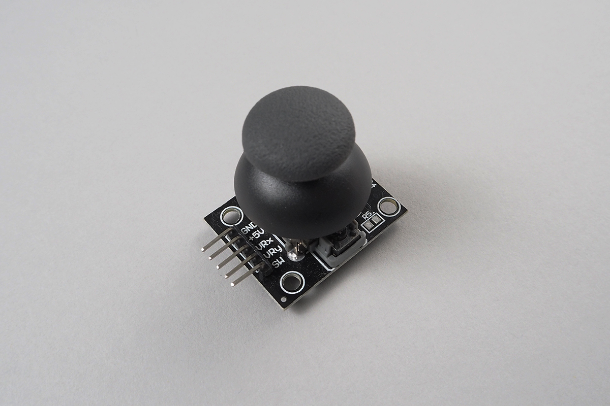

# JoyStick

X and Y direction with Push Switch Joystick.
This class accept only analog output.




## wired(obniz, {sw, x, y, vcc, gnd})

connect to an obniz Board.

1. vcc: power supply
2. gnd: power supply
3. sw: push switch
4. x: X axis analog output
5. Y: T axis analog output

### Attention! pins assing is diffrerent in each product!
There are some joystick and these pin assigns are different.

For example, A joystick commonly used with obniz Board is below.


But another one has a pinassign like


```Javascript

var joystick = obniz.wired("JoyStick", {gnd:4, sw:0, y:1, x:2, vcc:3});

// or

var joystick = obniz.wired("JoyStick", {gnd:0, sw:1, y:2, x:3, vcc:4});

// and mores
```

## onchangex = callback(angle)
## onchangey = callback(angle)
callback for on change angle.

angle = -1 to 1

```Javascript
// Javascript Example
var joystick = obniz.wired("JoyStick", {gnd:4, sw:0, y:1, x:2, vcc:3});
joystick.onchangex = function(val){
  console.log(val);
};

joystick.onchangey = function(val){
  console.log(val);
};
```

## onchangesw = function(pressed)

It's called when button pressed/released.

```Javascript
// Javascript Example
var joystick = obniz.wired("JoyStick", {gnd:4, sw:0, y:1, x:2, vcc:3});
joystick.onchangesw = function(pressed){
  console.log(pressed);
};
```


## [await] isPressedWait()

Get button state once. 

```Javascript
// Javascript Example
var joystick = obniz.wired("JoyStick", {gnd:4, sw:0, y:1, x:2, vcc:3});
var isPressed = await joystick.isPressedWait()
if(isPressed){
  console.log("PRESSED");
}

```


## [await] getXWait()
## [await] getYWait()

Get X or Y angle once

```Javascript
// Javascript Example
var joystick = obniz.wired("JoyStick", {gnd:4, sw:0, y:1, x:2, vcc:3});
var x = await joystick.getXWait()
var y = await joystick.getYWait()
 
console.log("x:" + x + " y:"+y);

```