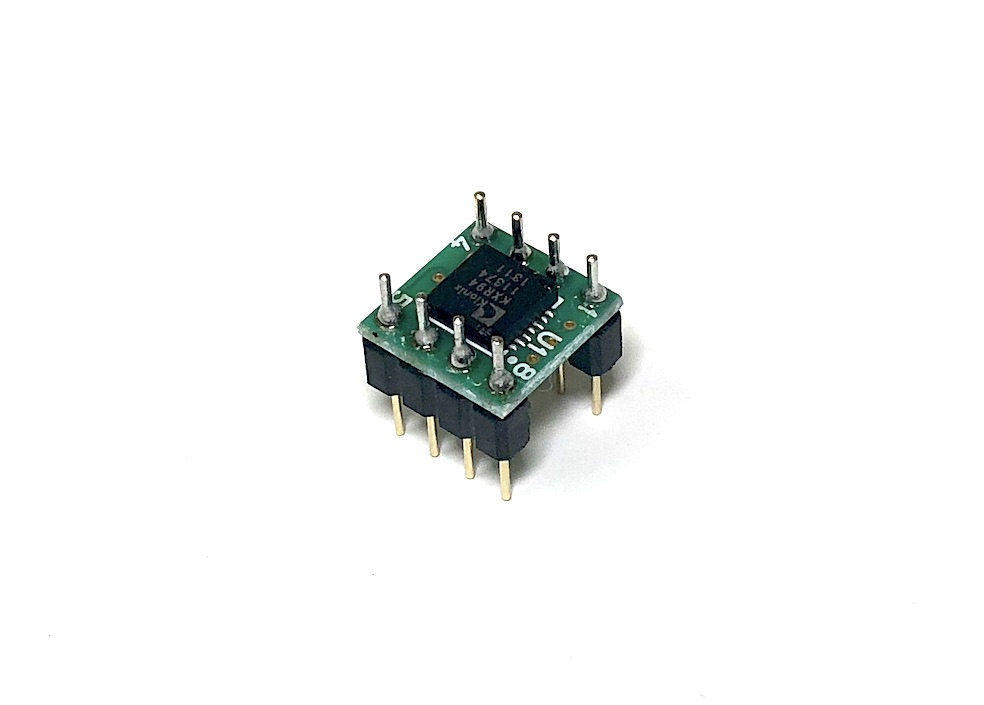

# KXR94-2050

x,y,z 3 dimention accelaration sensor.
This is used for determin direction and angle of a device.




## obniz.wired(obniz, {x, y, z [, vcc, gnd, enable, self_test]})

Connect pins to an obniz Board and specify io.

name | type | required | default | description
--- | --- | --- | --- | ---
x | `number(obniz Board io)` | yes | &nbsp; | value of x
y | `number(obniz Board io)` | yes | &nbsp; | value of y
z | `number(obniz Board io)` | yes | &nbsp; | value of z
vcc | `number(obniz Board io)` | &nbsp; | &nbsp; | Power supply. 5v
gnd | `number(obniz Board io)` | &nbsp; | &nbsp; | Power supply. gnd
self_test | `number(obniz Board io)` | &nbsp; | &nbsp; | high for enter test mode
enable | `number(obniz Board io)` | &nbsp; | &nbsp; | low for disable device.

```javascript

// Javascript Example
var sensor = obniz.wired("KXR94-2050", { vcc:0, gnd:1, x:2, y:3, z:4, enable:5, self_test:6 });

sensor.onChange = function(values){
  console.log("x:" + values.x);
  console.log("y:" + values.y);
  console.log("z:" + values.z);
}
   
```

## onChange = function({x: y: z:})

Specifying a callback function for one of value changes of x,y,z.
The value is regarding gravity. 1 measn 9.8m^2. The value will be -2<= and <= +2.

```javascript

// Javascript Example
var sensor = obniz.wired("KXR94-2050", { vcc:0, gnd:1, x:2, y:3, z:4, enable:5, self_test:6 });

sensor.onChange = function(values){
  console.log("x:" + values.x);
  console.log("y:" + values.y);
  console.log("z:" + values.z);
}
   
```

## onChangeX = function(value)

## onChangeY = function(value)

## onChangeZ = function(value)

Specifying a callback function for value change.
This is useful when you only want to watch one of them.

## get()

Getting a current three acceleration value.
This function not contact to an obniz Board. It return last notified value from an obniz Board.

Notice: You should insert a wait() in infinity loop.


```javascript
// Javascript Example
var sensor = obniz.wired("KXR94-2050", { vcc:0, gnd:1, x:2, y:3, z:4, enable:5, self_test:6 });
  
while (true) {
  let values = sensor.get();
  console.log("x:" + values.x);
  console.log("y:" + values.y);
  console.log("z:" + values.z);
  await obniz.wait(30);
}
```


## [await] getWait()

Getting a current three acceleration value.
This function will contact to an obniz Board to retrive current value.

```javascript
// Javascript Example
var sensor = obniz.wired("KXR94-2050", { vcc:0, gnd:1, x:2, y:3, z:4, enable:5, self_test:6 });
  
while (true) {
  let values = await sensor.getWait();
  console.log("x:" + values.x);
  console.log("y:" + values.y);
  console.log("z:" + values.z);
}
```