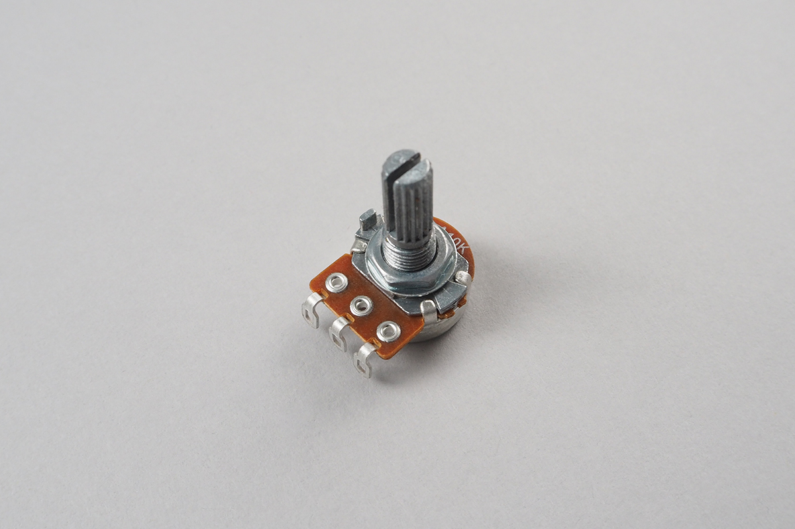

# Potentiometer
ボリュームのように回すことで抵抗値を変えることが出来る可変抵抗です。
抵抗値を読み取ることにより今どの位置に回されているのかがわかります。３本の端子があり、端の２つの間はどう回していても一定の抵抗値です。この２つの端子に電圧をかけます。
回されることで間の１本の電圧が２つの電圧の間を移動します。




このパーツで扱えるポテンションメーターの抵抗値は10Ω〜100kΩの間です。

## obniz.wired(obniz, {pin0, pin1, pin2})
ポテンショメーターの３本のピンをそれぞれpin0, 1, 2として接続します。pin0とpin2は逆でも構いません。（回転が逆になりますが）


```Javascript
// Javascript Example
var meter = obniz.wired("Potentiometer", {pin0:0, pin1:1, pin2:2});
```
## onchange 
回転を監視し、回転された時にcallback関数を呼び出します。回転に合わせて0.0~1.0の値が返ります。例えばちょうど真ん中であれば0.5です。
```Javascript
// Javascript Example
var meter = obniz.wired("Potentiometer", {pin0:0, pin1:1, pin2:2});
meter.onchange = function(position) {
  console.log("position: "+position);
};
```