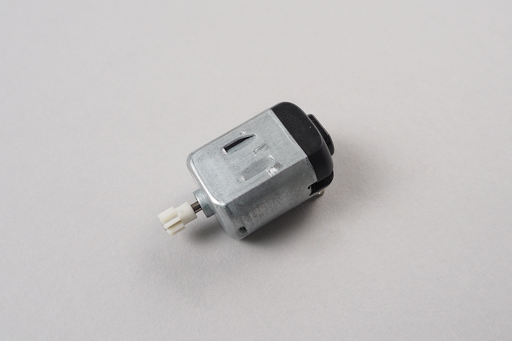
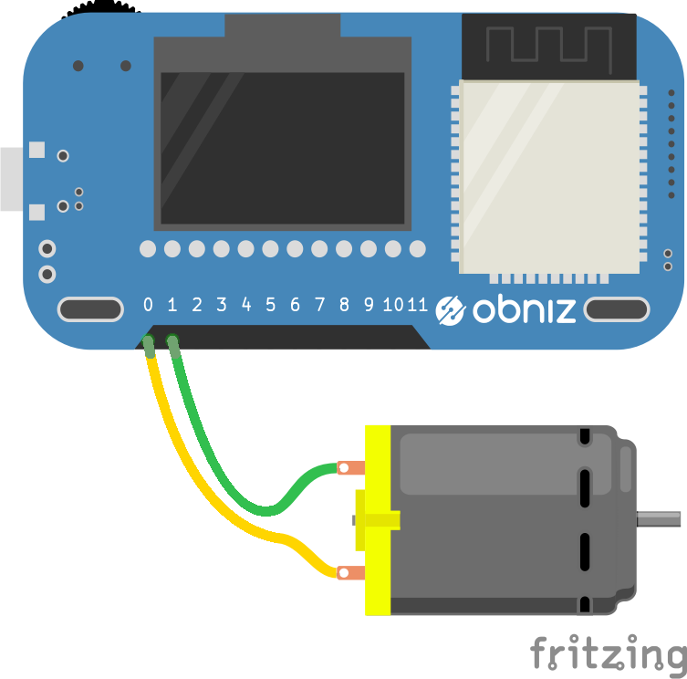

# DCMotor
タミヤモーターやマブチモーターのような、<br>電池を繋いで回すような一般的なモーターです。プラスとマイナスはありませんが逆にすると逆に回転します。



## wire({forward, back})
モーターから出ている２本の線をobniz Boardにつなぎます。どちらをどこにつないでもOKですが、プログラムで「前」と書いて後ろに動いたらあとで配線を逆にすると良いです。モーターをobniz Boardの0と1番に繋いだ場合は以下のようにします



```javascript
// Javascript Example
var motor = obniz.wired("DCMotor",  {forward:0, back:1});

```
## forward();
モーターを回転させます。


```javascript
// Javascript Example
var motor = obniz.wired("DCMotor", {forward:0, back:1});

motor.forward();
```
## reverse();
モーターを逆に回転させます。

```javascript
// Javascript Example
var motor = obniz.wired("DCMotor", {forward:0, back:1});

motor.reverse();
```
## stop();
モーターを停止させます。

```javascript
// Javascript Example
var motor = obniz.wired("DCMotor", {forward:0, back:1});

motor.forward();
setTimeout(function(){
  motor.stop();
}, 1000);
```
## move(boolean)
directionに合わせて指定した方向にモーターを回転させます。rotateとreverseを引数を変えるだけでこの関数１つで扱えます。trueであれば正転。falseであれば逆に回転します。

```javascript
// Javascript Example
var motor = obniz.wired("DCMotor", {forward:0, back:1});

motor.move(true); // = motor.forward();
```
## power(float)
モーターのパワーを変更します。0~100で指定することが出来ます。

```javascript
// Javascript Example
var motor = obniz.wired("DCMotor", {forward:0, back:1});

motor.power(3);
motor.move(true);
```