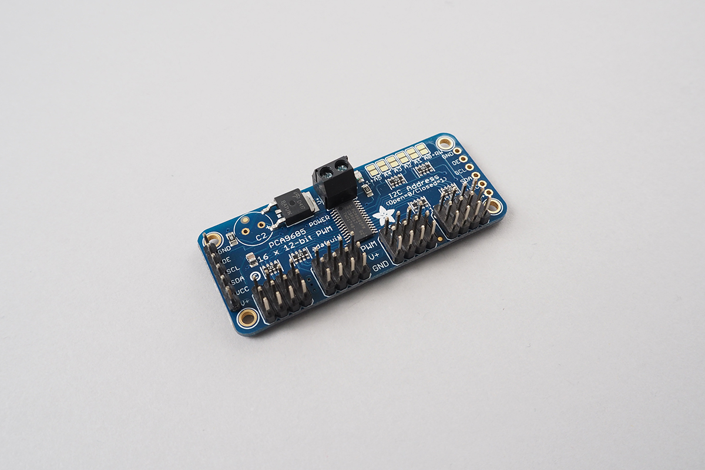

# PCA9685

PCA9685 generate 16 independent PWM. Frequency is shared by 16 PWM.
This is useful for driving multiple servo motors independently up to 16.

Output is not so tough. You can't connect a DC motor directly.



Some vendor sales module which have pin headers for servo motor.
Above photo is Adafruit's one.
[https://www.adafruit.com/product/815](https://www.adafruit.com/product/815)


## wired(obniz, {[gnd, vcc, oe, scl, sda, i2c, enabled, address, drive]})

Specify connected io and configrations.

Please use another power supply to drive servo motors at V+.

name | type | required | default | description
--- | --- | --- | --- | ---
scl | `number(obniz Board io)` | no |  &nbsp; | Specify obniz Board io number
sda | `number(obniz Board io)` | no | &nbsp;  | Specify obniz Board io number
i2c | `i2c object` | no | &nbsp;  | Specify configrated i2c object
vcc | `number(obniz Board io)` | no |  &nbsp; | If you specify either vcc/gnd, wire() will wait a moment after power up.
gnd | `number(obniz Board io)` | no |  &nbsp; | If you specify either vcc/gnd, wire() will wait a moment after power up.
oe | `number(obniz Board io)` | no |  &nbsp; | oe controls output tri-state. off for normal operation.This is optional. You don't need to specify oe when oe is connected directly to GND.You can use setEnable() function when specify oe. By default, oe is set to enabled state.
enabled | `boolean` | no | true  | If oe was specified, you can set initial enable/disable with this parameter.
address | `number` | no | 0x40 | The address of module.
drive | `boolean` | no |  'push-pull' | Default output is push-pull driven. Specify "open-drain" to drive as open-drain.

```Javascript
// Javascript Example
var driver = obniz.wired("PCA9685", {gnd:0, oe:1, scl:2, sda:3, vcc:4});
var pwm0 = driver.getPWM(0);
pwm0.freq(1000);
pwm0.duty(50);
```

### Multiple on single i2c

This module accept flexible address configration.
You can put multiple modules on same i2c bus.

```Javascript
// Javascript Example

var i2c = obniz.getFreeI2C();
i2c.start({mode:"master", sda:3, scl:2, clock:400 * 1000, pull:"5v"}); 

var driver0 = obniz.wired("PCA9685", {gnd:0, oe:1, i2c:i2c, vcc:4, address:0x40});
var driver1 = obniz.wired("PCA9685", {i2c:i2c, address:0x41});

var pwm0 = driver0.getPWM(0);
pwm0.freq(1000);
pwm0.duty(50);

var pwm16 = driver1.getPWM(0);
pwm16.freq(1000);
pwm16.duty(50);
```

## getPWM(num)

Retriving pwm object. 0 to 15.

pwm object have similar functions as obniz.pwm. 

 - pwm.freq()
 - pwm.duty()
 - pwm.pulse()

But frequency is shared by all pwm. So if you change one, then others frequency will be affected.

```Javascript
// Javascript Example
var driver = obniz.wired("PCA9685", {gnd:0, oe:1, scl:2, sda:3, vcc:4});
var pwm0 = driver.getPWM(0);
pwm0.freq(1000);
pwm0.duty(50);
```

And [ServoMotor](../ServoMotor) can accept this pwm object.

```Javascript
// Javascript Example
var driver = obniz.wired("PCA9685", {gnd:0, oe:1, scl:2, sda:3, vcc:4});
var servo0 = obniz.wired("ServoMotor", {pwm: driver.getPWM(0)});
var servo1 = obniz.wired("ServoMotor", {pwm: driver.getPWM(1)});
var servo2 = obniz.wired("ServoMotor", {pwm: driver.getPWM(2)});
servo0.angle(90);
servo1.angle(95);
servo2.angle(100);
```

## freq(frequency)

Specify a frequency. 24 to 1526 hz.

Duty ratio will be kept.

```Javascript
// Javascript Example
var driver = obniz.wired("PCA9685", {gnd:0, oe:1, scl:2, sda:3, vcc:4});
driver.freq(1000);
```

## duty(index, duty)

Changing a duty ratio of specified index pwm.

```Javascript
// Javascript Example
var driver = obniz.wired("PCA9685", {gnd:0, oe:1, scl:2, sda:3, vcc:4});
driver.freq(1000);
driver.duty(0, 50);
driver.duty(1, 60);
```

## pulse(index, pulse_width)

Changing high length (msec) of specified index pwm.

```Javascript
// Javascript Example
var driver = obniz.wired("PCA9685", {gnd:0, oe:1, scl:2, sda:3, vcc:4});
driver.freq(100); // 100hz = 10msec interval
driver.pulse(0, 5);
driver.pulse(1, 6);
```

## setEnable(enabled)
This function available only when oe was specified.
Changing Normal-operation/Hi-Z on all of it's chip output.

```Javascript
// Javascript Example
var driver = obniz.wired("PCA9685", {gnd:0, oe:1, scl:2, sda:3, vcc:4, enabled: false});
driver.setEnable(true);
```