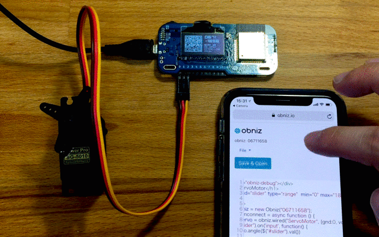
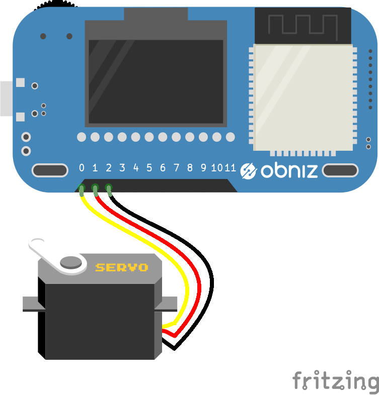

# ServoMotor

RC Servo Motor is computer embeded geard motor.
It keep "Angle".
You just need to send a angle data to servomotor. 




### About Motor Power Supply

Some RC Servo Motors can be connected obniz Board directly even power supply.
But Some (Especcialy tiny)  Motors tends to leak vcc. So obniz Board would recognize as over current situation and stop supplying.

If it occure, our recommendations are

- (Recommended) connect power supply to other resource. (J1 pin on obniz Board can be use. It's USB direct)
- Connect throught the bread board. (It's resistance is not so low. So, it can prevent over current detection)

Servomotors which vcc can be driven directly from obniz Board io

Maker | SKU
--- | ---
Tower Pro | SG-5010
Tower Pro | MG92B
Tower Pro | MG90S
Tower Pro | MG90D
Tower Pro | SG90
Tower Pro | SG92R
GWS | S35STD

Servomotors which vcc can not be driven directly from obniz Board io

Maker | SKU
--- | ---
Quimat | QKY66-5
FEETECH | FS90R

## obniz.wired("ServoMotor", {[vcc, gnd, signal, pwm]})

Connect three feet to obniz Board. gnd, vcc and signal, respectively, and the placement is different depending on the manufacturere of motor. 

This is commonly used pattern.
obniz Board set include this pattern's servomotor.


If you connect gnd ,vcc and signal to obniz Board 0, 1, 2 respectively, write a code as follows.



```Javascript
// Javascript Example
var servo = obniz.wired("ServoMotor", {gnd:0,vcc:1,signal:2});
servo.angle(90.0); // half position
```

vcc and gnd is optional. When you connect vcc and gnd to other way, then just specify signal.
```Javascript
var servo = obniz.wired("ServoMotor", {signal:2});
```

Or you can use pwm object.

```Javascript
var pwm = obniz.getFreePwm();
pwm.start({io:0})
var servo = obniz.wired("ServoMotor", {pwm:pwm});
```

## angle(degree)
Change the motor angle.
angle : 0 - 180 degree

```Javascript
// Javascript Example
var servo = obniz.wired("ServoMotor", {gnd:0,vcc:1,signal:2});

servo.angle(90.0); // half position
```

## range = {min, max}

Adjusting output pulse length.
By default 0.5 to 2.4 msec pulse will be generated regarding angle 0 to 180 degree.

```Javascript
// Javascript Example
var servo = obniz.wired("ServoMotor", {gnd:0,vcc:1,signal:2});
servo.range = {
  min: 0.8,
  max: 2.4
}
servo.angle(90.0); // half position
```

## on();
Turn on the power.
When you call wired function, it automatically turn on.

```Javascript
// Javascript Example
var servo = obniz.wired("ServoMotor", {gnd:0,vcc:1,signal:2});

servo.angle(90.0); // half position
servo.off();
servo.on();
```

## off();
Turn off the power.
When you call wired function, it automatically turn on.

```Javascript
// Javascript Example
var servo = obniz.wired("ServoMotor", {gnd:0,vcc:1,signal:2});

servo.angle(90.0); // half position
servo.off();
servo.on();
```