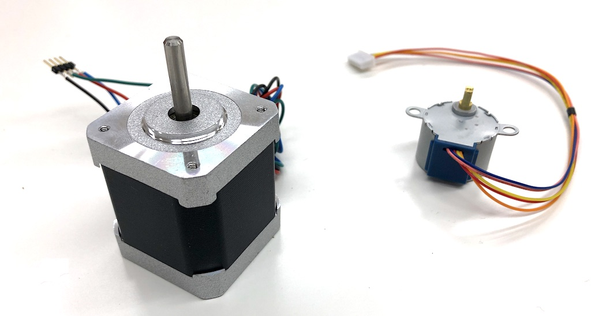
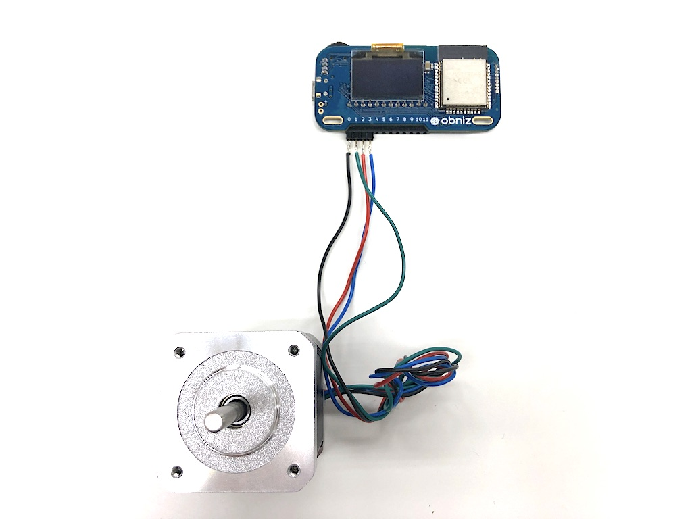

# StepperMotor

ステッピングモーター(またはパルスモーター)はDCモーターのように中にあるコイルをとにかく回すというものとは違い、
ある角度ずつ正確に回転させることができるモーターです。ステップごとに動かすのでそのような名前になっています。
ステッピングモーターを使えば正確に回転させたり、移動させたり、または動かないように位置をキープしたりといったことが簡単にできます。逆に高速にパワフルに回転させる用途には向きません。

このライブラリではバイポーラ・ユニポーラのステッピングモーターを駆動できます。obniz Boardから直接つないで動かすため5vで動くものを想定しています。






## wired(obniz, {a, b, aa, bb [, common]})

部品と接続したioを指定します。

バイポーラ・ユニポーラ、それぞれでこのように接続します。


ライブラリはcommonの有無でバイポーラかユニポーラかを判断します。

name | type | required | default | description
--- | --- | --- | --- | ---
a | `number(obniz Board io)` | no |  &nbsp; | つないだobniz Boardのioを指定してください。
b | `number(obniz Board io)` | no |  &nbsp; | つないだobniz Boardのioを指定してください。
aa | `number(obniz Board io)` | no |  &nbsp; | つないだobniz Boardのioを指定してください。aの逆相を指定します。
bb | `number(obniz Board io)` | no |  &nbsp; | つないだobniz Boardのioを指定してください。bの逆相を指定します。
common | `number(obniz Board io)` | no |  &nbsp; | ユニポーラの場合に指定します。


```Javascript
// Javascript Example
var motor = obniz.wired("StepperMotor", {a:0, aa:1, b:2, bb:3});
await motor.stepWait(100);
await motor.stepWait(200);
console.log(motor.currentStep); // => 300
```

### stepType(type: string)

励磁方法を変更します。デフォルトで2となっています。

name | type | required | default | description
--- | --- | --- | --- | ---
type | `string` | yes | `'2'` | 下に詳細を記す

指定できるのは以下です。

keyname | type | description
--- | --- | ---
`'1'` | 1相励磁 | どれか１つのコイルのみを動作する方法。消費電力が少ないが、パワーは弱い
`'2'` | 2相励磁 | 必ず２つのコイルを動作する方法。最も一般的
`'1-2'` | 1-2相励磁 | 上記２つを組み合わせた方式で半分のステップで駆動できるのが特徴

`'1-2'`のみステップあたりの移動量が変わるので注意が必要です。

```Javascript
// Javascript Example
var motor = obniz.wired("StepperMotor", {a:0, aa:1, b:2, bb:3});
motor.stepType('1');
await motor.stepWait(100);
await motor.stepWait(200);
console.log(motor.currentStep); // => 300
```

### speed(frequency: number)

速度をHzで指定します。100は1秒間に100ステップとなります。

name | type | required | default | description
--- | --- | --- | --- | ---
frequency | `number` | yes | `100` | ステップ移動の周波数

指定できる最大値はモーターとモーターの負荷によって異なります。大きいほどスリップの可能性(動かしたはずなのに実際は動いていない)が上がります

```Javascript
// Javascript Example
var motor = obniz.wired("StepperMotor", {a:0, aa:1, b:2, bb:3});
motor.speed(1000);
await motor.stepWait(100);
```

### [await] stepWait(step: number)

指定したステップだけ移動します。speedとstepTypeに従ってモーターを駆動します。

name | type | required | default | description
--- | --- | --- | --- | ---
step | `number` | yes | - | 動かしたいステップ数

小数が与えられた場合は四捨五入されます。

```Javascript
// Javascript Example
var motor = obniz.wired("StepperMotor", {a:0, aa:1, b:2, bb:3});
await motor.stepWait(100);
await motor.stepWait(-100);
// now returned to start position.
```

### [await] stepToWait(destination: number)

目的となるステップ数の場所まで移動します。speedとstepTypeに従ってモーターを駆動します。

name | type | required | default | description
--- | --- | --- | --- | ---
destination | `number` | yes | - | 目的となるステップ数。


```Javascript
// Javascript Example
var motor = obniz.wired("StepperMotor", {a:0, aa:1, b:2, bb:3});
await motor.stepWait(100);
await motor.stepToWait(-150); // it move -250 steps
console.log(motor.currentStep) // => -150
```

### [await] holdWait()

今のステップ位置で電流を流し、維持した状態にします。

```Javascript
// Javascript Example
var motor = obniz.wired("StepperMotor", {a:0, aa:1, b:2, bb:3});
await motor.holdWait();
```

### [await] freeWait()

全てのコイルへの電流を停止し、モーターを自由な状態にします。

```Javascript
// Javascript Example
var motor = obniz.wired("StepperMotor", {a:0, aa:1, b:2, bb:3});
await motor.stepWait(100);
await motor.freeWait();
```


### currentStep

現在の位置をステップで表します。初期値は0です。
100ステップ動かし-50動かしたなら50となっています。

```Javascript
// Javascript Example
var motor = obniz.wired("StepperMotor", {a:0, aa:1, b:2, bb:3});
await motor.stepWait(100);
await motor.stepToWait(-150); // it move -250 steps
console.log(motor.currentStep) // => -150
```

### [await] rotateWait(rotation: number)

指定した角度だけ回転させます。
rotationStepCount変数に従い動かすので、先に設定する必要があります。

name | type | required | default | description
--- | --- | --- | --- | ---
rotation | `number` | yes | - | 回転させたい角度(度)

360を指定すれば1回転することになり、-360で逆向きに１回転します。

```Javascript
// Javascript Example
var motor = obniz.wired("StepperMotor", {a:0, aa:1, b:2, bb:3});
motor.rotationStepCount = 100;
await motor.rotateWait(360 * 2);
console.log(motor.currentRotation()); // => 720
console.log(motor.currentAngle()); // => 0
```

### [await] rotateToWait(rotation: number)

始めの角度を0度として指定した角度になるように回転させます。
また、最も少ない移動数でその角度に移動します。
rotationStepCount変数に従い動かすので、先に設定する必要があります。

name | type | required | default | description
--- | --- | --- | --- | ---
angle | `number` | yes | - | 目標となる角度(0 to 360)

355度に移動したあと0を指定すると355度ではなく5度の移動となります。

```Javascript
// Javascript Example
var motor = obniz.wired("StepperMotor", {a:0, aa:1, b:2, bb:3});
motor.rotationStepCount = 100;
await motor.rotateToWait(90);
```

### rotationStepCount

1回転するのに何ステップ必要かを指定します。この値はモーターによって異なります。デフォルトで100となっています。

```Javascript
// Javascript Example
var motor = obniz.wired("StepperMotor", {a:0, aa:1, b:2, bb:3});
motor.rotationStepCount = 100;
await motor.rotateToWait(90);
```

### [await] moveWait(distance: number)

指定した距離(mm)だけ移動します。
milliMeterStepCount変数に従い動かすので、先に設定する必要があります。

name | type | required | default | description
--- | --- | --- | --- | ---
distance | `number` | yes | - | 移動距離(mm)


```Javascript
// Javascript Example
var motor = obniz.wired("StepperMotor", {a:0, aa:1, b:2, bb:3});
motor.milliMeterStepCount = 10;
await motor.moveWait(100);
await motor.moveWait(-10);
console.log(motor.currentDistance()); // => 90
```

### [await] moveToWait(destination: number)

はじめを0として、指定した位置(mm)に移動します。
milliMeterStepCount変数に従い動かすので、先に設定する必要があります。

name | type | required | default | description
--- | --- | --- | --- | ---
destination | `number` | yes | - | 目標位置(mm)


```Javascript
// Javascript Example
var motor = obniz.wired("StepperMotor", {a:0, aa:1, b:2, bb:3});
motor.milliMeterStepCount = 10;
await motor.moveWait(100);
await motor.moveToWait(-10);
console.log(motor.currentDistance()); // => -10
```

### milliMeterStepCount

1ミリ移動するのに何ステップ必要なのかを指定します。デフォルトで1となっています。

```Javascript
// Javascript Example
var motor = obniz.wired("StepperMotor", {a:0, aa:1, b:2, bb:3});
motor.milliMeterStepCount = 10;
await motor.moveWait(100);
await motor.moveToWait(-10);
console.log(motor.currentDistance()); // => -10
```