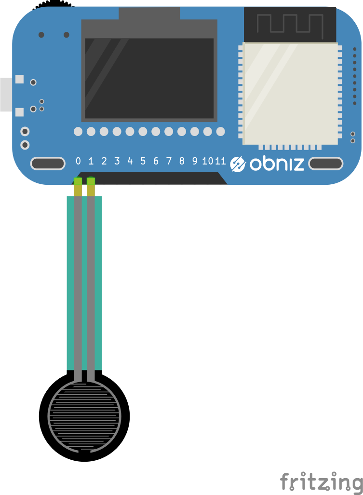

# Pressure Sensor - FSR40X

Pressure sensor. It output pressure as a voltage.


## wired(obniz, {pin0, pin1})

Connect two pins to an obniz Board. pin0 and pin1 is obniz Board io number.


```javascript
// Javascript Example
var pressure = obniz.wired("FSR40X", {pin0:0, pin1:1});
```

## onchange = function(temp)

callbackfunction will called when pressure changed.

```javascript
// Javascript Example
var pressure = obniz.wired("FSR40X", {pin0:0, pin1:1});
pressure.onchange =function(press){
  console.log(press)
}
```

## [await]getWait();

Get pressure value once.

```javascript
// Javascript Example
var pressure = obniz.wired("FSR40X", {pin0:0, pin1:1});
var press = await pressure.getWait();
console.log(press)
```
