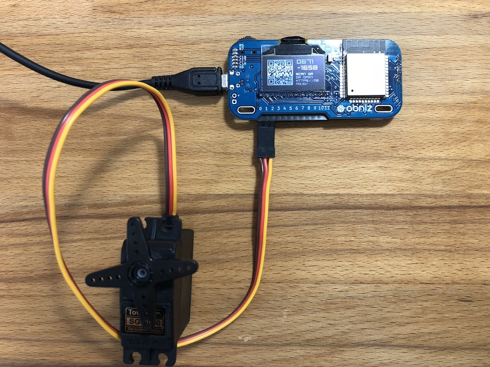

# ServoMotor

RC Servo Motor is computer embeded geard motor.
It keep "Angle".
You just need to send a angle data to servomotor. 



## obniz.wire("ServoMotor", {signal, [, vcc, gnd]})

Connect three feet to obniz. gnd, vcc and signal, respectively, and the placement is different depending on the manufacturere of motor. 

This is commonly used pattern.
obniz set include this pattern's servomotor.


If you connectgnd, vcc and signal to Obniz 0, 1, 2 respectively, write a code as follows.

```Javascript
var servo = obniz.wired("ServoMotor", {gnd:0, vcc:1, signal:2});
```
## angle(float)
Change the motor angle.
angle : 0 - 180 degree
### Example
```Javascript
var servo = obniz.wired("ServoMotor", {gnd:0, vcc:1, signal:2});

servo.angle(90.0); // half position
```

vcc and gnd is optional. When you connect vcc and gnd to other way, then just specify signal.
```Javascript
var servo = obniz.wired("ServoMotor", {signal:2});
```

## on();
Turn on the power.
When you call wired function, it automatically turn on.

### Example
```Javascript
var servo = obniz.wired("ServoMotor", {gnd:0, vcc:1, signal:2});

servo.position(90.0); // half position
servo.off();
servo.on();
```

## off();
Turn off the power.
When you call wired function, it automatically turn on.

### Example
```Javascript
var servo = obniz.wired("ServoMotor", {gnd:0, vcc:1, signal:2});

servo.position(90.0); // half position
servo.off();
servo.on();
```