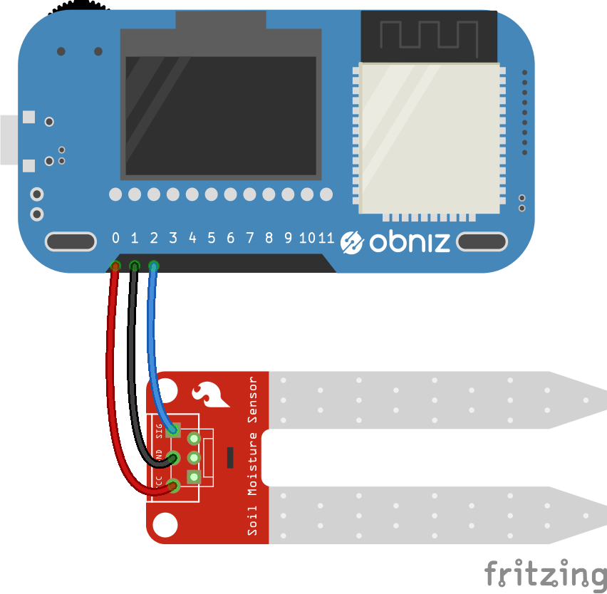

# Soil Moisture Sensor - SEN0114

It detect moisture level in soil.


## wired(obniz, { vcc, output, gnd} )
connect vcc,output,gnd to an obniz Board.




```javascript
// Javascript Example
var sensor = obniz.wired("SEN0114", {vcc:0,  gnd:1, output:2});
sensor.onchange = function(humidity){
  console.log(humidity)
};
```


## onchange = function(value)
callback function called when the value was changed.
Manufacture data says moisture level increse with moisture like

1. 0~1.47: Dry
2. 1.47~3.43: Wet
3. 3.43~4.20: Under walter

```javascript
// Javascript Example
var sensor = obniz.wired("SEN0114", {vcc:0,  gnd:1, output:2});
sensor.onchange = function(humidity){
  console.log(humidity)
};
```
## [await] getHumidityWait()
Measure and get current value once.

```javascript
// Javascript Example
var sensor = obniz.wired("SEN0114",  {vcc:0,  gnd:1, output:2});
var humid = await sensor.getHumidityWait();
console.log('Humidity Level:' + humid);
```
