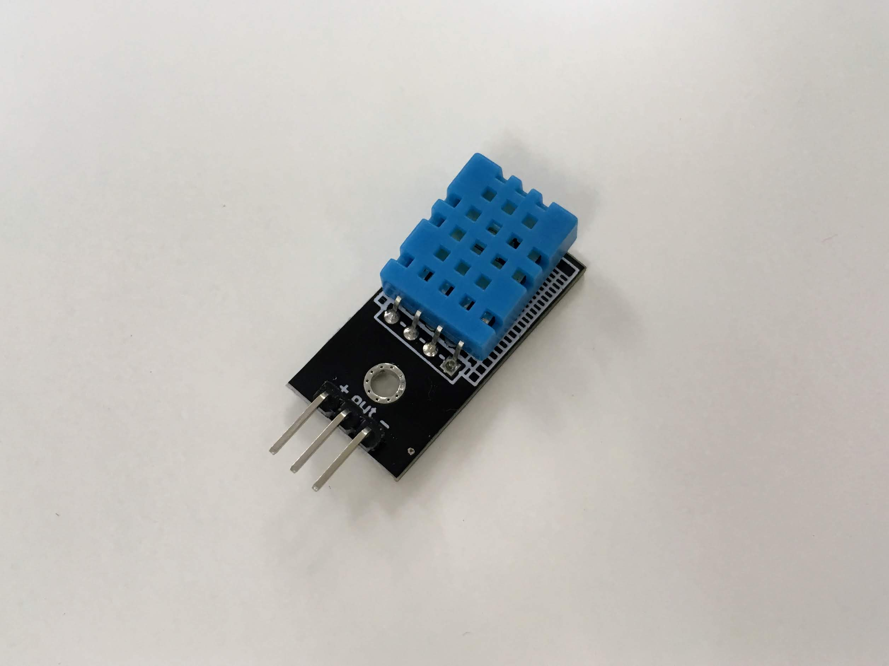
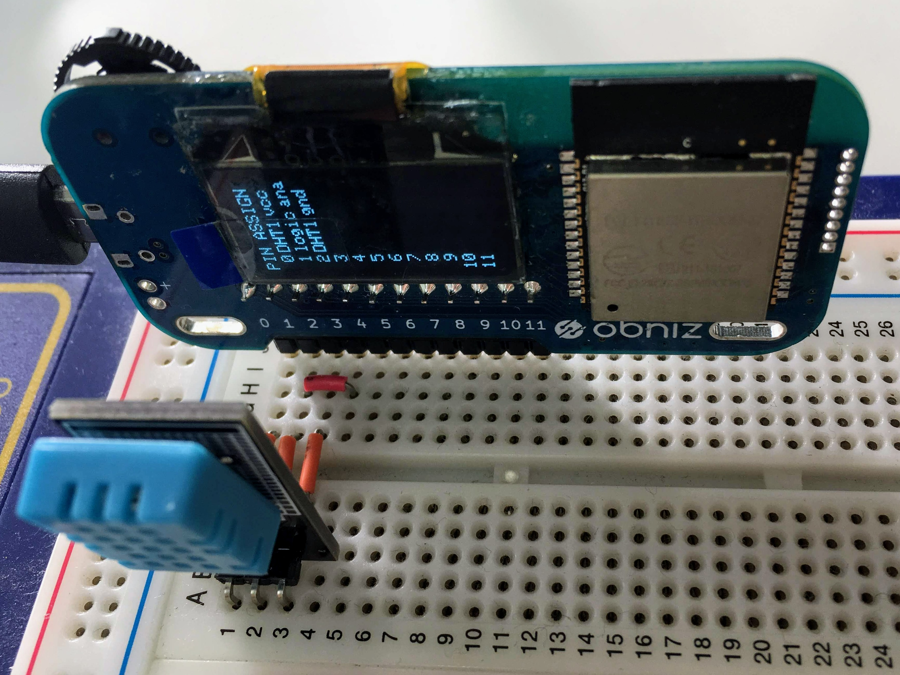

# Temperature Sensor - DHT11
温度、湿度センサDHT11です。センサで取得した温度と湿度を知ることができます。



## wired(obniz, {[gnd, sda, vcc, trigger]})

センサをobnizにつなぎます。
このライブラリでは、`sda`と`trigger`ピンはどちらも、センサのシリアルデータ端子に接続する必要があります。
そのため、ブレッドボードの使用を推奨します。



```javascript
// Javascript Example
var dht11 = obniz.wired("DHT11", { gnd: 0, sda: 1, vcc: 2, trigger: 3 });
obniz.wait(2000);
const obj = await dht11.getAllWait();
console.log(obj);
```

## [await] getAllWait()

すべての値を取得します。

- temperature: セルシウス温度
- humidity: %

DHT11のサンプリング間隔は2秒以上必要です。
初期化時にも2秒以上待つ必要があるので、ここでは`obniz.wait(2000);`で2秒待ちます。

```javascript
// Javascript Example
var dht11 = obniz.wired("DHT11", { gnd: 0, sda: 1, vcc: 2, trigger: 3 });
obniz.wait(2000); //DHT11のサンプリング間隔は2秒以上必要なため、初期化時にも2秒以上待つ必要がある
const obj = await dht11.getAllWait();
console.log('temp: ' + obj.temperature + ' degree');
console.log('humidity: ' + obj.humidity + ' %');
```

継続的に測定したい場合は、`setInterval`を使います。
また`debugprint`を`true`に設定することにより、データが正しく読まれなかったときの情報をブラウザのコンソールに出力することができます。

```javascript
// Javascript Example
var dht11 = obniz.wired("DHT11", { gnd: 0, sda: 1, vcc: 2, trigger: 3 });
dht11.debugprint = true;
setInterval(async function () {
  const obj = await dht11.getAllWait();
  console.log('temp: ' + obj.temperature + ' degree');
  console.log('humidity: ' + obj.humidity + ' %');
}, 2500);
```

## [await] getTempWait()

現在の温度を計測して返します。単位は摂氏(°C)です。
getAllWait,getTempWait,getHumdWaitを合わせて、2秒以内に2回以上実行しても、正しくデータを取得することができないので、注意してください。

```javascript
// Javascript Example
var dht11 = obniz.wired("DHT11", { gnd: 0, sda: 1, vcc: 2, trigger: 3 });
obniz.wait(2000);
const temp = await dht11.getTempWait();
console.log('temp: ' + temp + ' degree');
```

## [await] getHumdWait()

現在の湿度を計測して返します。単位は%です。
getAllWait,getTempWait,getHumdWaitを合わせて、2秒以内に2回以上実行しても、正しくデータを取得することができないので、注意してください。

```javascript
// Javascript Example
var dht11 = obniz.wired("DHT11", { gnd: 0, sda: 1, vcc: 2, trigger: 3 });
obniz.wait(2000);
const humd = await dht11.getHumdWait();
console.log('humd: ' + humd + ' %');
```

## read(callback)

コールバック関数を指定して、非同期的に読み取ることもできます。

```javascript
// Javascript Example
var dht11 = obniz.wired("DHT11", { gnd: 0, sda: 1, vcc: 2, trigger: 3 });
obniz.wait(2000); //DHT11のサンプリング間隔は2秒以上必要なため、初期化時にも2秒以上待つ必要がある
await dht11.read(function(obj){
  console.log('temp: ' + obj.temperature + ' degree');
  console.log('humidity: ' + obj.humidity + ' %');
});
```
