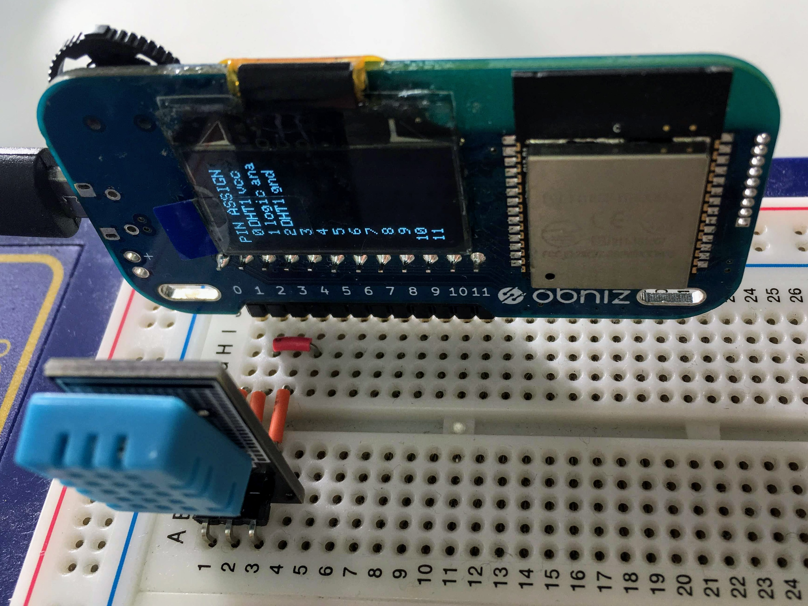

# Temperature Sensor - DHT11
Temperature and Humidity sensor DHT11.


## wired(obniz, {[vcc, sda, gnd, trigger]})

Connect a sensor to an obniz.
In this library, the `sda` and `trigger` pins must be connected to the sensor's serial data pin.
Therefore, we recommend using a breadboard.



```javascript
// Javascript Example
var dht11 = obniz.wired("DHT11", { vcc: 0, sda: 1, gnd: 2, trigger: 3 });
obniz.wait(2000);
const obj = await dht11.getAllWait();
console.log(obj);
```

## [await] getAllWait()

Get all the values.

- temperature: Celsius temperature
- humidity: %

The sampling interval of DHT11 needs 2 seconds or more.
Since we need to wait more than 2 seconds at initialization, here we wait for 2 seconds with `obniz.wait (2000);`.

```javascript
// Javascript Example
var dht11 = obniz.wired("DHT11", { vcc: 0, sda: 1, gnd: 2, trigger: 3 });
obniz.wait(2000); //Since the sampling interval of DHT11 requires 2 seconds or more, it is necessary to wait 2 seconds or more at initialization as well.
const obj = await dht11.getAllWait();
console.log('temp: ' + obj.temperature + ' degree');
console.log('humidity: ' + obj.humidity + ' %');
```

If you want to measure continuously, use `setInterval`.
You can also set `debugprint` to `true` to print information to the browser console when the data was not read correctly.

```javascript
// Javascript Example
var dht11 = obniz.wired("DHT11", { vcc: 0, sda: 1, gnd: 2, trigger: 3 });
dht11.debugprint = true;
setInterval(async function () {
  const obj = await dht11.getAllWait();
  console.log('temp: ' + obj.temperature + ' degree');
  console.log('humidity: ' + obj.humidity + ' %');
}, 2500);
```

## [await] getTempWait()

Measure and return the current temperature. The unit is Celsius (°C).
Please note that even if you execute getAllWait, getTempWait, and getHumdWait together and execute them more than once within 2 seconds, you can not acquire data correctly.

```javascript
// Javascript Example
var dht11 = obniz.wired("DHT11", { vcc: 0, sda: 1, gnd: 2, trigger: 3 });
obniz.wait(2000);
const temp = await dht11.getTempWait();
console.log('temp: ' + temp + ' degree');
```

## [await] getHumdWait()

Measure and return the current humidity. The unit is %.
Please note that even if you execute getAllWait, getTempWait, and getHumdWait together and execute them more than once within 2 seconds, you can not acquire data correctly.

```javascript
// Javascript Example
var dht11 = obniz.wired("DHT11", { vcc: 0, sda: 1, gnd: 2, trigger: 3 });
obniz.wait(2000);
const humd = await dht11.getHumdWait();
console.log('humd: ' + humd + ' %');
```

## read(callback)

You can also specify a callback function to read asynchronously.

```javascript
// Javascript Example
var dht11 = obniz.wired("DHT11", { vcc: 0, sda: 1, gnd: 2, trigger: 3 });
obniz.wait(2000); //Since the sampling interval of DHT11 requires 2 seconds or more, it is necessary to wait 2 seconds or more at initialization as well.
await dht11.read(function(obj){
  console.log('temp: ' + obj.temperature + ' degree');
  console.log('humidity: ' + obj.humidity + ' %');
});
```
