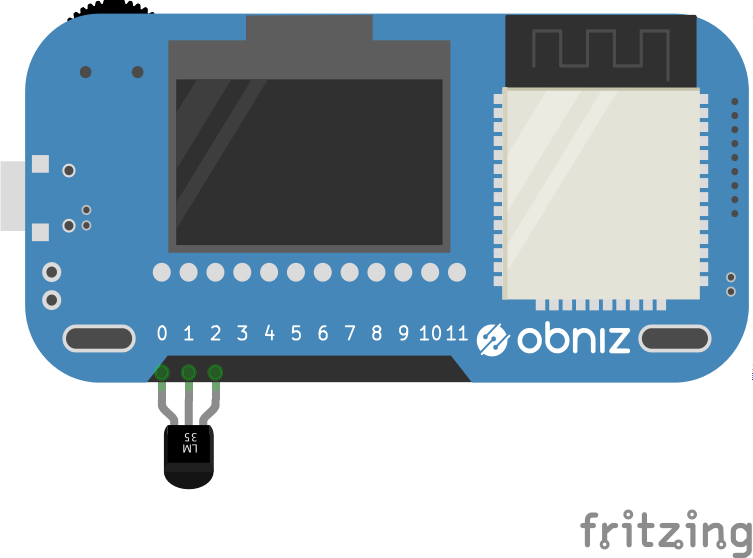

# Temperature Sensor - LM61

温度センサLM61BIZ/LM61CIZです。センサで取得した温度を知ることができます。




## wired(obniz, {vcc, output, gnd})
Obnizに温度センサをつなぎます。
0,1,2はそれぞれ温度センサの電源,センサ出力,GNDへ接続してください。
```javascript
var tempsens = obniz.wired("LM61", { gnd:0 , output:1, vcc:2});
```

## onchange
温度センサの値に変化があった場合にcallback関数を呼び出します。
温度は摂氏で返されます。
```javascript
var tempsens = obniz.wired("LM61", { gnd:0 , output:1, vcc:2});
tempsens.onchange = function(temp){
  console.log(temp);
};
```
` 