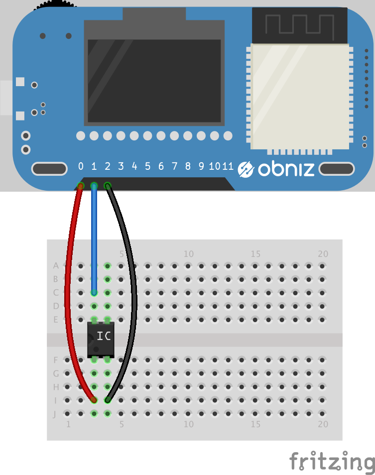

# Temperature Sensor - S8120C





## wired(obniz, {vcc, gnd, output})
```javascript
var tempsens = obniz.wired("S8120C", { gnd:0 , output:1, vcc:2});
```

## onchange
callback function for temperature change.
Unit of temp is Celsius

```javascript
var tempsens = obniz.wired("S8120C",   { gnd:0 , output:1, vcc:2});
tempsens.onchange = function(temp){
console.log(temp)
};
```
 

