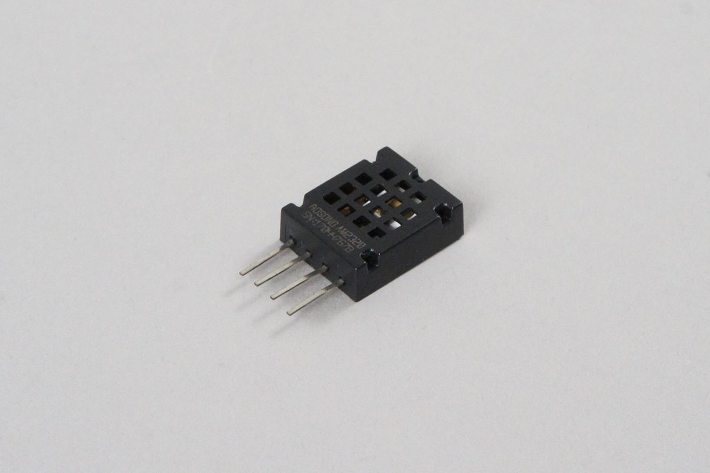
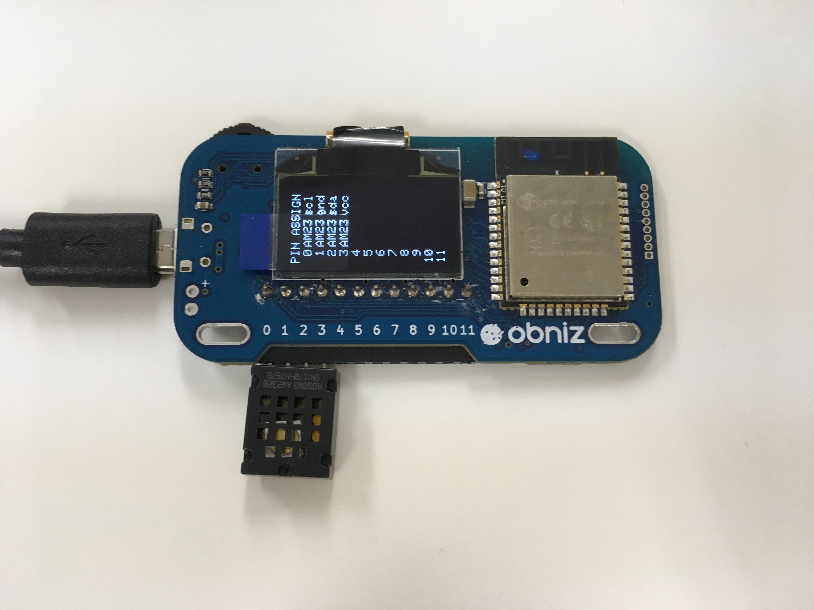

# Temperature Sensor - AM2320
温度、湿度センサAM2320です。センサで取得した温度と湿度を知ることができます。



## wired(obniz,  {vcc, sda, gnd, scl} )

obnizに温度センサをつなぎます。
図のように繋ぐと、0,1,2,3はそれぞれ温度センサのSCL, GND, SDA, 電源ピンに接続したことになります。センサのピンが薄いため、接触が悪い場合があります。その場合はブレッドボードを使うと良いです。



```javascript
// Javascript Example
var sensor = obniz.wired("AM2320", { vcc: 3, sda: 2, gnd: 1, scl: 0 });
```

## [await] getAllWait()

すべての値を取得します。

- temperature: セルシウス温度
- humidity: %

AM2320のサンプリング間隔は2秒以上必要です。
初期化時にも2秒以上待つ必要があるので、ここでは`obniz.wait(2000);`で2秒待ちます。

```javascript
// Javascript Example
var sensor = obniz.wired("AM2320", { vcc: 3, sda: 2, gnd: 1, scl: 0 });
obniz.wait(2000); //AM2320のサンプリング間隔は2秒以上必要なため、初期化時にも2秒以上待つ必要がある
const obj = await sensor.getAllWait();
console.log('temp: ' + obj.temperature + ' degree');
console.log('humidity: ' + obj.humidity + ' %');
```

継続的に測定したい場合は、`setInterval`を使います。

```javascript
// Javascript Example
var sensor = obniz.wired("AM2320", { vcc: 3, sda: 2, gnd: 1, scl: 0 });
setInterval(async function () {
  const obj = await sensor.getAllWait();
  console.log('temp: ' + obj.temperature + ' degree');
  console.log('humidity: ' + obj.humidity + ' %');
}, 2500);
```

## [await] getTempWait()

現在の温度を計測して返します。単位は摂氏(°C)です。

```javascript
// Javascript Example
var sensor = obniz.wired("AM2320", { vcc: 3, sda: 2, gnd: 1, scl: 0 });
obniz.wait(2000);
const temp = await sensor.getTempWait();
console.log('temp: ' + temp + ' degree');
```

## [await] getHumdWait()

現在の湿度を計測して返します。単位は%です。

```javascript
// Javascript Example
var sensor = obniz.wired("AM2320", { vcc: 3, sda: 2, gnd: 1, scl: 0 });
obniz.wait(2000);
const humd = await sensor.getHumdWait();
console.log('humd: ' + humd + ' %');
```
