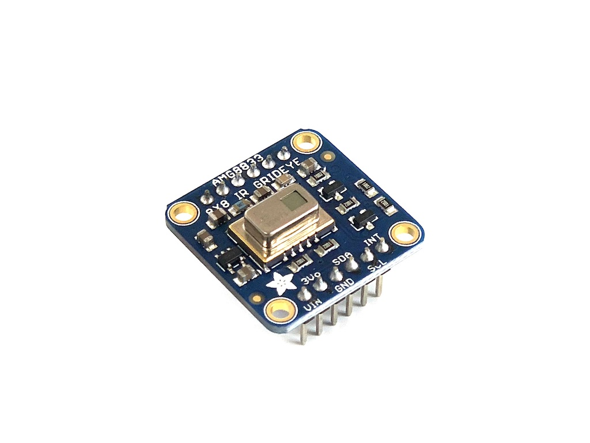
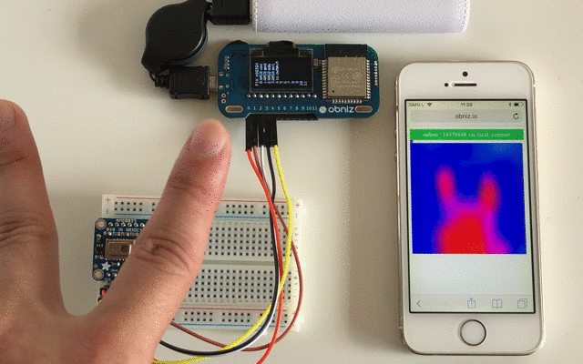

# Thermal Camera Sensor - AMG8833
赤外線アレイセンサAMG8833を使用しています。
測定範囲は0~80℃です。
8x8画素で温度分布を測定することができます。



いくつかのメーカーからAMG8833を使ったモジュールが発売されています。
上の写真はAdafruitの出しているモジュールの写真です。




## wired(obniz,  {[vin, gnd, sda, scl, address]} )
obniz Boardにセンサをつなぎます。
AMG8833は3.3V駆動です。このライブラリでのvinは5V出力になりますので、Adafruit社製以外のモジュールを使用する場合は注意してください。

Adafruitのモジュールを使う場合は、電源を安定供給するためにobniz Boardの２箇所以上のIOから電源を供給してください。

addressは未指定の場合は0x69になります。モジュール裏面のジャンパを接続した場合は、0x68を指定してください。
```javascript
// Javascript Example
obniz.io4.output(true);
var grideye = obniz.wired("AMG8833", {vcc:0, gnd:1, sda:2, scl:3, address:0x69});
```


## [await] getAllPixWait()
64個すべての画素の温度を取得します。
温度はセルシウス温度で0~80度です。
戻り値は64個の要素を持つ配列です。
```javascript
// Javascript Example
var grideye = obniz.wired("AMG8833", {vcc:0, gnd:1, sda:2, scl:3});
var temp = await grideye.getAllPixWait();
console.log('temperature:' + temp);
```

canvasなどを使うと簡単に描画することが出来ます。

```javascript
<canvas id="canvas" width="300" height="300"></canvas>

and

var canvas=document.getElementById("canvas");
var ctx=canvas.getContext("2d");
var width = canvas.width;
var height = canvas.height;

for(let x=0;x<8;x++) {
  for(let y=0;y<8;y++) {
    var temp = temps[x*8+y];
    var h = -80+(temp-29)*25
    ctx.fillStyle="hsl("+h+", 100%, 50%)";
    ctx.fillRect(width/8*x,height/8*y,width/8,height/8);
  }
}
```


OpenCVなどの解像度のアップコンバートを利用すると、擬似的に高解像度化することが出来ます。

```javascript
<canvas id="canvas" width="8" height="8"></canvas>
<canvas id="canvas_highr" width="100" height="100"></canvas>

and

var canvas=document.getElementById("canvas");
var ctx=canvas.getContext("2d");
var width = canvas.width;
var height = canvas.height;

for(let x=0;x<8;x++) {
  for(let y=0;y<8;y++) {
    var temp = temps[x*8+y];
    var h = -80+(temp-29)*25
    ctx.fillStyle="hsl("+h+", 100%, 50%)";
    ctx.fillRect(width/8*x,height/8*y,width/8,height/8);
  }
}

let src = cv.imread('canvas');
let dst = new cv.Mat();
let dsize = new cv.Size(300, 300);
cv.resize(src, dst, dsize, 0, 0, cv.INTER_CUBIC);
cv.imshow('canvas_highr', dst);
src.delete(); dst.delete();
```


## [await] getOnePixWait(pixel)
pixelで指定した1画素の温度を出力します。画素は0~63の範囲で指定してください。
```javascript
// Javascript Example
var grideye = obniz.wired("AMG8833", {vcc:0, gnd:1, sda:2, scl:3});
var temp = await grideye.getOnePixWait(10);
console.log('temperature:' + temp);
```
