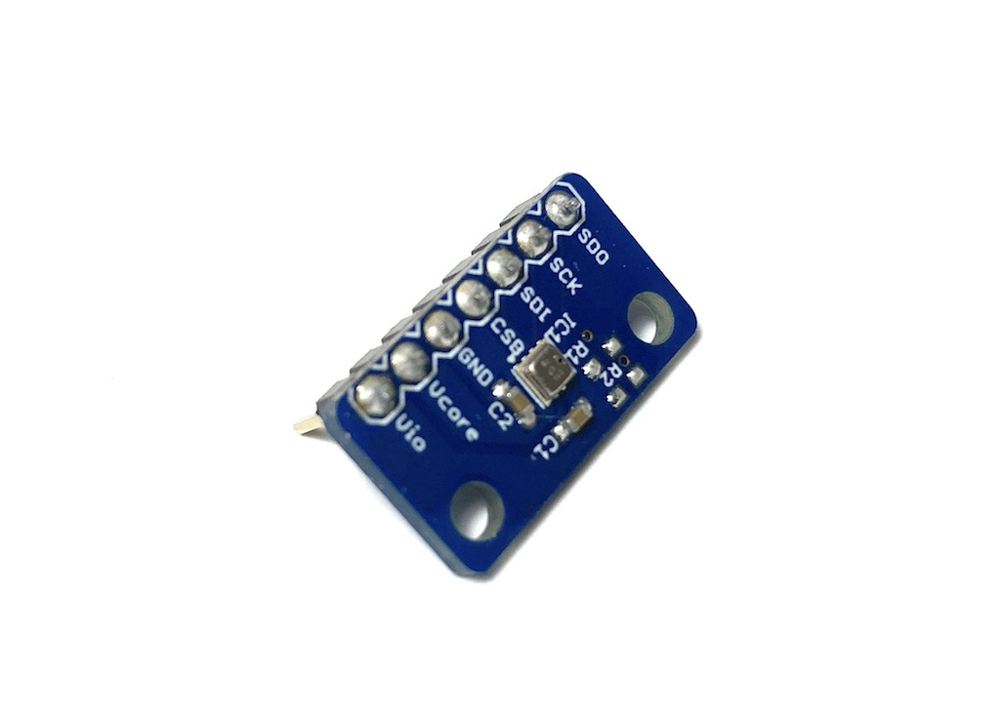
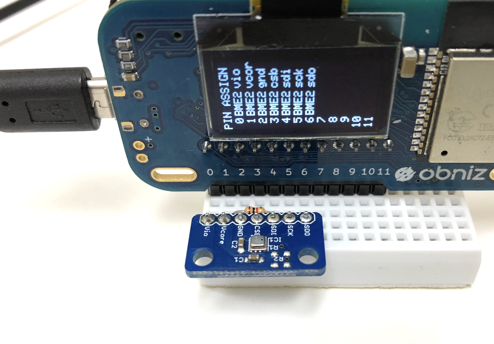

# 温度センサー - BME280
温度、湿度、気圧センサーです。
とても低い消費電力で、かつ高い精度で計測できま



## wired(obniz,  {[vio, vcore, gnd, csb, sdi, sck, sdo, address, i2c]} )

センサーをobniz Boardにつなぎます。
obniz Boardには内部プルアップがありますが、安定した通信のためには外部の抵抗を使ってSCKとSDIをvioなどにプルアップして下さい。



##### 以下のような直接接続はおすすめできません


name | type | required | default | description
--- | --- | --- | --- | ---
vio | `number(obniz Board io)` | no | &nbsp; | connected obniz Board io. power supply for interface
vcore | `number(obniz Board io)` | no | &nbsp; | connected obniz Board io. power supply for core
gnd | `number(obniz Board io)` | no | &nbsp; | connected obniz Board io. power supply
csb | `number(obniz Board io)` | no | &nbsp; | connected obniz Board io. I2C/SPI 選択.
sdi | `number(obniz Board io)` | no | &nbsp; | connected obniz Board io. データ端子
sck | `number(obniz Board io)` | no | &nbsp; | connected obniz Board io. クロック
sdo | `number(obniz Board io)` | no | &nbsp; | connected obniz Board io. データ通信かアドレス選択
i2c | `i2c object` | no | &nbsp; | configured i2c object
address | `number` | no | 0x76  | 0x76 or 0x77

このライブラリではI2Cで部品と通信します。

```javascript
// Javascript Example
// Please pullup sdi and sck.
var bme280 = obniz.wired("BME280", {vio:0, vcore:1, gnd:2, csb:3, sdi: 4, sck: 5, sdo:6 });
await bme280.applyCalibration();
const val = await bme280.getAllWait();
console.log(val);
```

vioとvcoreは直接繋げられます。
csbはhighに単純に繋げられ、sdoもgndに単純に繋げられます。
なので、そのように繋いだものをobniz Boardにつなぐときの最小構成は以下になります。


```javascript
// Javascript Example

// vcore connected to vio
// csb connected to vio
// sdo connected to gnd

var bme280 = obniz.wired("BME280", {vio:0, gnd:1, sdi: 2, sck: 3 });
await bme280.applyCalibration();
const val = await bme280.getAllWait();
console.log(val);
```

またはI2Cオブジェクトで設定することで他のI2C接続の部品とバスを共有できます。

```javascript
// Javascript Example

var i2c = obniz.getFreeI2C();
i2c.start({mode:"master", sda:2, scl:3, clock:100000}); 

var bme280 = obniz.wired("BME280", {vio:0, gnd:1, i2c: i2c });
```

もしチップをsdoをプルアップすることでアドレスを 0x77にしている場合は

```javascript
// Javascript Example

var bme280 = obniz.wired("BME280", {vio:0, gnd:1, sdi: 2, sck: 3, address: 0x77});
```

## [await] applyCalibration()

チップに保存されている工場で設定されているキャリブレーションデータを取り出します。
これをしないで使うことも出来ますが、これを一度呼び出すことで精度がかなり上がります。

```javascript
// Javascript Example
// Please pullup sdi and sck.
var bme280 = obniz.wired("BME280", {vio:0, vcore:1, gnd:2, csb:3, sdi: 4, sck: 5, sdo:6 });
await bme280.applyCalibration();
```

## [await] setIIRStrength()

内蔵IIRフィルタの強度を変更できます。 0 to 4.

0 で使わない設定となります（デフォルト）

IIRフィルタは計測結果を安定させてより高い精度にします。
ただし、そのためには結果が出るのをしばらく待つ必要があります。


```javascript
// Javascript Example
// Please pullup sdi and sck.
var bme280 = obniz.wired("BME280", {vio:0, vcore:1, gnd:2, csb:3, sdi: 4, sck: 5, sdo:6 });
await bme280.applyCalibration();
await bme280.setIIRStrength(1); // start using minimum IIR 
```

## [await] getAllWait()

すべての値を取得します。

- temperature: セルシウス温度
- humidity: %
- pressure: hPa

```javascript
// Javascript Example
// Please pullup sdi and sck.
var bme280 = obniz.wired("BME280", {vio:0, vcore:1, gnd:2, csb:3, sdi: 4, sck: 5, sdo:6 });
await bme280.applyCalibration();
const obj = await bme280.getAllWait();
console.log('temp: ' + obj.temperature + ' degree');
console.log('humidity: ' + obj.humidity + ' %');
console.log('pressure: ' + obj.pressure + ' hPa');
```

## calcAltitude(pressure, seaPressure)

気圧から高度を計算するUtility関数です。返り値はメートルでとなります。

```javascript
// Javascript Example
// Please pullup sdi and sck.
var bme280 = obniz.wired("BME280", {vio:0, vcore:1, gnd:2, csb:3, sdi: 4, sck: 5, sdo:6 });
await bme280.applyCalibration();
const obj = await bme280.getAllWait();
const airPressure = obj.pressure;
const hight_in_m = bme280.calcAltitude(airPressure);
console.log('altitude: ' + hight_in_m + ' m');
```