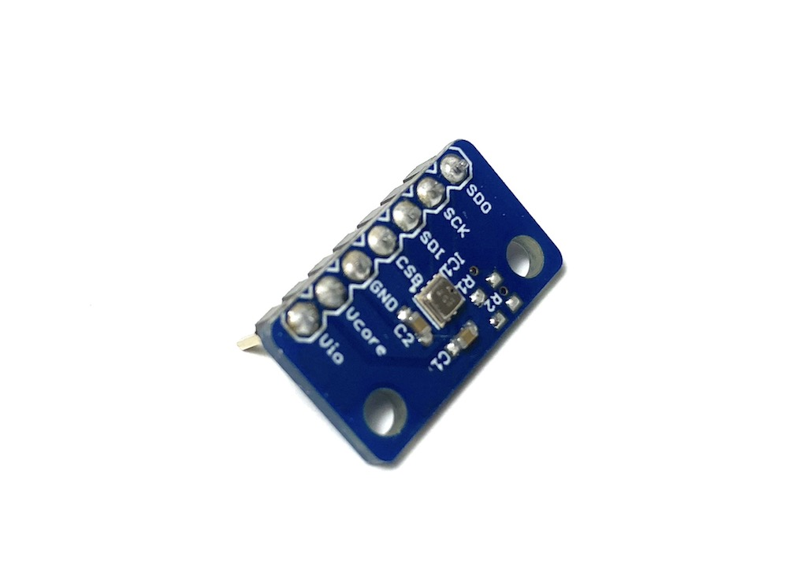
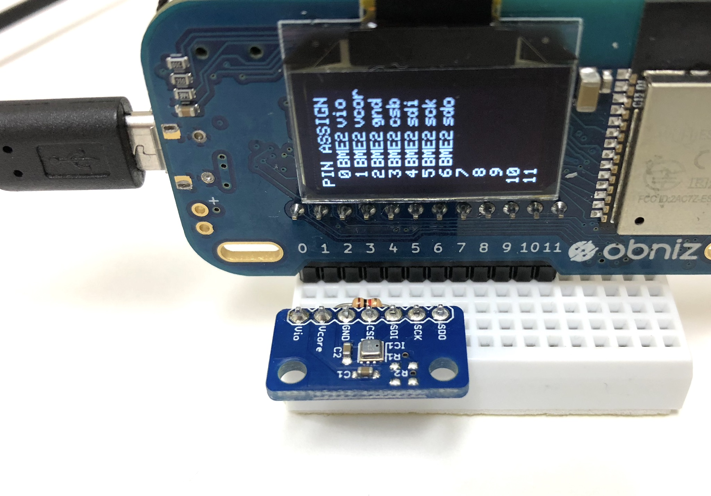
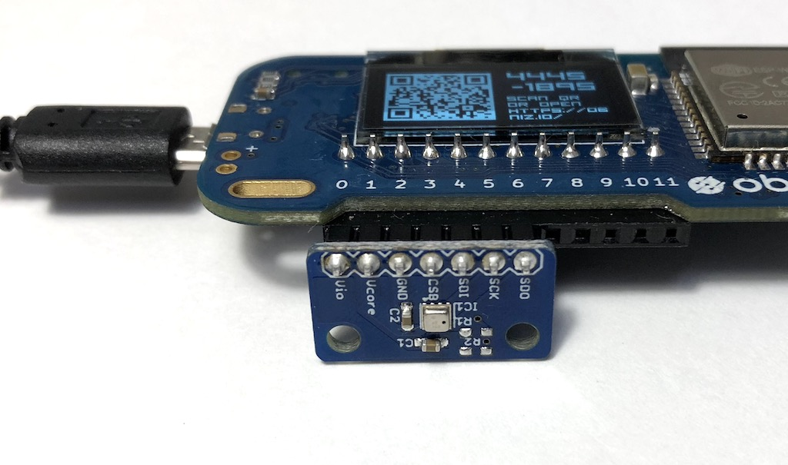

# Temperature Sensor - BME280
Temperature / Humidity / Air pressure sensor.
Very low energy consumption and high accuracy.



## wired(obniz,  {[vio, vcore, gnd, csb, sdi, sck, sdo, address, i2c]} )

Connect a sensor to an obniz Board.
obniz Board has internal pull up. But for communication stability, please add pull-up resistor to both SCK and SDI.



##### Not recommended direct connecting.



name | type | required | default | description
--- | --- | --- | --- | ---
vio | `number(obniz Board io)` | no | &nbsp; | connected obniz Board io. power supply for interface
vcore | `number(obniz Board io)` | no | &nbsp; | connected obniz Board io. power supply for core
gnd | `number(obniz Board io)` | no | &nbsp; | connected obniz Board io. power supply
csb | `number(obniz Board io)` | no | &nbsp; | connected obniz Board io. I2C/SPI selection.
sdi | `number(obniz Board io)` | no | &nbsp; | connected obniz Board io. data port
sck | `number(obniz Board io)` | no | &nbsp; | connected obniz Board io. clock
sdo | `number(obniz Board io)` | no | &nbsp; | connected obniz Board io. data port or address selection
i2c | `i2c object` | no | &nbsp; | configured i2c object
address | `number` | no | 0x76  | 0x76 or 0x77

This library use I2C to communicate.

```javascript
// Javascript Example
// Please pullup sdi and sck.
var bme280 = obniz.wired("BME280", {vio:0, vcore:1, gnd:2, csb:3, sdi: 4, sck: 5, sdo:6 });
await bme280.applyCalibration();
const val = await bme280.getAllWait();
console.log(val);
```

vio and vcore can be connected.
csb can be connected to high simply, and sdo can be connected to low.
So, minimum connection and configration is.


```javascript
// Javascript Example

// vcore connected to vio
// csb connected to vio
// sdo connected to gnd

var bme280 = obniz.wired("BME280", {vio:0, gnd:1, sdi: 2, sck: 3 });
await bme280.applyCalibration();
const val = await bme280.getAllWait();
console.log(val);
```

Or you can use i2c object

```javascript
// Javascript Example

var i2c = obniz.getFreeI2C();
i2c.start({mode:"master", sda:2, scl:3, clock:100000}); 

var bme280 = obniz.wired("BME280", {vio:0, gnd:1, i2c: i2c });
```

If you configured a chip to use address 0x77 (by pull-up sdo)

```javascript
// Javascript Example

var bme280 = obniz.wired("BME280", {vio:0, gnd:1, sdi: 2, sck: 3, address: 0x77});
```

## [await] applyCalibration()

Retrive factory stored calibration data from connected chip.
You can use BME280 without calling this, But You should do for better accuracy.

```javascript
// Javascript Example
// Please pullup sdi and sck.
var bme280 = obniz.wired("BME280", {vio:0, vcore:1, gnd:2, csb:3, sdi: 4, sck: 5, sdo:6 });
await bme280.applyCalibration();
```

## [await] setIIRStrength()

configure of internal IIR filter. 0 to 4.

0 for disable IIR filter.(default)

IIR filter makes more stable and accurate result.
But you should wait for get more accurate result.


```javascript
// Javascript Example
// Please pullup sdi and sck.
var bme280 = obniz.wired("BME280", {vio:0, vcore:1, gnd:2, csb:3, sdi: 4, sck: 5, sdo:6 });
await bme280.applyCalibration();
await bme280.setIIRStrength(1); // start using minimum IIR 
```

## [await] getAllWait()

get all values.

- temperature: celcius
- humidity: %
- pressure: hPa

```javascript
// Javascript Example
// Please pullup sdi and sck.
var bme280 = obniz.wired("BME280", {vio:0, vcore:1, gnd:2, csb:3, sdi: 4, sck: 5, sdo:6 });
await bme280.applyCalibration();
const obj = await bme280.getAllWait();
console.log('temp: ' + obj.temperature + ' degree');
console.log('humidity: ' + obj.humidity + ' %');
console.log('pressure: ' + obj.pressure + ' hPa');
```

## calcAltitude(pressure, seaPressure)

Utility function for calcurate accuracy using air pressure.
Unit is m.

```javascript
// Javascript Example
// Please pullup sdi and sck.
var bme280 = obniz.wired("BME280", {vio:0, vcore:1, gnd:2, csb:3, sdi: 4, sck: 5, sdo:6 });
await bme280.applyCalibration();
const obj = await bme280.getAllWait();
const airPressure = obj.pressure;
const hight_in_m = bme280.calcAltitude(airPressure);
console.log('altitude: ' + hight_in_m + ' m');
```