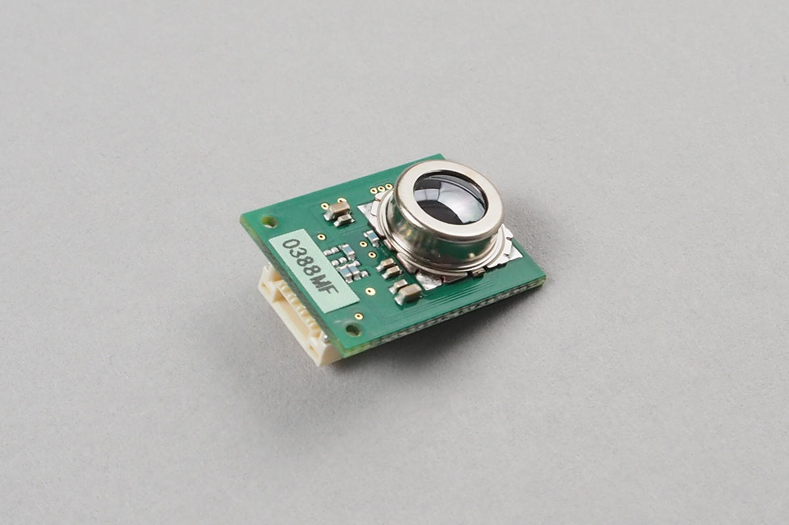

# MEMS Thermal Sensor - D6T44L
MEMSのサーモセンサーです
測定範囲は5~50℃の温度分布を4x4画素で測定することができます。



## wired(obniz,  { [ gnd, vcc, sda, scl] } )
センサーを接続します

```javascript
// Javascript Example
var d6t = obniz.wired('D6T44L', { gnd: 0, vcc: 1, sda: 2, scl: 3 });
```


## [await] getAllPixWait()

16個すべての画素の温度を取得します。
温度はセルシウス温度で5~50度です。
戻り値は16個の要素を持つ配列です。

```javascript
// Javascript Example
var d6t = obniz.wired('D6T44L', { gnd: 0, vcc: 1, sda: 2, scl: 3 });
let temps = await d6t.getAllPixWait();
console.log('temperature:' + temps);
```

canvasなどを使うと簡単に描画することが出来ます。

```javascript
<canvas id="canvas" width="300" height="300"></canvas>

and

var canvas=document.getElementById("canvas");
var ctx=canvas.getContext("2d");
var width = canvas.width;
var height = canvas.height;

for(let x=0;x<4;x++) {
  for(let y=0;y<4;y++) {
    var temp = temps[x*4+y];
    var h = -80+(temp-29)*25
    ctx.fillStyle="hsl("+h+", 100%, 50%)";
    ctx.fillRect(width/4*x,height/4*y,width/4,height/4);
  }
}
```

## [await] getOnePixWait(pixel)
pixelで指定した1画素の温度を出力します。画素は0~15の範囲で指定してください。


```javascript
// Javascript Example
var d6t = obniz.wired('D6T44L', { gnd: 0, vcc: 1, sda: 2, scl: 3 });
let temp = await d6t.getOnePixWait(10);
console.log('temperature:' + temp);
```


