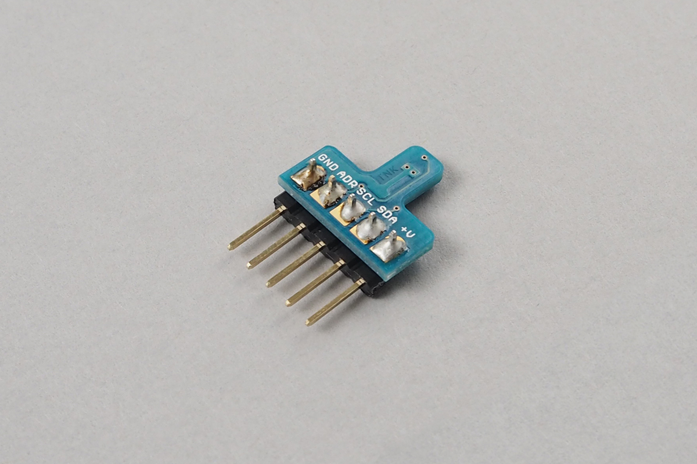

# Temperature Sensor - SHT31
温度センサSHT31です。センサで取得した温度を知ることができます。



## wired(obniz,  {vcc , sda, scl, adr, gnd, addressmode} )
obniz Boardに温度センサをつなぎます。
0,1,2,3,4はそれぞれ温度センサの電源,SDA,SCL,GND,ADDRピンへ接続してください。
5はI2Cアドレスです。アドレスを0x44にする場合は4,0x45にする場合は5を入力してください。
ADDRピンをプルアップしている場合は0x45,プルダウンしている場合は0x44です。
秋月電子のモジュールキット(K-12125)を使用している場合のデフォルトは0x45です。
```javascript
// Javascript Example
var sensor = obniz.wired("SHT31", {vcc : 0, sda:1, scl:2, adr:3, gnd:4, addressmode:5});
```
## [await] getTempWait()
現在の温度を計測して返します。単位は摂氏(°C)です。

## [await] getHumdWait()
現在の湿度を計測して返します。単位は%です。
```javascript
// Javascript Example
var sensor = obniz.wired("SHT31", {vcc : 0, sda:1, scl:2, adr:3, gnd:4, addressmode:5});
var temp = await sensor.getTempWait();
var humd = await sensor.getHumdWait();
console.log('temperature:' + temp);
console.log('humidity:' + humd);
```
