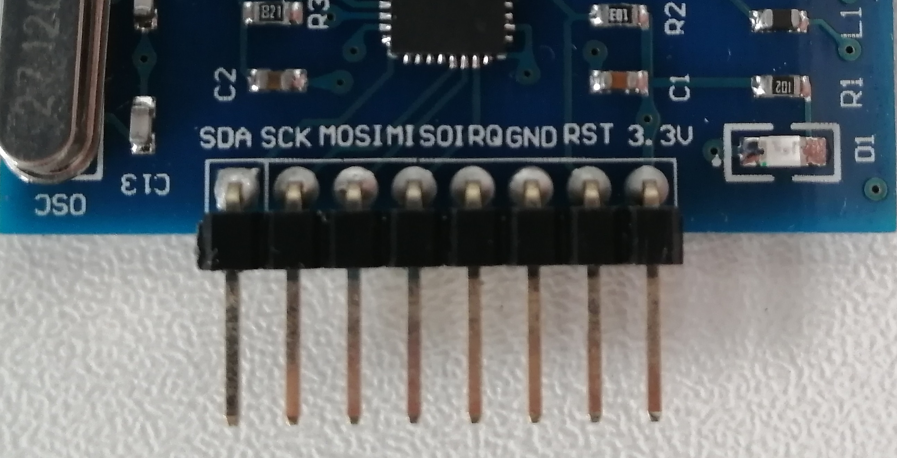

# MFRC522
RFID-RC522 is an RFID card reader / writer equipped with NXP MFRC522 chip. \
You can also identify Mifare cards such as point cards, student ID cards and so on.\
Three sample programs are also available. \
dump.html	: Read all data in the card \
read.html	: Read specified data in the card \
write.html	: Write specified data to the card


## Notes and Explanations about RFID-RC522
### Wiring Notes
Since the 3V pin setting of obniz is not enough power, drop the 5V pin setting to 2.5-3.6V (3.3V recommended) with the regulator!

### Pin setting
RFID-RC522 has the following pins.



Each pin's relation of obniz corresponds to the table below.

|RFID-RC522 | obniz pin settings | Required / Not required in wired () |
|:-----------------:|:---------------------:|:--------------------:|
| SDA | cs | Required |
| SCK | clk | Not required |
| MOSI | mosi | Required |
| MISO | miso | Required |
| IRQ |-|-|
| GND | gnd | Not required |
| rst | rst | Required |
| 3.3V | vcc | Not required |

### UID
Unique ID number used to identify the card.

### PICC_Type
MFRC522 chip has different types that depend on the amount of memory, \
"MIFARE Mini, 320 bytes", \
"MIFARE 1KB", \
"MIFARE 4KB", \
"MIFARE Ultralight or Ultralight C", \
"MIFARE Plus",\
and so on.

### Memory structure of MFRC522
In addition to UID and PICC Type, MFRC522 provides a data string that can be written and read. \
The data string is as follows.

|Sector (= 4Block)	|Block (= 16Byte)				|
|:-----------------:|:-----------------------------:|
|0 					|0(UID), 1, 2, 3(Reserved)		|
|1 					|4, 5, 6, 7(Reserved)			|
|2 					|8, 9, 10, 11(Reserved) 		|
|3					|12, 13, 14, 15(Reserved) 		|
|... 				|... 							|
|15					|60, 61, 62, 63(Reserved)		|

Usually the first 5 bytes of Block: 0 is reserved as UID. \
In addition, the 4th block (Block: 3, 7, 11 ...) of each Sector is reserved as a authentication block, so you can use 3 blocks of each Sector.\
This library prohibits rewriting UID and authentication block because rewriting cause some trouble such as cannot access the card.

In the case of the normal "MIFARE 1KB" type, there are 64 blocks, and the amount of memory is calculated as follows:\
64 Block * 16 Byte = 1,024 B = 1KB\
If you have another type of card, you can read up to the number of blocks corresponding to the amount of memory. \
However, commercial cards such as point cards are protected and the internal data cannot be read. You can only get the UID.

# Functions in the library

## wired("MFRC522", { cs, clk, mosi, miso, gnd, rst, vcc})
Since RFID-RC522 has many occupied pins, we set some pins that don't require declaration. \
Required pins shown in the “Pin Relation table above must be declared in the wired(). \
Not required pins don't have to be declared in the wired() function, but in that case, these pins must share with other modules.

name | type | required | default | description
--- | --- | --- | --- | ---
cs | `number(obniz Board io)` | yes |  &nbsp; | pin which printed as SDA
clk | `number(obniz Board io)` | yes |  &nbsp; | pin which printed as SCK
mosi | `number(obniz Board io)` | yes |  &nbsp; | pin which printed as MOSI
miso | `number(obniz Board io)` | yes |  &nbsp; | pin which printed as MISO
rst | `number(obniz Board io)` | no |  &nbsp; | pin which printed as RST
gnd | `number(obniz Board io)` | no |  &nbsp; | pin which printed as GND

```Javascript
// Javascript Example
var mfrc522 = obniz.wired("MFRC522", { cs: 0, clk: 1, mosi: 2, miso: 3, gnd: 5, rst: 6});
```


## [await] findCardWait(uid, PICC_Type)

A function for finding cards. \
When a card is detected, "uid" and "PICC Type" are included in the returned value.

```Javascript
// Javascript Example
var mfrc522 = obniz.wired("MFRC522", { cs: 0, clk: 1, mosi: 2, miso: 3, gnd: 5, rst: 6});
while(true) {
	try {
		let card = await mfrc522.findCardWait();
		console.log("Card is detected!");
		console.log("UID		: " + card.uid);
		console.log("PICC Type 	: " + card.PICC_Type);
	} catch(e) {
		// Not Found or Error
		console.error(e)
	}
}
```


## [await] readBlockDataWait(Block, UID)
This function can get 1 block data by entering the number of blocks you want to read and UID.

```Javascript
// Javascript Example
// Read block data in the card
var mfrc522 = obniz.wired("MFRC522", { cs: 0, clk: 1, mosi: 2, miso: 3, gnd: 5, rst: 6});
while(true) {
	try {
		let card = await mfrc522.findCardWait();
		const Block = 4;
		response = await mfrc522.readBlockDataWait(Block, card.uid);
		console.log("Block: " + Block + " Data: " + response);
	} catch(e) {
		// Not Found or Error
		console.error(e)
	}
}
```

## [await] readSectorDataWait(Sector, UID)
This function can get 1 Sector (4 Block) data at once by entering the number of sectors you want to read and UID.
This function return value as 4 arrays.

```Javascript
// Javascript Example
// Read Sector data in the card
var mfrc522 = obniz.wired("MFRC522", { cs: 0, clk: 1, mosi: 2, miso: 3, gnd: 5, rst: 6});
while(true) {
  try {
    let card = await mfrc522.findCardWait();
    const Sector = 2;
    response = await mfrc522.readSectorDataWait(Sector, card.uid);
    console.log("Sector: " + Sector);
    for (let i = 0; i < 4; i++)
	  console.log("Block: " + (Sector * 4 + i) + " Data: " + response[i]);
  } catch(e) {
    // Not Found or Error
    console.error(e)
  }
}
```

## [await] writeBlockDataWait(Block, data)
You can write the specified data to the specified block by entering the number of blocks you want to write and 16 bytes of data.

Attention: Writing is not recommended by manufacturer. Possibly not stable and breaking data will be caused.

```Javascript
// Javascript Example
var mfrc522 = obniz.wired("MFRC522", { cs: 0, clk: 1, mosi: 2, miso: 3, gnd: 5, rst: 6});
while(true) {
  try {
    let card = await mfrc522.findCardWait();
    let data00 = [
        0x00, 0x00
    ];
    const Block = 4;
    // Write block data to card
    console.log("Writing data to Block " + Block + "...");
    await mfrc522.writeBlockDataWait(Block, data00);
    console.log("Wrinting finished.");
  } catch(e) {
    // Not Found or Error
    console.error(e)
  }
}
```


# Notes about the sample program
## alert (buzzer_pin)
This is a function declared in the sample html and does not exist in the library. \
This function is used to sound a buzzer when a card is detected for example. \
This function requires buzzer pin.
## About try_catch(err)
The try_catch syntax is used in the sample program. \
This makes it possible to return error when the error occurred and stop the program. Therefore, there is no duplication of errors. \
The types of errors are all written in the sample program, and the error details are output in the log. \
Therefore, you can select and display only the errors that he wants to display.