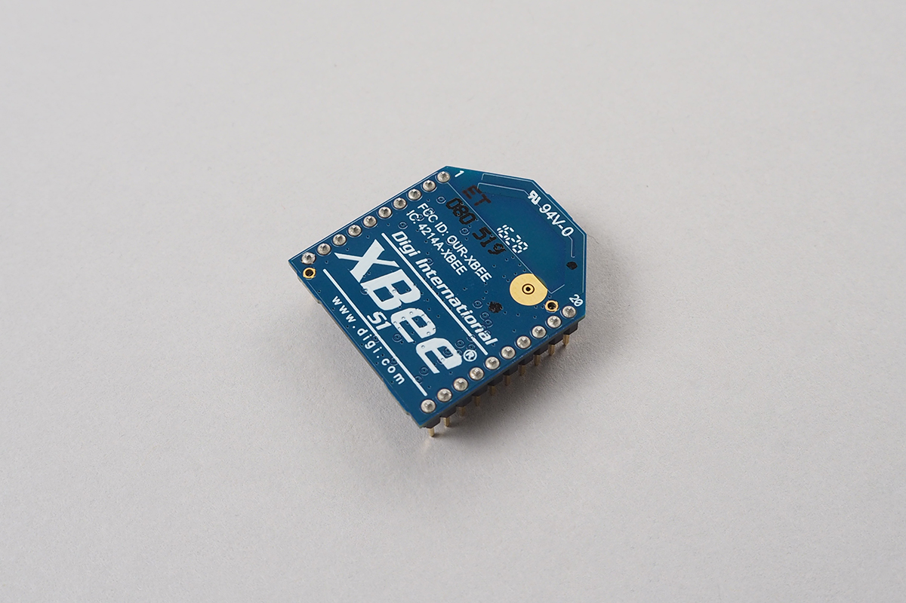
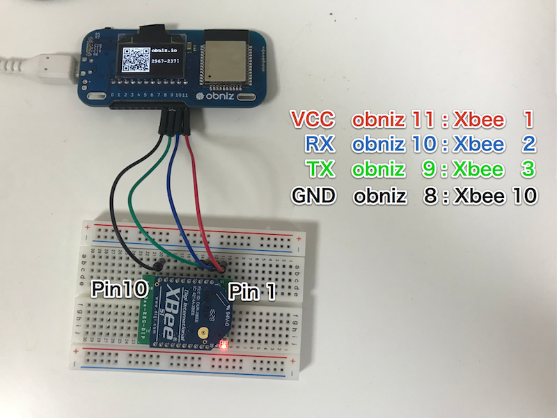

# XBee
Wireless network Module.
P2P or broadcasting communication with some Xbee modules are you can use.



## obniz.wired(obniz, {tx, rx})

Wiring obniz Board and XBee. XBee also need VCC(3.3V) and GND.
3.3V power supply is not supported by obniz Board, so need to get another way.

If you wired like this photo,code is here.
obniz Board output 5V vcc to regulator and convert to 3.3V. 



```javascript
// Javascript Example
obniz.io11.output(true);
obniz.io8.output(false);
var xbee = obniz.wired("XBee", {tx:9,rx:10});
```


## await configWait(json)

Set config of xbee. This function need some seconds (about 3sec).
So use with "await". 
```javascript
// Javascript Example
obniz.io11.output(true);
obniz.io8.output(false);
var xbee = obniz.wired("XBee", {tx:9,rx:10});
await xbee.configWait({
   	"destination_address" : "52",
   	"source_address" : "51",
});
```

Json scheme is here.

```javascript
{
  "destination_address" : "5A",     // hex string address send to  ( 0 ~ FFFFFFFFFFFFFFFF)
                                    // 0x000000000000FFFF is bloadcasting
  "source_address" : "E2",          // hex string address for mine ( 0 ~ FFFFFFFF)

  // or 

  "destination_address_high" : "0",  // higher 16 bit ( 0 ~ FFFFFFFF)
  "destination_address_low" : "5A",  // lower 16 bit ( 0 ~ FFFFFFFF)

  // or 

  "DH" : "0",                //AT command directly are supported.
  "DL" : "5A",               //see maker datasheets. 
  "MY" : "E2",
  
}
```

## send(data)
send a data.
available formats are

- string
- number => will be one byte data
- array of number => array of bytes
- object => converted to json string
- Buffer => array of bytes


If seting config are not finished, throw error. 
```javascript
// Javascript Example
obniz.io11.output(true);
obniz.io8.output(false);
var xbee = obniz.wired("XBee", {tx:9,rx:10});
xbee.send("Hi");
xbee.send(0x11);
xbee.send([0x11, 0x45, 0x44]);
xbee.send({success: true});
```

## onreceive(data, text)

callback function when data recieved.
data is array of bytes.
text is same data. but it was text representation.

```javascript
// Javascript Example
obniz.io11.output(true);
obniz.io8.output(false);
var xbee = obniz.wired("XBee", {tx:9,rx:10});
xbee.onreceive = function(data, text) {
    console.log("recieved : " + text);
}
```